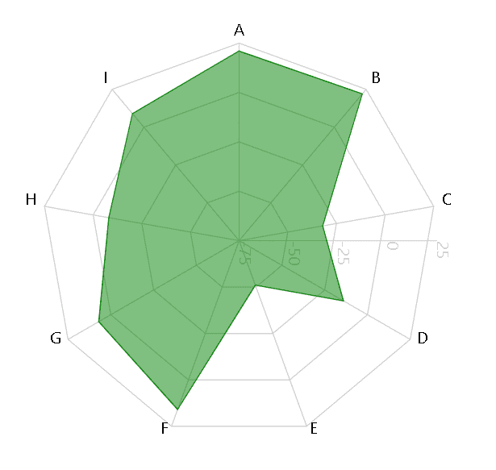

# 使用反应堆中的充电创建雷达图

> 原文:[https://www . geeksforgeeks . org/create-a-radar-chart-use-recharts-in-reactjs/](https://www.geeksforgeeks.org/create-a-radar-chart-using-recharts-in-reactjs/)

**简介:Rechart JS** 是一个用于为 React JS 创建图表的库。借助 React 和 D3(数据驱动文档)，该库用于构建折线图、条形图、饼图等。

**方法:**为了使用 Recharts 创建雷达图，我们创建了一个带有标签和极坐标细节的数据集。然后，我们使用数据坐标创建一个极轴网格和两个轴，即极角轴和极半径轴。最后使用雷达元素绘制雷达图。

**创建反应应用程序并安装模块:**

*   **步骤 1:** 使用以下命令创建一个 React 应用程序。

    ```jsx
    npx create-react-app foldername
    ```

*   **步骤 2:** 创建项目文件夹(即文件夹名)后，使用以下命令移动到该文件夹。

    ```jsx
    cd foldername
    ```

*   **步骤 3:** 创建 ReactJS 应用程序后，使用以下命令安装所需的模块。

    ```jsx
    npm install --save recharts
    ```

**项目结构:**如下图。


**示例:**现在在 App.js 文件中写下以下代码。在这里，App 是我们编写代码的默认组件。

## App.js

```jsx
import React from 'react';
import { Radar, RadarChart, PolarGrid, 
    PolarAngleAxis, PolarRadiusAxis } from 'recharts';

const App = () => {

    // Sample data
    const data = [
        { name: 'A', x: 21 },
        { name: 'B', x: 22 },
        { name: 'C', x: -32 },
        { name: 'D', x: -14 },
        { name: 'E', x: -51 },
        { name: 'F', x: 16 },
        { name: 'G', x: 7 },
        { name: 'H', x: -8 },
        { name: 'I', x: 9 },
    ];

    return (
        <RadarChart height={500} width={500} 
            outerRadius="80%" data={data}>
            <PolarGrid />
            <PolarAngleAxis dataKey="name" />
            <PolarRadiusAxis />
            <Radar dataKey="x" stroke="green" 
                fill="green" fillOpacity={0.5} />
        </RadarChart>
    );
}

export default App;
```

**运行应用程序的步骤:**从项目的根目录使用以下命令运行应用程序:

```jsx
npm start
```

**输出:**现在打开浏览器，转到***http://localhost:3000/***，会看到如下输出:



输出