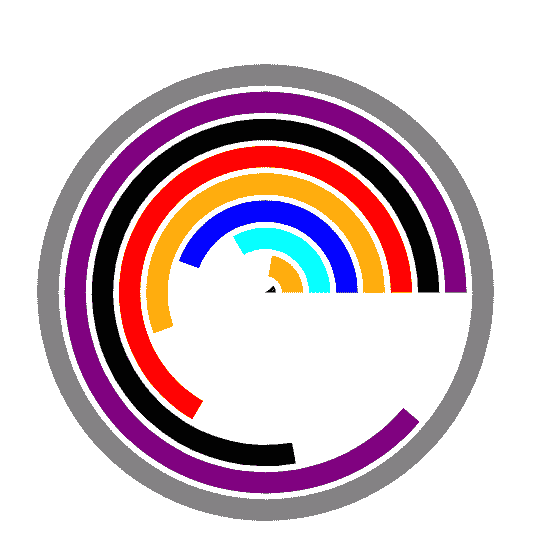
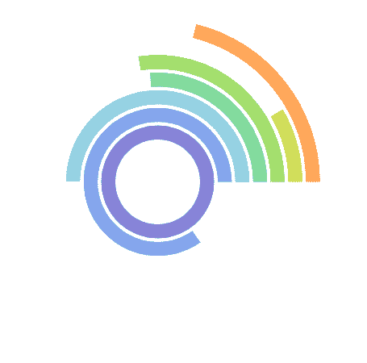

# 使用反应堆中的充电创建径向条形图

> 原文:[https://www . geeksforgeeks . org/create-a-radial-bar-chart-use-recharts-in-reactjs/](https://www.geeksforgeeks.org/create-a-radial-bar-chart-using-recharts-in-reactjs/)

**简介:Rechart JS** 是一个用于为 React JS 创建图表的库。借助 React 和 D3(数据驱动文档)，该库用于构建折线图、条形图、饼图等。

**放射条形图**是以极坐标显示的分类条形图。它也被称为圆形条形图。它用于通过圆形图显示分类数据之间的比较。

**方法:**为了在使用 recharts 进行反应时创建径向条形图，我们使用了 Recharts npm 包的 RadialBarChart 组件。为了在图表中创建条形图，我们使用了 RadialBar 组件。

**创建反应应用程序并安装模块:**

**步骤 1:** 使用以下命令创建一个 React 应用程序。

```
npx create-react-app foldername
```

**步骤 2:** 创建项目文件夹(即文件夹名)后，使用以下命令移动到该文件夹。

```
cd foldername
```

**步骤 3:** 创建 ReactJS 应用程序后，使用以下命令安装所需的模块。

```
npm install --save recharts
```

**项目结构:**如下图。


**示例 1:** 现在在 App.js 文件中写下以下代码。在这里，App 是我们编写代码的默认组件。

## App.js

```
import React from 'react';
import { RadialBarChart, RadialBar } from 'recharts';

const App = () => {

// Sample data
const data = [
  {name:'A', x:1,fill:"green"},
  {name:'B', x:2, fill:"yellow"},
  {name:'C', x:3, fill:"aqua"},
  {name:'D', x:4, fill: "blue"},
  {name:'E', x:5, fill:"orange"},
  {name:'F', x:6, fill:"red"},
  {name:'G', x:7, fill:"black"},
  {name:'H', x:8, fill:"purple"},
  {name:'I', x:9, fill:"gray"},
];

return (
  <RadialBarChart width={500} height={500} data={data}>
    <RadialBar minAngle={15} dataKey="x"/>
  </RadialBarChart>
);
}

export default App;
```

**运行应用程序的步骤:**从项目的根目录使用以下命令运行应用程序:

```
npm start
```

**输出:**现在打开浏览器，转到***http://localhost:3000/***，会看到如下输出:



输出

**示例 2:** 现在更改 App.js 文件中的以下代码。

## App.js

```
import React from 'react';
import { RadialBarChart, RadialBar } from 'recharts';

const App = () => {

// Sample data
const data = [
  {
    name: 'A',
    x: 31.47,
    fill: '#8784d8',
  },
  {
    name: 'B',
    x: 26.69,
    fill: '#84a6ed',
  },
  {
    name: 'C',
    x: 15.69,
    fill: '#8ed1e1',
  },
  {
    name: 'D',
    x: 8.22,
    fill: '#82da9d',
  },
  {
    name: 'E',
    x: 8.63,
    fill: '#a2de6c',
  },
  {
    name: 'F',
    x: 2.63,
    fill: '#d0dd57',
  },
  {
    name: 'G',
    x: 6.67,
    fill: '#ffa658',
  },
];

return (
  <RadialBarChart width={500} height={500} data={data} 
    innerRadius="20%" outerRadius="70%">
    <RadialBar minAngle={30} dataKey="x" clockWise/>
  </RadialBarChart>
);
}

export default App;
```

**输出:**使用 ***CTRL+S.*** 保存文件现在打开浏览器，转到***http://localhost:3000/***，会看到如下输出:



输出