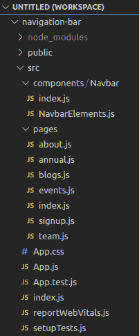

# 使用 ReactJS

创建一个响应式导航条

> 原文:[https://www . geeksforgeeks . org/create-a-responsive-nav bar-using-reactjs/](https://www.geeksforgeeks.org/create-a-responsive-navbar-using-reactjs/)

在本文中，我们将使用 Reactjs 创建一个功能正常的导航栏。

**问题陈述:**使用 reactJS &样式的组件创建导航栏

**所需模块:**

1.  国家预防机制
2.  创建-反应-应用
3.  样式组件
4.  react-路由器-dom

**基本设置:**要创建 react 应用程序，您的计算机上安装了一个节点，您可以通过在终端中键入以下命令来检查该节点:

```
node -v
```

如果没有请安装[最新版本](https://nodejs.org/en/)。

一切就绪！您将使用[创建-反应-应用程序](https://reactjs.org/docs/create-a-new-react-app.html)启动一个新项目，因此打开您的终端并键入:

```
npx create-react-app navigation-bar
```

现在，通过在终端中键入给定的命令，转到导航栏文件夹:

```
cd navigation-bar
```

通过在终端中键入给定的命令，安装此项目所需的依赖项:

```
npm install react-router-dom
npm install --save styled-components
```

现在在 src 中创建组件文件夹，然后转到组件文件夹并创建一个新的文件夹名 Navbar。在 Navbar 文件夹中创建两个索引文件，js 和 NavbarElements.js。

在 src 名称页面中再创建一个文件夹，并在页面中创建文件名 about.js、annual.js、blogs.js、events.js、index.js、registration . js、team.js

**项目结构:**项目中的文件结构如下图所示:



**文件路径:**在 src/components/Navbar 中创建 index.js 文件。

## java 描述语言

```
import React from 'react';
import {
  Nav,
  NavLink,
  Bars,
  NavMenu,
  NavBtn,
  NavBtnLink,
} from './NavbarElements';

const Navbar = () => {
  return (
    <>
      <Nav>
        <Bars />

        <NavMenu>
          <NavLink to='/about' activeStyle>
            About
          </NavLink>
          <NavLink to='/events' activeStyle>
            Events
          </NavLink>
          <NavLink to='/annual' activeStyle>
            Annual Report
          </NavLink>
          <NavLink to='/team' activeStyle>
            Teams
          </NavLink>
          <NavLink to='/blogs' activeStyle>
            Blogs
          </NavLink>
          <NavLink to='/sign-up' activeStyle>
            Sign Up
          </NavLink>
          {/* Second Nav */}
          {/* <NavBtnLink to='/sign-in'>Sign In</NavBtnLink> */}
        </NavMenu>
        <NavBtn>
          <NavBtnLink to='/signin'>Sign In</NavBtnLink>
        </NavBtn>
      </Nav>
    </>
  );
};

export default Navbar;
```

**文件路径:**在 src/components/Navbar 中创建 NavbarElements.js 文件。

## java 描述语言

```
import { FaBars } from 'react-icons/fa';
import { NavLink as Link } from 'react-router-dom';
import styled from 'styled-components';

export const Nav = styled.nav`
  background: #63D471;
  height: 85px;
  display: flex;
  justify-content: space-between;
  padding: 0.2rem calc((100vw - 1000px) / 2);
  z-index: 12;
  /* Third Nav */
  /* justify-content: flex-start; */
`;

export const NavLink = styled(Link)`
  color: #808080;
  display: flex;
  align-items: center;
  text-decoration: none;
  padding: 0 1rem;
  height: 100%;
  cursor: pointer;
  &.active {
    color: #000000;
  }
`;

export const Bars = styled(FaBars)`
  display: none;
  color: #808080;
  @media screen and (max-width: 768px) {
    display: block;
    position: absolute;
    top: 0;
    right: 0;
    transform: translate(-100%, 75%);
    font-size: 1.8rem;
    cursor: pointer;
  }
`;

export const NavMenu = styled.div`
  display: flex;
  align-items: center;
  margin-right: -24px;
  /* Second Nav */
  /* margin-right: 24px; */
  /* Third Nav */
  /* width: 100vw;
  white-space: nowrap; */
  @media screen and (max-width: 768px) {
    display: none;
  }
`;

export const NavBtn = styled.nav`
  display: flex;
  align-items: center;
  margin-right: 24px;
  /* Third Nav */
  /* justify-content: flex-end;
  width: 100vw; */
  @media screen and (max-width: 768px) {
    display: none;
  }
`;

export const NavBtnLink = styled(Link)`
  border-radius: 4px;
  background: #808080;
  padding: 10px 22px;
  color: #000000;
  outline: none;
  border: none;
  cursor: pointer;
  transition: all 0.2s ease-in-out;
  text-decoration: none;
  /* Second Nav */
  margin-left: 24px;
  &:hover {
    transition: all 0.2s ease-in-out;
    background: #fff;
    color: #808080;
  }
`;
```

在 src/pages 中编辑项目中导航栏的各种页面:

*   **文件名 about.js:**

    ## java 描述语言

    ```
    import React from 'react';

    const About = () => {
      return (
        <div
          style={{
            display: 'flex',
            justifyContent: 'Right',
            alignItems: 'Right',
            height: '100vh'
          }}
        >
          <h1>GeeksforGeeks is a Computer Science portal for geeks.</h1>
        </div>
      );
    };

    export default About;
    ```

*   **文件名 annual.js:**

    ## java 描述语言

    ```
    import React from 'react';

    const AnnualReport = () => {
      return (
        <div
          style={{
            display: 'flex',
            justifyContent: 'Right',
            alignItems: 'Right',
            height: '100vh'
          }}
        >
          <h1>Annual Report</h1>
        </div>
      );
    };

    export default AnnualReport;
    ```