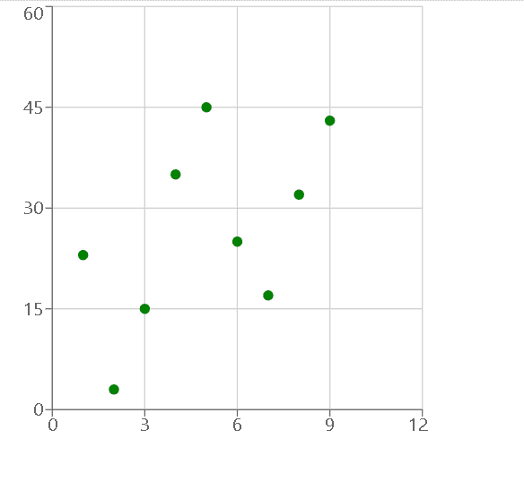

# 使用反应堆中的充电创建散点图

> 原文:[https://www . geeksforgeeks . org/create-a-散点图-使用-recharts-in-reactjs/](https://www.geeksforgeeks.org/create-a-scatter-chart-using-recharts-in-reactjs/)

**简介:** RechartJS 是一个用于为 React JS 创建图表的库。借助 React 和 D3(数据驱动文档)，该库用于构建折线图、条形图、饼图等。

为了使用 Recharts 创建散点图，我们创建了一个包含 x 和 y 坐标细节的数据集。然后我们使用数据坐标创建一个笛卡尔网格和两个轴。最后使用散点元素将散点绘制在笛卡尔网格中。

**创建反应应用程序并安装模块:**

*   **步骤 1:** 使用以下命令创建一个 React 应用程序。

    ```
    npx create-react-app foldername
    ```

*   **步骤 2:** 创建项目文件夹(即文件夹名)后，使用以下命令移动到该文件夹。

    ```
    cd foldername
    ```

*   **步骤 3:** 创建 ReactJS 应用程序后，使用以下命令安装所需的模块。

    ```
    npm install --save recharts
    ```

**项目结构:**如下图。


**示例:**现在在 App.js 文件中写下以下代码。在这里，App 是我们编写代码的默认组件。

## App.js

```
import React from 'react';
import { ScatterChart, Scatter, XAxis, 
    YAxis, CartesianGrid } from 'recharts';

const App = () => {

    // Sample data
    const data = [
        { x: 1, y: 23 },
        { x: 2, y: 3 },
        { x: 3, y: 15 },
        { x: 4, y: 35 },
        { x: 5, y: 45 },
        { x: 6, y: 25 },
        { x: 7, y: 17 },
        { x: 8, y: 32 },
        { x: 9, y: 43 },
    ];

    return (
        <ScatterChart width={400} height={400}>
            <CartesianGrid />
            <XAxis type="number" dataKey="x" />
            <YAxis type="number" dataKey="y" />
            <Scatter data={data} fill="green" />
        </ScatterChart>
    );
}

export default App;
```

**运行应用程序的步骤:**从项目的根目录使用以下命令运行应用程序:

```
npm start
```

**输出:**现在打开浏览器，转到***http://localhost:3000/***，会看到如下输出:



输出