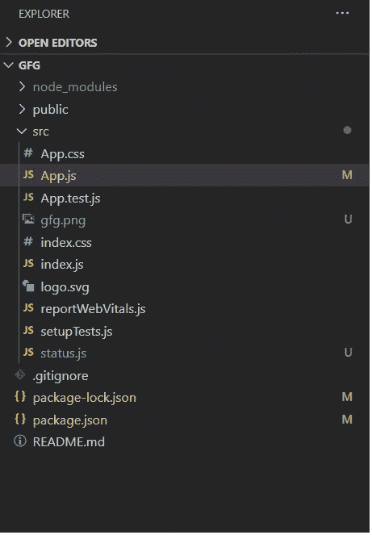
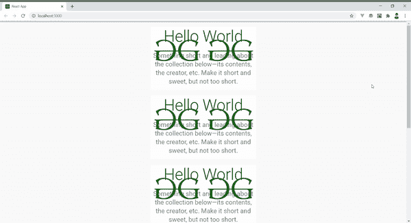

# 使用材料界面

在反应中创建滚动状态

> 原文:[https://www . geeksforgeeks . org/create-a-scroll-status-in-reactjs-use-material-ui/](https://www.geeksforgeeks.org/create-a-scroll-status-in-reactjs-using-material-ui/)

顶部显示滚动状态的进度条现在在网页中非常常见。此外，ReactJS 和 Material-UI 非常协调，React-JS 是构建 UI 组件和 Material-UI 的最流行的 JavaScript 框架，Material-UI 是一个提供各种有用且可重用的 React 组件的库。

**创建反应应用程序并安装模块:**

**步骤 1:** 使用以下命令创建一个 React 应用程序。

```
npx create-react-app gfg
```

**第 2 步:**创建项目文件夹后，即 gfg **，**使用以下命令移动到它。

```
cd gfg
```

**步骤 3:** 创建 ReactJS 应用程序后，使用以下命令安装 **material-ui** 模块。

```
npm install @material-ui/core
```

现在，创建一个新的文件 status.js，并在 src 文件夹中放置一个 gfg 徽标“gfg.png ”,

**项目结构:**如下图:



**素材界面进度条有两种类型:**

1.  **确定:**使用变量控制进度状态。
2.  **不确定:**进度状态不确定。

我们将使用线性确定进度条来显示我们的应用程序的滚动状态。“线性进度”组件的值属性决定了进度指示器在 0 到 100 之间的值。

**添加状态:**我们添加一个状态‘progress’，它是使用 React 提供的‘State’钩子控制进度条进度长度的变量。“设置程序”是更新该状态变量的值的方法。

```
const [progress, setProgress] = React.useState(0);
```

**使用“效果”钩子:**效果钩子让我们在反应中对功能组件产生副作用。它在组件的每次重新呈现后执行效果方法。

## status.js

```
import React from 'react';
import { makeStyles } from '@material-ui/core/styles';
import LinearProgress from '@material-ui/core/LinearProgress';

const useStyles = makeStyles({
  root: {
    position: 'fixed',
    width: '100%',
  },
});

export default function StatusBar() {
  const classes = useStyles();
  const [progress, setProgress] = React.useState(0);

  React.useEffect(() => {

    let computeProgress = () => {
      // The scrollTop gives length of window that has been scrolled
      const scrolled = document.documentElement.scrollTop;
      // scrollHeight gives total length of the window and 
      // The clientHeight gives the length of viewport
      const scrollLength = document.documentElement.scrollHeight - 
      document.documentElement.clientHeight;
      const progress = `${100*scrolled/scrollLength}`;

      setProgress(progress);
    }

    // Adding event listener on mounting
    window.addEventListener("scroll", computeProgress);

    // Removing event listener upon unmounting
    return () => window.removeEventListener("scroll", computeProgress);
  });

  return (
    <div className={classes.root}>
      <LinearProgress variant="determinate" value={progress} />
    </div>
  );
}
```

## App.js

```
import React, { Component } from 'react';
import './App.css';
import StatusBar from './status';
import gfglogo from "./gfg.png"
import CssBaseline from '@material-ui/core/CssBaseline';
import Container from '@material-ui/core/Container';
import Typography from '@material-ui/core/Typography';

function App() {
  const paras = [1, 2, 3, 4, 5, 6];
  return (
    <React.Fragment>
      <CssBaseline />

      {/* Status bar component */}
      <StatusBar></StatusBar>

      <br></br>
      {paras.map(para => (
        <Container maxWidth="xs" key={para}>
          <div style={{ backgroundImage: `url(${gfglogo})`, 
          display: 'inline-block', 
          backgroundRepeat: 'none', }}>
            <Typography component="h1" variant="h2" align="center" 
            color="textPrimary" gutterBottom>
              Hello World
            </Typography>
            <Typography variant="h5" align="center" color="textSecondary" 
            paragraph>
            Something short and leading about the collection below—its contents, 
            the creator, etc. Make it short and sweet, but not too short.
            </Typography>
          </div>
          <br /><br />
        </Container>
      ))}
    </React.Fragment>
  );
}

export default App;
```

**运行应用程序的步骤:**从项目的根目录使用以下命令运行应用程序:

```
npm start
```

**输出:**现在打开浏览器，转到***http://localhost:3000/***，会看到如下输出:

