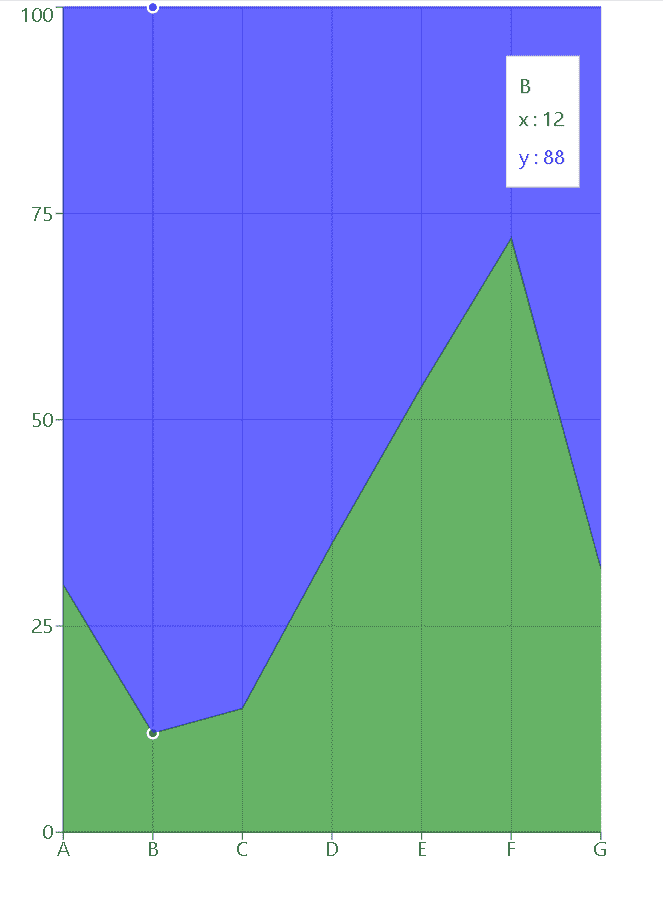
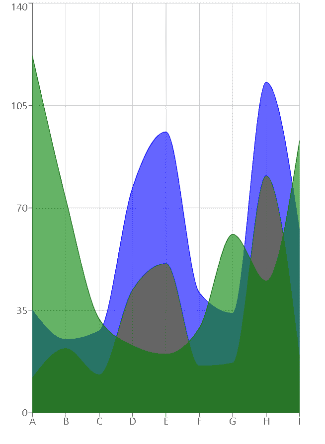

# 使用反应堆中的充电创建堆叠面积图

> 原文:[https://www . geeksforgeeks . org/create-a-stacked-area-chart-use-recharts-in-reactjs/](https://www.geeksforgeeks.org/create-a-stacked-area-chart-using-recharts-in-reactjs/)

**RechartJS** 是一个用于为 ReactJS 创建图表的库。该库用于借助 React 和 D3(数据驱动文档)构建折线图、条形图、饼图等。

**堆叠面积图**是基本面积图的延伸。它在同一区域图表中显示各种连续数据，以便更好地比较数据。面积图将折线图和条形图结合在一起，展示某个渐进变量的数值偏差。

**方法:**为了创建堆叠面积图，我们使用了 recharts npm 包的面积图组件。我们首先创建一个笛卡尔网格和 X 轴和 Y 轴。然后使用面积组件添加多个面积图，并使它们堆叠在一起。我们对所有图表使用相同的 stackId。

**创建反应应用程序并安装模块:**

**步骤 1:** 使用以下命令创建一个 React 应用程序。

```
npx create-react-app foldername
```

**步骤 2:** 创建项目文件夹(即文件夹名)后，使用以下命令移动到该文件夹。

```
cd foldername
```

**步骤 3:** 创建 ReactJS 应用程序后，使用以下命令安装所需的模块。

```
npm install --save recharts
```

**项目结构:**如下图。


**示例 1:** 这里，我们将使用 recharts npm 包的 Area chart 和 Area 组件创建一个基本的堆叠面积图。为了将两个面积图组件堆叠在一起，我们将向两个面积图组件添加相同的 stackId。

现在在 App.js 文件中写下以下代码。在这里，App 是我们编写代码的默认组件。

## java 描述语言

```
import React from 'react';
import {AreaChart, Area, XAxis, YAxis, 
    CartesianGrid, Tooltip} from 'recharts';

const App = () => {

    // Sample data
    const data = [
        {name:"A", x:30, y:70},
        {name:"B", x:12, y:88},
        {name:"C", x:15, y:85},
        {name:"D", x:35, y:65},
        {name:"E", x:54, y:46},
        {name:"F", x:72, y:28},
        {name:"G", x:32, y:68}
    ];

    return (
    <AreaChart width={500} height={700} data={data}>
        <CartesianGrid/>
        <XAxis dataKey="name" />
        <YAxis />
        <Tooltip />
        <Area dataKey="x" stackId="1" 
            stroke="green" fill="green" />
        <Area dataKey="y" stackId="1" 
            stroke="blue" fill="blue" />
    </AreaChart>
    );
}

export default App;
```

**运行应用程序的步骤:**从项目的根目录使用以下命令运行应用程序:

```
npm start
```

**输出:**现在打开浏览器，转到***http://localhost:3000/***，会看到如下输出:



**示例 2:** 这里，为了将此从面积图转换为曲线图，我们将类型属性设置为单调。如果我们想让面积图一个叠一个，第三个叠起来，而不是叠起来，我们会给需要叠起来的图和需要叠起来的图赋予不同的堆栈 id。

现在更改 App.js 文件中的以下代码。

## java 描述语言

```
import React from 'react';
import {AreaChart, Area, XAxis, YAxis, 
    CartesianGrid } from 'recharts';

const App = () => {

    // Sample data
    const data = [
        {name:'A', x:12, y:23,  z:122},
        {name:'B', x:22, y:3,   z:73},
        {name:'C', x:13, y:15,  z:32},
        {name:'D', x:42, y:35,  z:23},
        {name:'E', x:51, y:45,  z:20},
        {name:'F', x:16, y:25,  z:29},
        {name:'G', x:17, y:17,  z:61},
        {name:'H', x:81, y:32,  z:45},
        {name:'I', x:19, y:43,  z:93},
    ];

    return (
    <AreaChart width={500} height={700} data={data}>
        <CartesianGrid/>
        <XAxis dataKey="name" />
        <YAxis />
        <Area type="monotone" dataKey="x" 
            stackId="1" stroke="black" fill="black" />
        <Area type="monotone" dataKey="y" 
            stackId="1" stroke="blue" fill="blue" />
        <Area type="monotone" dataKey="z" 
            stackId="2" stroke="green" fill="green" />
    </AreaChart>
    );
}

export default App;
```

**输出:**使用 **CTRL+S** 保存项目。现在打开浏览器，转到***http://localhost:3000/***，会看到如下输出:



输出

**参考:**T2】https://recharts.org/en-US/examples