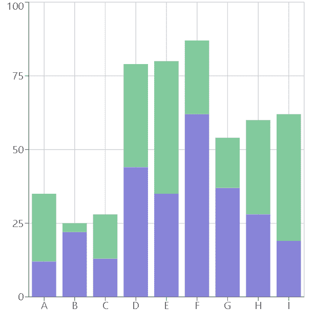
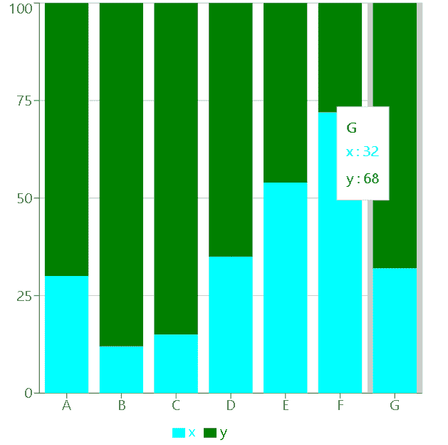

# 使用反应堆中的充电创建堆叠条形图

> 原文:[https://www . geeksforgeeks . org/create-a-stacked-bar-chart-use-recharts-in-reactjs/](https://www.geeksforgeeks.org/create-a-stacked-bar-chart-using-recharts-in-reactjs/)

**简介:Rechart JS** 是一个用于为 React JS 创建图表的库。借助 React 和 D3(数据驱动文档)，该库用于构建折线图、条形图、饼图等。

堆叠**条形图**是基本条形图的扩展。它在同一个条形图中显示各种离散数据，以便更好地比较数据。

**方法:**为了创建堆叠条形图，我们使用了 recharts npm 包的条形图组件。我们首先创建一个笛卡尔网格和 X 轴和 Y 轴。然后使用条形图组件添加多个条形图，并使用相同的 stackId 将它们堆叠在一起。

**创建反应应用程序并安装模块:**

*   **步骤 1:** 使用以下命令创建一个 React 应用程序。

    ```jsx
    npx create-react-app foldername
    ```

*   **步骤 2:** 创建项目文件夹(即文件夹名)后，使用以下命令移动到该文件夹。

    ```jsx
    cd foldername
    ```

*   **步骤 3:** 创建 ReactJS 应用程序后，使用以下命令安装所需的模块。

    ```jsx
    npm install --save recharts
    ```

**项目结构:**如下图。


**示例 1:** 在本例中，我们将使用 recharts npm 包的 bar chart 和 bar 组件创建一个基本的堆叠条形图。为了将两个小节堆叠在一起，我们将向两个小节组件添加相同的 stackId。现在在 App.js 文件中写下以下代码。在这里，App 是我们编写代码的默认组件。

## App.js

```jsx
import React from 'react';
import { BarChart, Bar, XAxis, YAxis, 
    CartesianGrid } from 'recharts';

const App = () => {

    // Sample data
    const data = [
        { name: 'A', x: 12, y: 23, z: 122 },
        { name: 'B', x: 22, y: 3, z: 73 },
        { name: 'C', x: 13, y: 15, z: 32 },
        { name: 'D', x: 44, y: 35, z: 23 },
        { name: 'E', x: 35, y: 45, z: 20 },
        { name: 'F', x: 62, y: 25, z: 29 },
        { name: 'G', x: 37, y: 17, z: 61 },
        { name: 'H', x: 28, y: 32, z: 45 },
        { name: 'I', x: 19, y: 43, z: 93 },
    ];

    return (
        <BarChart width={500} height={500} data={data} >
            <CartesianGrid />
            <XAxis dataKey="name" />
            <YAxis />
            <Bar dataKey="x" stackId="a" fill="#8884d8" />
            <Bar dataKey="y" stackId="a" fill="#82ca9d" />
        </BarChart>
    );
}

export default App;
```

**运行应用程序的步骤:**从项目的根目录使用以下命令运行应用程序:

```jsx
npm start
```

**输出:**现在打开浏览器，转到***http://localhost:3000/***，会看到如下输出:



输出

**示例 2:** 在本例中，我们将使用 fill 属性更改条形的颜色。要添加一个工具提示，该工具提示将在悬停时显示有关条形图的信息，以及显示堆叠条形图标签的图例，我们将使用工具提示组件和图例组件。现在更改 App.js 文件中的以下代码。

## App.js

```jsx
import React from 'react';
import { BarChart, Bar, XAxis, YAxis, CartesianGrid,
        Legend, Tooltip } from 'recharts';

const App = () => {

    // Sample data
    const data = [
        { name: "A", x: 30, y: 70 },
        { name: "B", x: 12, y: 88 },
        { name: "C", x: 15, y: 85 },
        { name: "D", x: 35, y: 65 },
        { name: "E", x: 54, y: 46 },
        { name: "F", x: 72, y: 28 },
        { name: "G", x: 32, y: 68 }
    ];

    return (
        <BarChart width={500} height={500} data={data} >
            <CartesianGrid />
            <XAxis dataKey="name" />
            <YAxis />
            <Tooltip />
            <Legend />
            <Bar dataKey="x" stackId="a" fill="aqua" />
            <Bar dataKey="y" stackId="a" fill="green" />
        </BarChart>
    );
}

export default App;
```

**输出:**使用 **CTRL+S** 保存项目。现在打开浏览器，转到***http://localhost:3000/***，会看到如下输出:



输出