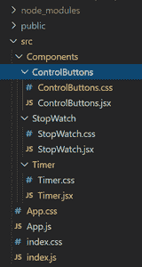
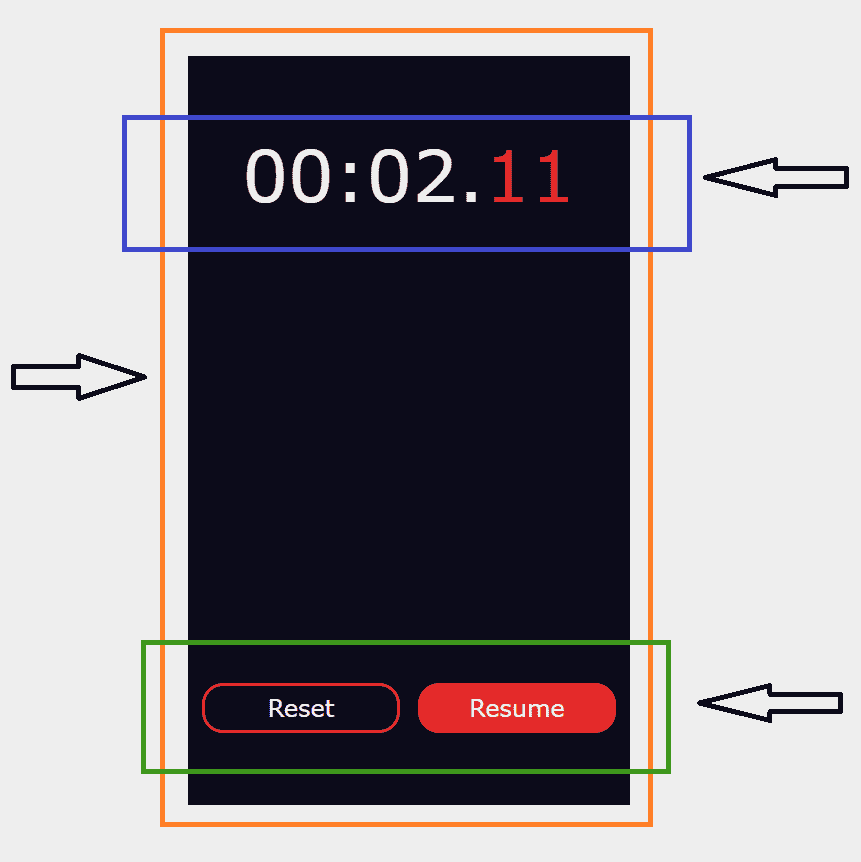

# 使用 ReactJS

创建秒表

> 原文:[https://www . geeksforgeeks . org/create-a-stop-watch-use-reactjs/](https://www.geeksforgeeks.org/create-a-stop-watch-using-reactjs/)

我们可以使用以下方法在 ReactJS 中创建 Stop Watch。我们的秒表将具有启动、暂停、恢复和重置功能。

**创建反应应用程序并安装模块:**

**步骤 1:** 使用以下命令创建一个 React 应用程序。

```jsx
npx create-react-app stopwatch
```

**第 2 步:**创建项目文件夹后，即秒表**，**使用以下命令移动到它。

```jsx
cd stopwatch
```

在**src**T4 文件夹内创建一个**组件**文件夹。在**组件**文件夹中，创建三个不同的子文件夹，名称分别为秒表、计时器和控制按钮。现在做一个**。jsx** 和 a **。每个组件的 css** 。

**项目结构:**如下图。



**我们应用中使用的组件有:**



**示例:**外部组件为**秒表，**蓝色标记为**计时器，**绿色组件将表示为**控制按钮。**

## index.js

```jsx
import React from 'react';
import ReactDOM from 'react-dom';
import './index.css';
import App from './App';

ReactDOM.render(
  <React.StrictMode>
    <App />
  </React.StrictMode>,
  document.getElementById('root')
);
```

## App.js

```jsx
import './App.css';
import StopWatch from './Components/StopWatch/StopWatch.js';

function App() {
  return (
    <div className="App">
      <StopWatch />
    </div>
  );
}

export default App;
```

## App.css 文件

```jsx
.App{
  background-color: rgb(238, 238, 238);
  width: 100vw;
  height: 100vh;
  display: flex;
  flex-direction: column;
  align-items: center;
  justify-content: center;
}
```