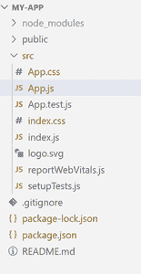

# 使用 ReactJS

创建文本到语音的应用程序

> 原文:[https://www . geesforgeks . org/create-a-text-to-speech-application-use-reactjs/](https://www.geeksforgeeks.org/create-a-text-to-speech-application-using-reactjs/)

**React.js:** React 是一个声明性的、高效的、灵活的 JavaScript 库，用于构建用户界面。是 MVC 中的‘V’。ReactJS 是一个开源的、基于组件的前端库，只负责应用程序的视图层。它由脸书维护。

**在 React JS 中使用 Recharts 创建折线图的步骤:**

**步骤 1:** 创建反应项目

```
npx create-react-app my-app
```

**步骤 2:** 更改您的目录并输入您的主文件夹图表如下

```
cd my-app
```

**项目结构如下:**



**步骤 2:** 通过以下命令安装反应语音套件:

```
npm i react-speech-kit
```

**第三步:**在 **App.js** 上写代码:

## java 描述语言

```
import './App.css';
import Speech from './speech';
function App() {
  return (
    <div className="App">
      <Speech/>
    </div>
  );
}
export default App;
```

**第四步:**在 **Speech.js** 文件中写代码

## java 描述语言

```
import React from "react";
import { useSpeechSynthesis } from "react-speech-kit";
const Speech = () => {
  const [value, setValue] = React.useState("");
  const { speak } = useSpeechSynthesis();
  return (
    <div className="speech">
      <div className="group">
        <h2>Text To Speech Converter Using React Js</h2>
      </div>
      <div className="group">
        <textarea
          rows="10"
          value={value}
          onChange={(e) => setValue(e.target.value)}
        ></textarea>
      </div>
      <div className="group">
        <button onClick={() => speak({ text: value })}>
          Speech
        </button>
      </div>
    </div>
  );
};
export default Speech;
```

**第五步:**在 **App.css** 上写代码

## 半铸钢ˌ钢性铸铁(Cast Semi-Steel)

```
* {
  margin: 0;
  padding: 20px;
  box-sizing: border-box;
}
body {
  font-family: sans-serif;
}
.Speech {
   width: 50px;
}
.group {
  margin: 7px 0;
}
textarea {
  width: 100%;
  padding: 5px 10px;
  border: 1px solid rgb(228, 20, 20);
  outline: none;
  border-radius: 3px;
}
button {
  width: 100%;
  display: block;
  padding: 10px 22px;
  color: rgb(10, 10, 10);
  font-weight: bold;
  cursor: pointer;
  outline: none;
  background: rgb(227, 240, 219);;
}
h2 {
  margin-bottom: 10px;
  text-align: center;
}
```

**第 6 步:运行应用程序的步骤:**打开终端，键入以下命令。

```
npm start
```

**输出:**打开浏览器，我们的项目显示在 URL[http://localhost:3000/](http://localhost:3000/)中

<video class="wp-video-shortcode" id="video-707280-1" width="640" height="360" preload="metadata" controls=""><source type="video/mp4" src="https://media.geeksforgeeks.org/wp-content/uploads/20211001180501/final-(1).mp4?_=1">[https://media.geeksforgeeks.org/wp-content/uploads/20211001180501/final-(1).mp4](https://media.geeksforgeeks.org/wp-content/uploads/20211001180501/final-(1).mp4)</video>