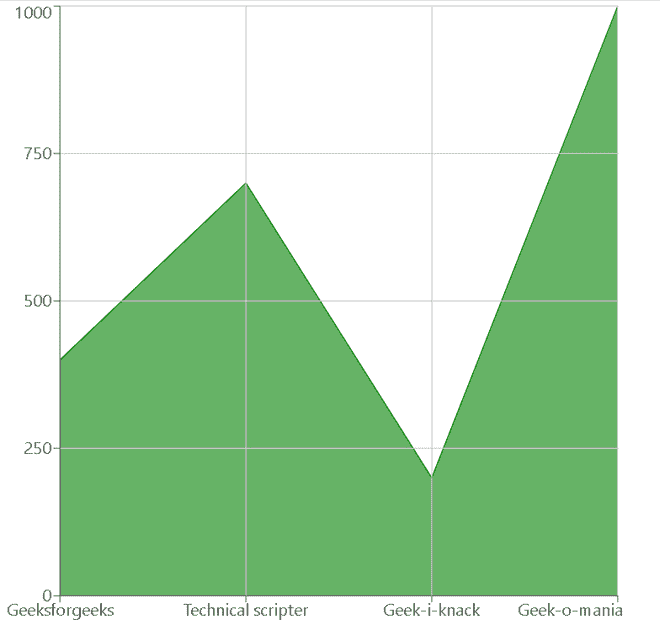

# 使用反应堆中的充电创建面积图

> 原文:[https://www . geeksforgeeks . org/create-a-area-chart-use-recharts-in-reactjs/](https://www.geeksforgeeks.org/create-an-area-chart-using-recharts-in-reactjs/)

**简介:** Rechart JS 是一个用于为 React JS 创建图表的库。借助 React 和 D3(数据驱动文档)，该库用于构建折线图、条形图、饼图等。

为了使用 Recharts 创建面积图，我们创建了一个包含实际数据的数据集。然后，我们使用带有数据属性的 area 元素和 datakey 属性来定义切片，数据属性将创建数据集的数据，data key 属性是带有切片值的属性名称。

**创建反应应用程序并安装模块:**

*   **步骤 1:** 使用以下命令创建一个 React 应用程序。

    ```jsx
    npx create-react-app foldername
    ```

*   **步骤 2:** 创建项目文件夹(即文件夹名)后，使用以下命令移动到该文件夹。

    ```jsx
    cd foldername
    ```

*   **步骤 3:** 创建 ReactJS 应用程序后，使用以下命令安装所需的模块。

    ```jsx
    npm install --save recharts
    ```

**项目结构:**如下图。


**示例:**现在在 **App.js** 文件中写下以下代码。在这里，App 是我们编写代码的默认组件。

## App.js

```jsx
import React from 'react';
import { AreaChart, Area, CartesianGrid, XAxis, YAxis } from 'recharts';

const App = () => {

// Sample data
const data = [
  {name: 'Geeksforgeeks', students: 400},
  {name: 'Technical scripter', students: 700},
  {name: 'Geek-i-knack', students: 200},
  {name: 'Geek-o-mania', students: 1000}
];

return (
<AreaChart width={600} height={600} data={data}>
    <Area dataKey="students" fill="green" stroke="green" />
    <CartesianGrid stroke="#ccc" />
    <XAxis dataKey="name" />
    <YAxis />
  </AreaChart>
);
}

export default App;
```

**运行应用程序的步骤:**从项目的根目录使用以下命令运行应用程序:

```jsx
npm start
```

**输出:**现在打开浏览器，转到***http://localhost:3000/***，会看到如下输出:



输出