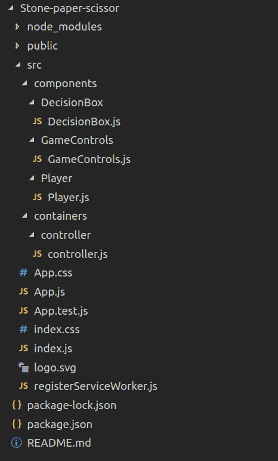

# 使用 ReactJS

创建石头纸剪刀游戏

> 原文:[https://www . geesforgeks . org/create-rock-paper-剪刀-game-use-reactjs/](https://www.geeksforgeeks.org/create-rock-paper-scissor-game-using-reactjs/)

在这里，两位选手将一个接一个地轮流上场。从第一个玩家开始，然后是第二个玩家。有三种武器可供选择，即石头、纸、剪刀。一旦玩家二开始游戏，他的回合结果将被计算出来，更新两个玩家的赢/输状态。

**使用的技术/先决条件:**

1.  ReactJS
2.  用户界面的 Antd 库

**方法:**容器是有状态反应组件(基于类)。组件是无状态反应组件(基于功能)。在这个项目中，我有一个容器，它是控制器，负责状态管理和整个游戏逻辑。此外，还有三个组成部分，即:

```
Player ->Represent​ing a Player entity in-game;
GameControls -> For Choosing stone, paper, or scissor; 
DecisionBox -> Displays win/loose status for players;
```

在点击武器按钮时，控制器中的状态会针对相应的玩家进行更新。当第二个玩家的武器被更新时，结果处理函数会计算出一个结果，这个结果涵盖了石头、纸、剪刀的所有九种组合，每次两个。

**项目结构:**



**步骤:**

1.  使用创建-反应-应用程序命令设置反应项目:**创建-反应-应用程序< <项目名称>>–脚本-版本 1.1.5。**使用这个命令，除了要在 src 文件夹中手动创建的组件和容器文件夹之外，将生成如上的项目结构。
2.  使用以下命令安装 antd 库: **npm 安装 antd**
3.  移除 **App.css** 中的代码。
4.  在 **App.js** 中编辑代码:App 组件渲染控制器并显示标题。
    T4T6T8】Java 描述语言

    ```
    import React, { Component } from "react";
    import Controller from "./containers/controller/controller";
    import { Typography } from "antd";

    import "antd/dist/antd.css";

    import "./App.css";
    const { Title } = Typography;

    class App extends Component {
      render() {
        return (
          <div className="App">
            <Title level={3} style={{ textAlign: "center" }}>
              Stone Paper Scissor
            </Title>
            <Controller />
          </div>
        );
      }
    }

    export default App;
    ```

5.  **Controller.js:** 控制器持有一个状态，该状态包括每个玩家最后使用的武器、当前赢/输状态以及指示轮到哪个玩家的活动状态

    ## java 描述语言

    ```
    import React, { Component } from "react";
    import { Row, Col, Divider } from "antd";
    import { Typography } from "antd";
    import axios from "axios";
    import "antd/dist/antd.css";

    import Player from "../../components/Player/Player";
    const { Title } = Typography;

    class Controller extends Component {
      state = {
        playerOne: {
          active: true,
          weapon: "",
          status: ""
        },
        playerTwo: {
          active: false,
          weapon: "",
          status: ""
        }
      };
    ```

    这里的核心思想是，在点击武器按钮时，相应玩家在状态中的武器应该得到更新，下一个玩家的回合应该到来，这是通过 toggleactive 功能完成的。此外，如果第二个玩家的武器被更新，那么赢/输也应该被更新，这是通过结果处理器功能完成的。对于游戏逻辑来说，它有一堆功能:

    *   **武器更新:**用于更新玩家在状态下的武器。它需要两个参数，第一个是 playerId，即 playerOne 或 playerTwo，因为这是一个两人游戏，第二个是玩家选择的武器。

        ## 爪哇描述语言

    ```
    weaponUpdate = (player, weapon) => {this.setState({
    [player]: {
    ...this.state[player],
    weapon: weapon
    }
    });
    if (player == "playerTwo") {
    this.resultHandler();
    } else {
    this.toggleActive();
    }
    };
    ```