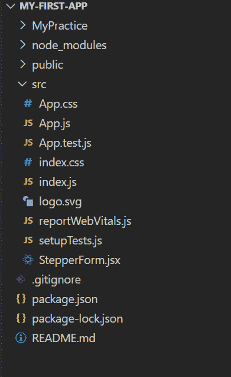
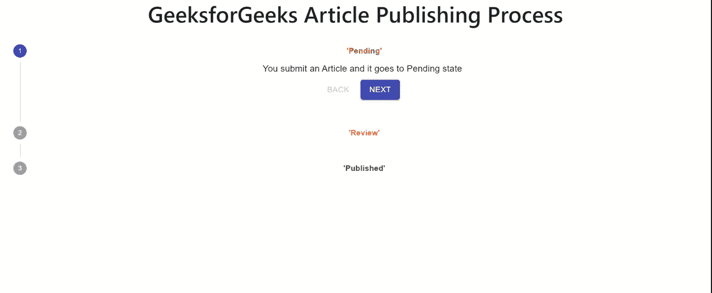

# 在反应中创建垂直步进器

> 原文:[https://www . geesforgeks . org/creating-a-vertical-stepper-in-react/](https://www.geeksforgeeks.org/creating-a-vertical-stepper-in-react/)

步进器通过一系列逻辑和编号的步骤显示进度。它们也可以用于导航。步骤保存后，步进器可能会显示短暂的反馈信息。

在本文中，我们将学习如何使用 *react 和 material-ui 创建垂直步进器。*

**创建反应应用程序**

**步骤 1:** 使用以下命令创建 react app。

```jsx
npx create-react-app my-first-app
```

**步骤 2:** 通过执行命令将目录更改为该文件夹:

```jsx
cd my-first-app
```

**步骤 3:** 安装必要的依赖项。转到目录“src ”,在那里执行命令提示符并运行命令。

```jsx
npm install @material-ui/core/Stepper
npm install @material-ui/core/Step
npm install @material-ui/core/StepLabel
```

**第 4 步:**通过在 src 中执行以下命令运行您的应用程序

```jsx
npm start
```

**文件结构:**



**文件名:App.js**

在根组件中导入< GeekStepper/>组件

## java 描述语言

```jsx
function App() {
  return (
    <div className="App">
      <GeekStepper />
    </div>
  );
}

export default App;
```

**文件名:StepperForm.jsx**

在这个文件中，我们将实现步进器。在这个例子中；我们将在 GeeksforGeeks 中解释文章发布的过程。文章经过 3 个状态

*   悬而未决的
*   回顾
*   出版

Stepper 是使用 react 中的 material-ui 创建的。我们已经在这个组件中导入了不同的用户界面类，如步进器、步进标签等。步进器使用预激活步骤和激活步骤实现。这些步骤用于显示活动的表单组件并返回。

## java 描述语言

```jsx
import React from 'react';
import { makeStyles, Theme, createStyles } 
    from '@material-ui/core/styles';
import Stepper from '@material-ui/core/Stepper';
import Step from '@material-ui/core/Step';
import StepLabel from '@material-ui/core/StepLabel';
import StepContent from '@material-ui/core/StepContent';
import Button from '@material-ui/core/Button';
import Paper from '@material-ui/core/Paper';
import Typography from '@material-ui/core/Typography';

const useStyles = makeStyles((theme: Theme) =>
  createStyles({
    root: {
      width: '100%',
    },
    button: {
      marginTop: theme.spacing(1),
      marginRight: theme.spacing(1),
    },
    actionsContainer: {
      marginBottom: theme.spacing(2),
    },
    resetContainer: {
      padding: theme.spacing(3),
    },
  }),
);

function getSteps() {
  return [<b style={{color:'red'}}>'Pending'</b>, 
      <b style={{color:'orange'}}>
  'Review'</b>, <b style={{color:'green'}}>'Published'</b>];
}

function getStepContent(step: number) {
  switch (step) {
    case 0:
      return `You submit an Article and it goes to Pending state `;
    case 1:
      return 'Article is reviewed';
    case 2:
      return `Hey Geek!! Your Article is Published`;
    default:
      return 'Unknown step';
  }
}

export default function GeekStepper() {
  const classes = useStyles();
  const [activeStep, setActiveStep] = React.useState(0);
  const steps = getSteps();

  const handleNext = () => {
    setActiveStep((prevActiveStep) => prevActiveStep + 1);
  };

  const handleBack = () => {
    setActiveStep((prevActiveStep) => prevActiveStep - 1);
  };

  const handleReset = () => {
    setActiveStep(0);
  };

  return (
    <div className={classes.root}>
    <h1>GeeksforGeeks Article Publishing Process</h1>
      <Stepper activeStep={activeStep} orientation="vertical">
        {steps.map((label, index) => (
          <Step key={label}>
            <StepLabel>{label}</StepLabel>
            <StepContent>
              <Typography>{getStepContent(index)}</Typography>
              <div className={classes.actionsContainer}>
                <div>
                  <Button
                    disabled={activeStep === 0}
                    onClick={handleBack}
                    className={classes.button}
                  >
                    Back
                  </Button>
                  <Button
                    variant="contained"
                    color="primary"
                    onClick={handleNext}
                    className={classes.button}
                  >
                    {activeStep === steps.length - 1 ? 'Finish' : 'Next'}
                  </Button>
                </div>
              </div>
            </StepContent>
          </Step>
        ))}
      </Stepper>
      {activeStep === steps.length && (
        <Paper square elevation={0} 
          className={classes.resetContainer}>
          <Typography>
            All steps completed - your Article is Published
          </Typography>
          <Button onClick={handleReset} className={classes.button}>
            Reset
          </Button>
        </Paper>
      )}
    </div>
  );
}
```

**运行应用程序的步骤:**打开终端，键入以下命令。

npm 启动

**输出:**

