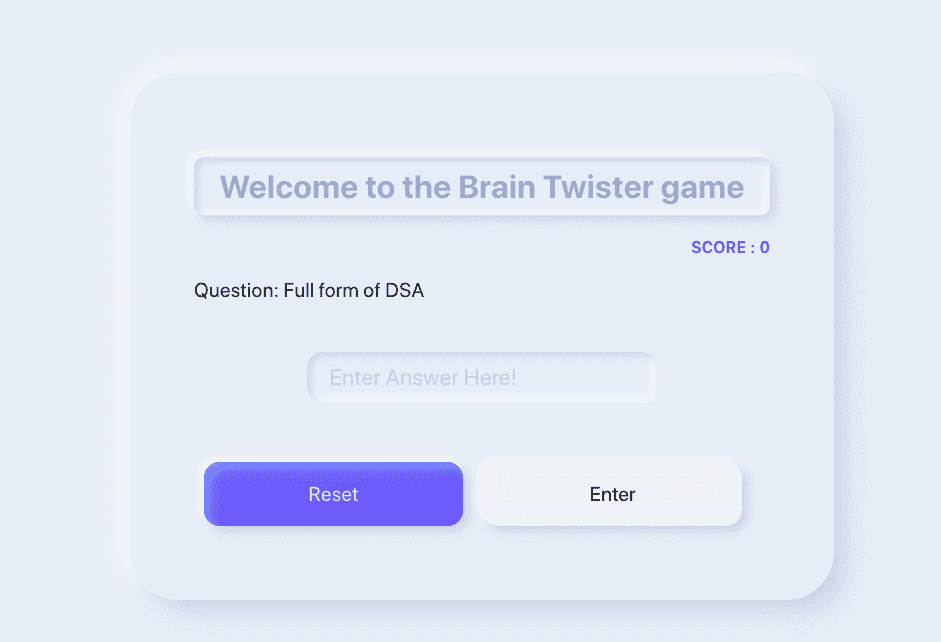
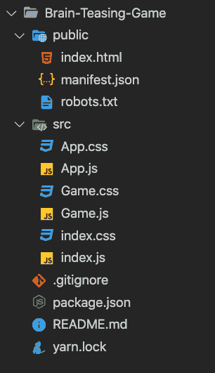
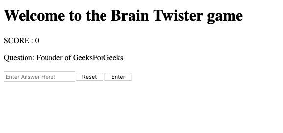

# 设计一款带有 React 和 NeumorphismUI 的大脑调侃游戏

> 原文:[https://www . geeksforgeeks . org/design-a-brain-chain-with-react-neommorphismui/](https://www.geeksforgeeks.org/design-a-brain-teasing-game-with-react-and-neumorphismui/)

一个戏弄大脑的游戏旨在尽可能快地找出一个人能回答多少个问题。我们将设计一个带有神经形态界面的反应应用程序，它将显示一些关于一些常见事实的有趣问题，用户必须尽快回答它们。

React 是一个声明性的、高效的、灵活的 JavaScript 库，用于构建用户界面。是 MVC 中的‘V’。ReactJS 是一个开源的、基于组件的前端库，只负责应用程序的视图层。它由脸书维护。

React 使用声明性范例，使您更容易对您的应用程序进行推理，旨在既高效又灵活。它为应用程序中的每个状态设计简单的视图，当数据发生变化时，React 将有效地更新和呈现正确的组件。声明式视图使您的代码更可预测，也更容易调试。

**为什么要用 NeumorphismUI？**

NeumorphismUI 是一种用于设计网页元素、框架和屏幕的现代软 UI，也是一种相对较新的设计趋势，最近获得了很大的流行。它的美学特征是极简而真实的用户界面，这是对旧的 SkeuomorphismUI 设计趋势的一种重新推进。因此，为了使我们的游戏更加用户友好和吸引人，我们将在我们的项目中使用它。

这个游戏会显示一组必须尽快回答的问题，分数也会相应地显示出来。回答错误或键入错误的答案将导致负面评分。

我们将首先创建 React 应用程序，并用一些 CSS 样式向其中添加一些逻辑，给它一种柔和的感觉。

**我们在建什么？**

下面只是我们在这里建设的一瞥。



现在，我们将编写一些 JSX 代码来构建我们的 web 应用程序。

**JSX 布局:**JSX 布局定义了将在页面上显示的元素结构。这包括

*   游戏主容器:这个部分包含我们的游戏标题和游戏容器。
*   游戏容器:这个部分包含了包含整个游戏逻辑的游戏组件。
*   游戏组件:该组件包含游戏分数、问题、错误和成功消息、输入区域、重置和输入按钮。
*   游戏错误和成功消息:如果用户输入了不正确的答案，或者如果他试图用空的输入区域提交答案，将显示错误消息，而如果用户输入了正确的答案，将显示成功消息。
*   输入区:该部分包含必须键入答案的输入区。
*   重置和输入按钮:如果用户想跳到另一个问题，他可以点击重置按钮，或者他可以点击输入按钮提交答案。

**实施:**

**步骤 1:** 使用以下命令创建一个反应应用程序:

```jsx
npx create-react-app Brain-Teasing-Game
```

**第二步:**创建项目文件夹后，即大脑-戏弄-游戏，使用以下命令移动到它:

```jsx
cd Brain-Teasing-Game
```

**项目结构:**如下图。



项目结构

**文件名-App.js:**

## java 描述语言

```jsx
import React from 'react';
import app from './App.css';
import Game from './Game.js';

function App() {
  // Creating the container and importing 
  // Game component
  return (
    <div className={app.Game__main_container}>
      <h1 className={app.Game__heading}>
       Welcome to the Brain Twister game
      </h1>
      <div className={app.Game__container}>
        <Game />
      </div>
    </div>
  );
}

export default App;
```

**文件名-Game.js:**

## java 描述语言

```jsx
import React, { useEffect, useState } from 'react';
import game from './Game.css';

const Game = () => {

// Initialising states with default values
  const [word, setWord] = useState('');
  const [value, setValue] = useState('');
  const [err, setErr] = useState('');
  const [success, setSuccess] = useState('');
  const [score, setScore] = useState(0);
  const [question, setQuestion] = useState('');

  // Starts generating words as soon as 
  // the component is placed in the DOM Tree
  useEffect(() => {
    wordGenerate();
  }, []);

  // Defining questions with their
  // corresponding answers
  const QUESTION = [];

  const ANSWERS = [];

  // Generating Random questions and storing
  // their answers in the state variable
  const wordGenerate = () => {};

  // checking if the typed answer is correct or not
  const check = () => {};

  // defining function to skip
  // to another question
  const reset = () => {};

  // Writing the JSX Code
  return (
    <div>
      <p className={game.Game__score}>SCORE : {score}</p>

      {question ? (
        <p className={game.Game__question}>Question: {question}</p>

      ) : null}

      {err ? <p className={game.Game__error}>{err}</p>
 : null}

      {success ? <p className={game.Game__success}>{success}</p>
 : null}

      <input
        type="text"
        value={value}
        onChange={(e) => setValue(e.target.value)}
        placeholder="Enter Answer Here!"
        className={game.Game__input_answer}
      />

      <button onClick={reset} className={game.Game__start}>
        Reset
      </button>
      <button onClick={check} className={game.Game__submit}>
        Enter
      </button>
    </div>
  );
};

export default Game;
```

现在，我们的应用程序的基本结构已经创建，现在是时候通过定义游戏组件中的初始化函数来添加一些逻辑了。



**游戏的主逻辑**:游戏的主逻辑在已经初始化的函数中定义。有几个功能协同工作来运行游戏。

*   **第一步:**写下问题和相应的答案

    戏弄大脑游戏的问题和答案将存储在初始化的数组中。

    ## java 描述语言

    ```jsx
    const QUESTION = [
        'Greatest Computer Science portal for geeks',
        'Full form of DSA',
        'Most Used Web Framework',
        'Founder of GeeksForGeeks',
        'Who Created Facebook',
        'CEO of Tesla and SpaceX',
        'When 5G going to launch in India',
      ];

      const ANSWERS = [
        'GeeksForGeeks',
        'Data Structures and algorithms',
        'React',
        'Sandeep Jain',
        'Mark Zuckerberg',
        'Elon Musk',
        '2021',
      ];
    ```

*   **第二步:**生成随机问题

    当游戏组件被放置在 DOM 树中时，或者当用户点击输入或重置按钮时，将调用一个函数 wordGenerate()。

    我们将生成一个 0 到 ANNESS 数组长度范围内的随机数，将其存储为一个变量，然后使用它来挑选随机问题及其答案，并将其存储在状态变量中。

    ## java 描述语言

    ```jsx
    const wordGenerate = () => {
      const randomNumber = Math.floor(Math.random() * ANSWERS.length);
      setWord(ANSWERS[randomNumber]);
      setQuestion(QUESTION[randomNumber]);
    };
    ```

*   **步骤 3:** 检查键入的答案是否正确

    我们这里有两个案例:

    *   用户没有在输入区输入任何值:
        *   如果键入的值为空，那么它将显示一条错误消息
    *   用户输入了一些值:
        *   将输入的值转换为小写，将其与存储的答案进行比较，然后相应地显示错误或成功消息

    ## java 描述语言

    ```jsx
    const check = () => {
        if (value) {
          if (value.toLowerCase() === word.toLowerCase()) {
            setValue('');
            setErr(null);
            setSuccess('Correct Answer');
            setScore((prevScore) => prevScore + 1);
            wordGenerate();
          } else {
            setSuccess(null);
            setErr('Wrong Answer');
            setScore((prevScore) => prevScore - 1);
            setValue('');
            wordGenerate();
          }
        } else {
          setSuccess(null);
          setErr('Please enter the value!');
        }
      };
    ```