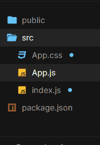

# 使用成帧器运动&反应

设计动画切换开关按钮

> 原文:[https://www . geesforgeks . org/design-an-animated-toggle-switch-button-use-framer-motion-react/](https://www.geeksforgeeks.org/design-an-animated-toggle-switch-button-using-framer-motion-react/)

在本文中，我们将学习如何使用创建动画切换开关按钮

*   成帧器运动
*   React.js

**先决条件:**

1.  应该安装 NodeJS
2.  JavaScript (ES6)知识。
    1.  [**箭头功能(ES6)**](https://www.geeksforgeeks.org/arrow-functions-in-javascript/)
    2.  [**三元算子**](https://www.geeksforgeeks.org/javascript-ternary-operator/)
    3.  [**文档背景颜色**](https://www.geeksforgeeks.org/html-dom-style-backgroundcolor-property/)
3.  HTML/CSS 的知识。
4.  ReactJS 的基本知识。
    1.  [**反应使用状态**](https://www.geeksforgeeks.org/reactjs-usestate-hook/)
    2.  [**反应使用效果**](https://www.geeksforgeeks.org/reactjs-useeffect-hook/)

**创建反应应用程序并安装模块:**

**步骤 1:** 现在，您将使用 create-react-app 启动一个新项目，因此请打开您的终端并键入:

```jsx
npx create-react-app toggle-switch
```

**步骤 2:** 创建项目文件夹(即切换开关)后，使用以下命令移动到该文件夹。

```jsx
cd toggle-switch
```

**步骤 3:** 添加项目期间需要的 npm 包:

```jsx
npm install framer-motion
```

或者

```jsx
npm i framer-motion
```

**第四步:**现在用你最喜欢的代码编辑器打开你新创建的项目，我正在使用 Visual Studio Code，我会推荐你用同样的代码。

打开 src 文件夹并删除以下文件:

1.  logo .. .svg
2.  serviceWorker.js
3.  setupTests.js
4.  index.css
5.  App.test.js(如果有)

**项目结构:**你的文件夹结构树应该是这样的。



文件夹结构

我强烈建议你写这段代码，而不仅仅是复制粘贴&玩 CSS，根据你的口味和需要稍微调整一下。

**进场:**

*   我们将使用 **const** & **箭头函数**对公用组件“**开关”**进行编码，该组件将用于创建拨动开关。
*   在 **Switch** 中，我们将根据通过析构作为道具传递的 **isOn** 的状态编写代码来更改类名和图像源。
*   切换开关及其动画将使用成帧器-motion 的 **motion.div** 组件和**动画**属性来实现。
*   在 **App** 中，我们将使用 **useState** 钩子来管理“iOn”的状态，通过点击切换开关按钮来改变该状态，该按钮又用于改变类名、背景色和图像源。
*   React **useEffect** 每当“iOn”的状态改变时，钩子都会用来创建一个副作用，从而相应地改变整个页面的背景颜色。

**示例:**

## App.js

```jsx
import React from "react";
import { useState, useEffect } from "react";
import { motion } from "framer-motion";
import "./App.css";

const Switch = ({ isOn, ...rest }) => {

  // initialize the customClassName according to the
  // state of the "isOn" using ternary operator
  const customClassName = 
     `toggleSwitch ${isOn ? "on" : "off"}`;

  // initialize the src according to the
  // state of the "isOn" using ternary operator
  const src = isOn
    ? 
"Toggle 1st Image link"
    : 
"Toggle 2nd Image link";

  return (
    <motion.div animate className=
        {customClassName} {...rest}>
      <motion.div animate>
        
      </motion.div>
    </motion.div>
  );
};

const App = () => {
  // useState hook is used to manage the state of
  // "isOn" that is used to change the className, 
  // background-color and img src accordingly
  const [isOn, setIsOn] = useState(false);

  useEffect(() => {
    // background-color changes every time "isOn" 
    // changes using JavaScript DOM methods
    document.body.style.backgroundColor = 
              isOn ? "#1c1c1c" : "#ffffff";
  }, [isOn]);

  return <Switch isOn={isOn} onClick={() => 
                          setIsOn(!isOn)} />;
};

export default App;
```

## App.css 文件

```jsx
body {
  margin: 0;
  display: flex;
  justify-content: center;
  align-items: center;
  min-height: 100vh;
  /* for smooth transition*/
  transition: 0.5s ease-in-out;
}

* {
  box-sizing: border-box;
}

.toggleSwitch {
  width: 170px;
  height: 100px;
  border-radius: 100px;
  padding: 10px;
  display: flex;
  cursor: pointer;
  z-index: 2;
}

/* CSS for switch when "on"*/
.toggleSwitch.on {
  background-color: #1aad66;
  justify-content: flex-end;
  /* for smooth transition*/
  transition: 0.5s ease-in-out;
}

/*CSS for switch when "off"*/
.toggleSwitch.off {
  background-color: #dddddd;
  justify-content: flex-start;
}

.toggleSwitch div {
  width: 80px;
  height: 80px;
  border-radius: 100%;
}

img {
  width: 80px;
  height: 80px;
  border-radius: 100%;
}
```

## index.js

```jsx
import React from "react";
import ReactDOM from "react-dom";
import App from "./App";

const rootElement = document.getElementById("root");
ReactDOM.render(
  <React.StrictMode>
    <App />
  </React.StrictMode>,
  rootElement
);
```

**运行应用程序的步骤:**从项目的根目录使用以下命令运行应用程序。

```jsx
npm start
```

**输出:**现在打开浏览器，转到 **http://localhost:3000/** ，会看到如下输出。

