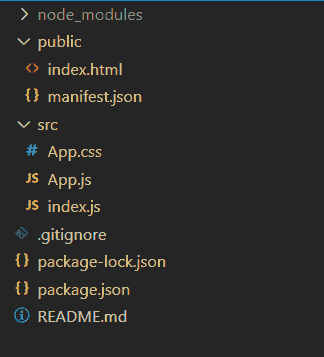
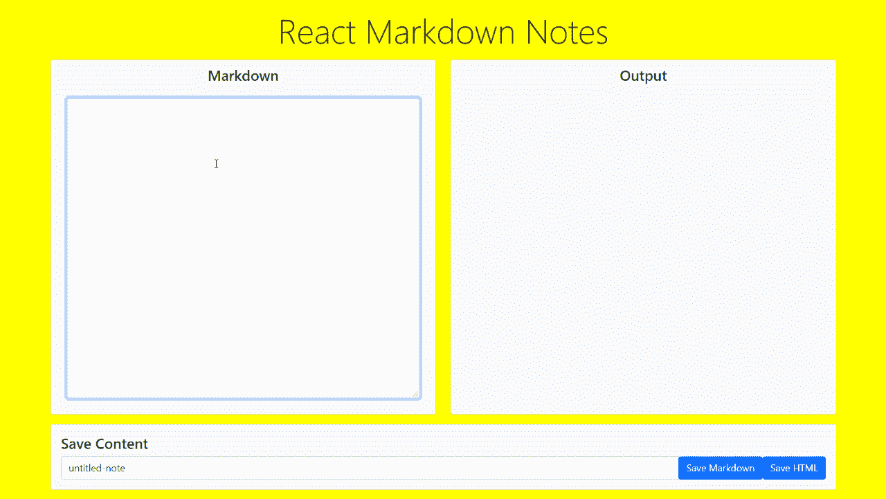

# 在 ReactJS 中设计一个记笔记应用程序

> 原文:[https://www . geesforgeks . org/design-a-markdown-note-taking-application-in-reactjs/](https://www.geeksforgeeks.org/designing-a-markdown-note-taking-application-in-reactjs/)

在本文中，我们将学习如何在 **React** 中设计一个**标记**笔记应用程序，它可以帮助用户快速记下笔记并下载渲染输出。使用向下标记可以减少格式化文本的时间，从而只使用[向下标记](https://www.geeksforgeeks.org/introduction-to-markdown/)语法创建丰富的文本内容。

我们将使用 [React](https://www.geeksforgeeks.org/reactjs-tutorials/) 库来快速创建用户界面，因为它将根据需要处理 DOM 的更新。我们将使用 [Bootstrap](https://www.geeksforgeeks.org/bootstrap-tutorials/) CSS 来设计应用程序，并使其用户友好。我们还将使用 [Blob](https://www.geeksforgeeks.org/javascript-blob/) 将内容保存到我们的设备中。

我们将按照以下步骤创建我们的应用程序:

**第一步:创建项目**

我们将从使用**创建-反应-应用**工具创建一个新的反应项目开始。您可以使用以下命令创建一个具有所需名称的。请确保系统上安装了**节点**和 **npm** 。

```
npx create-react-app react-md-note-app
```

**项目结构:**然后我们将删除所有不需要的文件。删除文件后的文件结构如下:



项目目录

**步骤 2:** **安装必要的模块**

我们将从将引导 CDN 添加到 index.html 页面开始。CDN 链接可以在[这里](https://getbootstrap.com/docs/5.0/getting-started/introduction/)找到，可以直接添加到索引页的头部。

我们还需要两个 **npm 包**，一个是 [**markdown-it**](https://www.npmjs.com/package/markdown-it) 包，它负责解析 markdown 内容并以 HTML 形式向我们提供渲染输出。我们可以简单地使用这个 HTML 来显示我们的输出。另一个模块是 [**文件保存程序**](https://www.npmjs.com/package/file-saver) 包，它简化了将给定的 blob 保存到系统的任务。以下命令用于安装这两个软件包:

```
npm install markdown-it file-saver
```

**步骤 3:** **使用引导**创建简单的用户界面

我们将使用**引导网格**系统来创建布局，以确保我们的应用程序是移动响应的，并且在不编写大量 CSS 的情况下看起来很好。

应用程序可分为 3 个部分；允许用户在标记中输入注释的标记编辑器，显示渲染的 HTML 的输出区域，以及包含文件名输入字段和保存内容按钮的文件保存选项。使用 Bootstrap 的**卡**组件嵌套每个部分，并将相关组件添加到输入元素中。

我们还需要一些可以导入到我们的 App.js 文件中的 CSS 规则。我们可以创建一个名为 App.css 的新文件，并编写如下规则:

**App.css:**

## 半铸钢ˌ钢性铸铁(Cast Semi-Steel)

```
body {
  background-color: yellow; 
} 
.markdown-editor, .rendered-output {
  height: 100%;
  width: 100%;
  padding: 10px; 
} 
.markdown-textarea, .rendered-html-output {
  height: 60vh;
  width: 100%;
  overflow: auto;
}
```

**步骤 4:** **创建用于管理状态的钩子**

我们将使用[](https://www.geeksforgeeks.org/what-is-usestate-in-react/)**方法创建 3 个钩子来管理我们应用程序的 3 个部分中的状态。每个钩子返回变量本身及其初始状态，以及可用于设置该变量状态的函数。当组件的状态改变时，React 将自动重新呈现该组件。**

**这将允许我们简单地使用各自的函数和变量来处理每个组件的状态。**

****步骤 5:** **使用应用程序中的状态变量****

**我们现在将在前面创建的 3 个组件中使用这些变量。**

****标记文本**变量用在*文本区*中，我们将在这里写标记文本。我们将在*文本区*的*值*属性中使用该值。使用**设置标记向下文本** 功能，我们可以在这里更改文本的值，它将通过这个*值*属性显示。**

**在 div 元素中使用了 **renderedHTML** 变量，该变量将显示减价的渲染输出。由于**标记**模块将从标记返回 HTML，我们需要直接设置这个元素的内部 HTML。这将需要使用元素的*dangerouslystinnerhtml*属性，并传递一个带有 *_html 键的对象。***

****注意:**这是 React 中的一个特性，它不鼓励直接修改 HTML 来防止对网页的跨站点脚本(XSS)攻击。建议在直接使用任何用户输入的 HTML 内容之前对其进行清理。**

**最后， **fileName** 变量用于文件保护程序选项中，以便可以用来输入要保存的内容的文件名。我们还将把 *onChange* 事件处理程序绑定到 **setFileName** ，这样用户输入的任何值都会更新到变量中。我们可以通过访问事件目标并获取 value 属性来实现这一点。**

****步骤 6:创建我们之前定义的函数****

****HandleTextInput()函数:**该函数将获取在标记编辑器中输入的文本，并使用标记编辑器渲染所需的 HTML。**

**我们将首先通过获取目标的值来获取输入的文本。然后，我们初始化 MarkdownIt 的一个新实例，并使用它的渲染方法。然后我们将使用**setmarkdownlhtml**功能在输出区域设置这个，我们的最终 HTML 将在输出区域显示。该功能将在减价编辑器的 *onChange* 属性中使用。**

****save html()和 saveMarkdown()函数:**这些函数将用给定的文件名将内容保存到我们的系统中。在这两个功能中，我们将使用要保存的内容创建一个**斑点**对象。我们可以使用**渲染 HTML** 和**标记文本**变量来获取应用程序的当前文本内容。**

**接下来指定 blob 的类型。我们可以使用**文本/html** 作为渲染输出，这样它就被保存为一个 html 文件，而只有**文本**作为标记文本。**

**我们现在将使用**文件保存**模块的**另存为()**方法将文件保存到系统中。这个方法使用两个参数，第一个是必须保存的 blob 对象，第二个是应该用来保存文件的文件名。我们可以通过使用**文件名**变量获得文件名，并传递我们之前创建的 blob 对象。**

**我们可以将这些函数分别与我们创建的两个按钮的 *onClick* 事件处理程序绑定。点击按钮将在浏览器上打开一个带有给定文件名的*另存为*对话框，用户可以根据需要选择保存文件。**

****App.js:****

## **java 描述语言**

```
import { useState } from 'react';

// Import the required modules
import MarkdownIt from 'markdown-it';
import FileSaver from 'file-saver';

import './App.css';

function App() {

  // Create the states that will be used 
  // through the application
  // This state will be used for the Markdown text
  let [markdownText, setMarkDownText] = useState("");

  // This state will be used for the rendered HTML
  let [renderedHTML, setRenderedHTML] = useState("");

  // This state will be used for the filename while saving
  let [fileName, setFileName] = useState("untitled-note");

  // Create a function that will be invoked
  // whenever the user modifies the content
  // in the textarea
  function handleTextInput(e) {

    // Change the text of the markdown side
    setMarkDownText(e.target.value);

    // Initialize a MarkdownIt instance
    let md = new MarkdownIt();

    // Render out the markdown to HTML using
    // the render() method
    let renderedHTML = md.render(e.target.value);

    // Change the markdown's side to the rendered HTML
    setRenderedHTML(renderedHTML);
  }

  // Create a function download the rendered HTML
  function saveHTML() {

    // Create a new Blob of the type 'text/html'
    // using the rendered HTML content
    let blobFile = new Blob([renderedHTML], {
      type: "text/html"
    });

    // Save the file using the given file name
    FileSaver.saveAs(blobFile, fileName);
  }

  // Create a function download the Markdown text
  function saveMarkdown() {

    // Create a new Blob of the type 'text'
    // using the markdown content
    let blobFile = new Blob([markdownText], {
      type: "text"
    });

    // Save the file using the given file name
    FileSaver.saveAs(blobFile, fileName);
  }

  return (
    <div className="container">
      <h2 className="app-heading text-center
                     display-4 my-3">
        React Markdown Notes
      </h2>
      <div className="row">
        <div className="col col-sm-12 col-md-6">

          {/* Card for the markdown editor */}
          <div className="card bg-light markdown-editor">
            <h4 className="card-title text-center">
              Markdown
            </h4>
            <div className="card-body">

              {/* Textarea for the markdown editor */}
              <textarea
                className="form-control markdown-textarea"
                rows={20}
                value={markdownText}
                onChange={handleTextInput}
              ></textarea>
            </div>
          </div>
        </div>
        <div className="col col-sm-12 col-md-6">

          {/* Card for the markdown editor */}
          <div className="card bg-light rendered-output">
            <h4 className="card-title text-center">
              Output
            </h4>

            {/* Textarea for the markdown editor */}
            <div className="card-body">
              <div

                // Change the HTML to be displayed according
                // to the render produced by MarkdownIt
                dangerouslySetInnerHTML={{ __html: renderedHTML }}
                className="rendered-html-output"
              >
              </div>
            </div>
          </div>
        </div>
      </div>

      <div className="row">
        <div className="col col-sm-12">

          {/* Card for the save files option */}
          <div className="card bg-light my-3">
            <div className="card-body">
              <h4>Save Content</h4>
              <div className="input-group">
                <input
                  type="text"
                  className="form-control"
                  placeholder="File name"
                  aria-label="File name"
                  value={fileName}
                  onChange={fname => setFileName(fname.target.value)}
                />

                {/* Buttons for saving the text */}
                <div className="input-group-append">
                  <button className="btn btn-primary" 
                          type="button" 
                          onClick={saveMarkdown}>
                            Save Markdown
                  </button>
                  <button className="btn btn-primary" 
                          type="button" 
                          onClick={saveHTML}>
                            Save HTML
                  </button>
                </div>
              </div>
            </div>
          </div>
        </div>
      </div>
    </div>
  )
}

export default App;
```

****第 6 步:运行和构建应用程序****

**我们可以使用以下命令运行这个应用程序。这将启动 React 的开发服务器，用于调试我们的应用程序。**

```
npm run start
```

**我们还可以构建这个应用程序，以便它可以托管在任何支持静态文件托管的平台上。我们可以使用以下命令运行项目来构建我们的应用程序:**

```
npm run build
```

****输出:****

****

****源代码:**[https://github . com/say antanm19/reac-markdown-notes-gfg](https://github.com/sayantanm19/react-markdown-notes-gfg)**