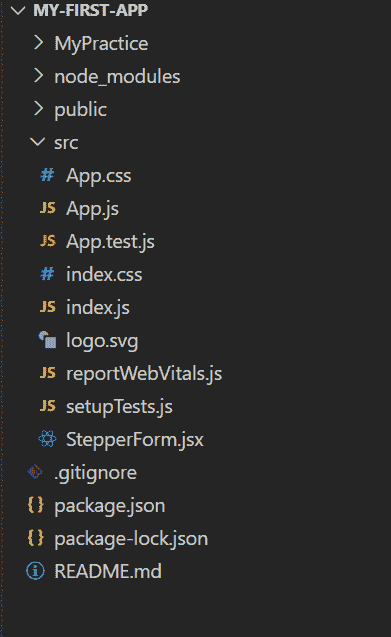
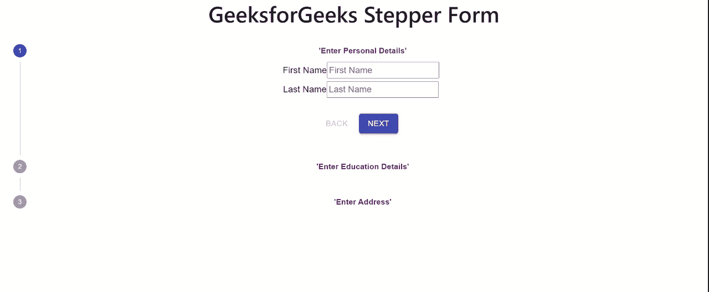

# 在反应堆中设计步进器形式

> 原文:[https://www . geesforgeks . org/design-a-steper-form-in-reactjs/](https://www.geeksforgeeks.org/designing-a-stepper-form-in-reactjs/)

步进器通过一系列逻辑和编号的步骤显示进度。它们也可以用于导航。步骤保存后，步进器可能会显示短暂的反馈信息。

在本文中，我们将学习如何使用 *react 和 material-ui 创建垂直步进器表单。*我们将创建一个垂直分档器，并向其中添加一个表单容器。在步进形式的所有阶段，我们将添加不同的细节。这就像你有不同的阶段来填写表格，完成所有步骤后，你将进入决赛。

**创建反应应用程序**

**步骤 1:** 使用以下命令创建 react app。

```jsx
npx create-react-app my-first-app
```

**步骤 2:** 通过执行命令将目录更改为该文件夹:

```jsx
cd my-first-app
```

**步骤 3:** 安装必要的依赖项。转到目录“src”，在那里执行命令提示符并运行命令

```jsx
npm install @material-ui/core/Stepper
npm install @material-ui/core/Step
npm install @material-ui/core/StepLabel
```

**文件结构:**如下图。



**步骤 4:** 在根组件中导入<极客步进器/ >组件。

## App.js

```jsx
import GeekStepper from './StepperForm'
function App() {
  return (
    <div className="App">
      <GeekStepper />
    </div>
  );
}

export default App;
```

**第五步:**在这个文件中，我们将实现 Stepper Form 来提交用户的个人详细信息、教育详细信息和地址。Stepper 是使用 react 中的 material-ui 创建的。我们已经在这个组件中导入了不同的用户界面类，如步进器、步进标签等。

使用主动步骤和主动步骤实现表单。这些步骤用于显示活动的表单组件并返回。

## StepperForm.jsx

```jsx
import React from 'react';
import { makeStyles, Theme, createStyles } 
        from '@material-ui/core/styles';
import Stepper from '@material-ui/core/Stepper';
import Step from '@material-ui/core/Step';
import StepLabel from '@material-ui/core/StepLabel';
import StepContent from '@material-ui/core/StepContent';
import Button from '@material-ui/core/Button';
import Paper from '@material-ui/core/Paper';
import Typography from '@material-ui/core/Typography';

const useStyles = makeStyles((theme: Theme) =>
  createStyles({
    root: {
      width: '100%',
    },
    button: {
      marginTop: theme.spacing(1),
      marginRight: theme.spacing(1),
    },
    actionsContainer: {
      marginBottom: theme.spacing(2),
    },
    resetContainer: {
      padding: theme.spacing(3),
    },

  }),
);

function getSteps() {
  return [<b style={{color:'purple'}}>'Enter Personal Details'</b>, 
  <b style={{color:'purple'}}>'Enter Education Details'</b>, 
  <b style={{color:'purple'}}>'Enter Address'</b>];
}

function getStepContent(step: number) {
  switch (step) {
    case 0:
      return (
        <form class="form-group">
        <label>First Name</label>
        <input type="text" placeholder="First Name"></input>
        <br></br>
        <label>Last Name</label>
        <input type="text" placeholder="Last Name"></input>
        </form>
      );
    case 1:
      return (
        <form class="form-group">
        <label>High School Percentage</label>
        <input type="number" placeholder="High School Percentage"></input>
        <br></br>
        <label>Graduation percentage</label>
        <input type="number" placeholder="Graduation Percentage"></input>
        </form>
      );
    case 2:
      return (
        <form class="form-group">
        <label>Permanent Address</label>
        <input type="text" placeholder="Permanent Address"></input>
        <br></br>
        <label>Temporary Address</label>
        <input type="text" placeholder="Temporary Address"></input>
        </form>
      );
    default:
      return 'Unknown step';
  }
}

export default function GeekStepper() {
  const classes = useStyles();
  const [activeStep, setActiveStep] = React.useState(0);
  const steps = getSteps();

  const handleNext = () => {
    setActiveStep((prevActiveStep) => prevActiveStep + 1);
  };

  const handleBack = () => {
    setActiveStep((prevActiveStep) => prevActiveStep - 1);
  };

  const handleReset = () => {
    setActiveStep(0);
  };

  return (
    <div className={classes.root}>
      <h1>GeeksforGeeks Stepper Form</h1>
      <Stepper activeStep={activeStep} orientation="vertical">
        {steps.map((label, index) => (
          <Step key={label}>
            <StepLabel>{label}</StepLabel>
            <StepContent>
              <Typography>{getStepContent(index)}</Typography>
              <div className={classes.actionsContainer}>
                <div>
                  <Button
                    disabled={activeStep === 0}
                    onClick={handleBack}
                    className={classes.button}
                  >
                    Back
                  </Button>
                  <Button
                    variant="contained"
                    color="primary"
                    onClick={handleNext}
                    className={classes.button}
                  >
                    {activeStep === steps.length - 1 ? 'Finish' : 'Next'}
                  </Button>
                </div>
              </div>
            </StepContent>
          </Step>
        ))}
      </Stepper>
      {activeStep === steps.length && (
        <Paper square elevation={0} className={classes.resetContainer}>
          <Typography>Form is submitted</Typography>
          <Button onClick={handleReset} className={classes.button}>
            Reset
          </Button>
        </Paper>
      )}
    </div>
  );
}
```

**运行应用程序的步骤:**通过在 src 中执行以下命令来运行您的应用程序

```jsx
npm start
```

**输出:**

