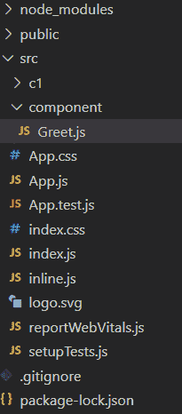

# 反应堆中道具的破坏

> 原文:[https://www . geeksforgeeks . org/reactjs 中道具的销毁/](https://www.geeksforgeeks.org/destructuring-of-props-in-reactjs/)

**解构**是一个简单的属性，用来让代码更加清晰可读，主要是我们在 React 中传递道具的时候。

**什么是破坏？**

*   析构是 JavaScript 的一个特点，它用于从数组或对象中取出数据段，我们可以将它们分配给开发人员创建的新的自己的变量。
*   在析构中，它不改变数组或任何对象，它通过在自己的新变量中赋值来复制所需的对象或数组元素，稍后我们可以在 React(类或函数)组件中使用这个新变量。
*   它使代码更加清晰。当我们使用[](https://www.geeksforgeeks.org/this-in-javascript/)**关键字访问道具时，我们必须在整个程序中使用 **this/ this.props** ，但是通过使用重组，我们可以通过在新变量中分配它们来丢弃 **this/ this.props** 。**
*   **这在复杂的应用程序中很难监控**道具**，所以通过在新的自身变量中分配这些道具，我们可以使代码更具可读性。**

****破坏优势:****

*   **通过分配他们自己的变量，这使得开发人员的生活变得容易。**
*   **嵌套数据更复杂，访问需要时间，但是通过使用析构，我们可以更快地访问嵌套数据。**
*   **它提高了代码的**可持续性**、**可读性**。**
*   **它有助于减少应用程序中使用的代码量。**
*   **它可以减少访问数据属性的步骤数。**
*   **它为组件提供精确的数据属性。**
*   **多次迭代对象数组可以节省时间。**
*   **在 ReactJS 中，我们在 render 函数内部多次使用三元运算符，不进行析构看起来很复杂，很难访问，但是通过使用析构，我们可以提高三元运算符的可读性。**

****如何使用解构？****

**我们可以在 ReactJS 中使用以下方法中的析构:**

****1。使用此.道具方法****

**在这个例子中，我们将简单地使用析构和不析构来显示一些单词。**

****项目结构:**如下图。**

****

****破坏**以更易读的格式提供使用道具的权限，并放弃每个属性对**道具**的需求。**

****App.js:** 现在在 App.js 文件中写下以下代码。在这里，App 是我们的默认组件，我们将在这里打印我们的组件代码。**

## **java 描述语言**

```jsx
import React from "react"
import Greet from './component/Greet'

 class App extends React.component{
   render(){
     return(
       <div className = "App">
                 <Greet active="KAPIL GARG"  activeStatus = "CSE"/>
       </div>
    );
  }
}
export default App;
```