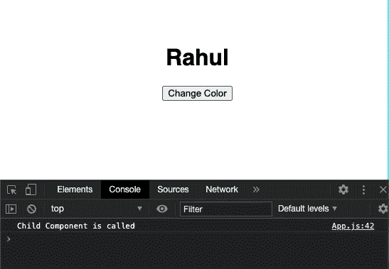

# 反应之间的差异。组件和反应。PureComponent？

> 原文:[https://www . geesforgeks . org/react-component 和 react-purecomponent 之差/](https://www.geeksforgeeks.org/difference-between-react-component-and-react-purecomponent/)

一个**组件**是 React 的核心构件之一。换句话说，我们可以说，您将在 React 中开发的每个应用程序都将由称为组件的部分组成。但是 React 有两种类型的组件:

1.  **反应过来。PureComponent:** 这是优化 React 应用程序最重要的方法之一。通过使用纯组件，不需要 shouldComponentUpdate()生命周期方法，因为 ReactJS 纯组件类将当前状态和道具与新的道具和状态进行比较，以决定组件是否应该重新呈现。
2.  **反应过来。成分:**但另一方面，*反应过来。组件*每次传递给它的道具发生变化时都会重新渲染自己，父组件会重新渲染，或者如果调用了 shouldComponentUpdate()方法。它不会优化 React 应用程序。它们实现起来既简单又快速，对于非常小的用户界面视图也很好，在这些视图中，重新渲染并不重要。它们提供了更清晰的代码和更少的需要处理的文件。

**何时使用 React。PureComponent？**

你可以选择反应。*反应完毕。组件*如果满足以下任一条件:

*   状态/道具应该是不可变的对象
*   状态/道具不应该有层次结构
*   当数据发生变化时，应该调用 forceUpdate()

**创建反应应用程序:**

**步骤 1:** 使用以下命令创建一个反应应用程序:

```
npx create-react-app functiondemo
```

**步骤 2:** 创建项目文件夹(即 functiondemo)后，使用以下命令移动到该文件夹:

```
cd functiondemo
```

**项目结构:**如下图。


项目结构

**示例:**在本例中，我们将构建一个名称颜色应用程序，当组件在 DOM 树中呈现时，该应用程序会更改文本的颜色。

**App.js:** 现在在 App.js 文件中写下以下代码。在这里，App 是我们编写代码的默认组件。

**使用反应。组件:**

## java 描述语言

```
import React from 'react';

class Comp1 extends React.Component {
  render() {
    console.log('Child Component is called');
    return <h1>{this.props.value}</h1>;
  }
}

class App extends React.Component {
  state = { color: 'black' };
  render() {
    return (
      <div style={{ color: this.state.color }}>
        <Comp1 value="Rahul" />
        <button onClick={() => this.setState({ color: 'green' })}>
          Change Color
        </button>
      </div>
    );
  }
}
export default App;
```

**运行应用程序的步骤:**从项目的根目录使用以下命令运行应用程序:

```
npm start
```

**输出:**现在打开浏览器，转到***http://localhost:3000/***，会看到如下输出:



**使用反应。PureComponent:**

## java 描述语言

```
import React from 'react';

class Comp1 extends React.PureComponent {
  render() {
    console.log('Child Component is called');
    return <h1>{this.props.value}</h1>;
  }
}

class App extends React.Component {
  state = { color: 'black' };
  render() {
    return (
      <div style={{ color: this.state.color }}>
        <Comp1 value="Rahul" />
        <button onClick={() => this.setState({ color: 'green' })}>
          Change Color
        </button>
      </div>
    );
  }
}
export default App;
```

**运行应用程序的步骤:**从项目的根目录使用以下命令运行应用程序:

```
npm start
```

**输出:**现在打开浏览器，转到***http://localhost:3000/***，会看到如下输出:


**结论:**

如果使用*反应。组件*如果父组件重新渲染自身，则子组件也会重新渲染，但在“反应”中。PureComponent，子组件只有在传递给它的道具发生变化时才会重新呈现。