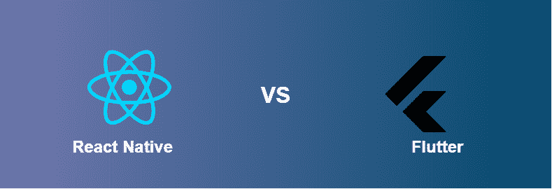

# 反应自然和颤动的区别

> 原文:[https://www . geeksforgeeks . org/react-native-and-flutter/](https://www.geeksforgeeks.org/difference-between-react-native-and-flutter/)



在本文中，我们将讨论两个框架，即 React Native 和 Flutter，这两个框架在相当长的一段时间内一直保持并超越顶级水平。考虑到在移动应用程序开发上投入的大量技能、时间和金钱，现在的公司需要一种更快的方法来制作应用程序。此外，要编写一个原生应用程序，你需要知道 Java 来为谷歌和苹果分别提供的 T2 iOS 应用程序构建一个安卓应用程序和一个 Swift 应用程序。此外，您必须拥有支持上述编程语言代码的本机呈现的 IDEs。因此，继续我们关于跨平台框架的观点，他们中的许多人试图解决这个问题，但在最终被视为另一个框架之前，获得了有限的支持和流行。

**React Native:**2015 年开源的脸书作品。渐渐地，它得到了社区的大力支持。主要基于 ReactJS，但是添加了非常有用的原生代码，这使得体验和转换不那么面向网络。

**Flutter:** 它是谷歌在 2017 年发布的，每个手机应用开发者都有同样的疑问，它会杀死 React Native 吗？Flutter 自 2015 年以来一直在开发和测试中，它的名字是“天空”，在灾难援助反应队会议上首次亮相，但谷歌一直保持低调，直到它的第一个阿尔法版本！
让我们深入探讨《原生反应》和《颤振》之间的详细视角。

**以下是 React Native 和 Flutter 基于不同领域的差异解释:**
**编程语言**

*   **React Native:** 使用 JavaScript，这意味着 web 开发人员更容易快速过渡到 React Native，用于移动应用程序开发，而不是 Dart。
*   **Flutter:** 除了它是一种全新的语言，而且 Dart 使用不多之外，由于概念上的面向对象支持，它松散地基于 Java。此外，遵循文档帮助您入门也很容易。

**安装**

*   **反应原生:**可以使用节点包管理器(NPM)安装，而使用苹果操作系统，你需要有自制包管理器。因此，对于开发人员来说，安装 NPM 的过程非常简单，而其他开发人员则需要了解 NPM 的来龙去脉。
*   **Flutter:** 支持针对特定平台直接从 GitHub 下载二进制文件。同样在 macOS 的情况下，下载文件后需要添加一个 PATH 变量。

**设置和项目配置**

*   **Native React:**没有太多考虑让开发人员开始编写文档。相反，它假设设置已经完成，这就是为什么 React Native 通过编写命令直接创建第一个应用程序

```
$ npx react-native init MyTestApp
$ cd MyProject
```

*   **Flutter:** 它记录了从 IDE 设置、平台特定设置到一个名为 flutter doctor 的 CLI 工具的所有小东西。

```
$ flutter create MyProject
$ cd MyProject
```

**UI 组件和开发 API**

*   **React Native:** 严重依赖第三方库来访问大部分原生模块。
*   **Flutter:** 由所需的每个本机模块组成的丰富组件集，不需要第三方库。另外，Flutter 充满了 WIDGETS。

**开发人员生产率**

*   **React Native:** 所有的 ide 都支持 JavaScript，所以根据开发人员的说法，使用方面永远不会有问题，这给了每个相关开发人员很大的自由。
*   **Flutter:** Dart 在用法上不是一种常规语言，在许多 ide 和文本编辑器中明显缺乏支持。

**社区支持**

*   **React Native:** 作为两者中最先发布的框架，它很快就会获得大量的支持，自 2015 年以来，它确实获得了大量的支持，因为它是由 GitHub 上的开发人员以及来自世界各地更多社区的开发人员强力维护的。
*   **Flutter:** Flutter 在社区支持方面也在快速上升，但同样需要一些时间来提供资源，这最终将使开发人员能够解决常见问题。

**测试支持**

*   **React Native:** 再次严重依赖第三方工具进行集成和 UI 测试。
*   **Flutter:** Flutter 有自己的特性，可以在单元测试、小部件测试和集成测试三个级别测试应用。

**构建&发布自动化支持**

*   **React Native:** 没有提供从任何平台自动部署应用程序的文档，所以基本上你只能自己在 Play Store 或 App Store 上搜索和部署。
*   **Flutter:** 它通过命令行界面提供部署支持，还提供了快速通道部署过程的文档。

**DevOps 和 CI/CD 支持**

*   **反应原生:**不包含任何关于设置 CI/CD 的官方文档。
*   **Flutter:** 有一篇关于 CI 和测试的单独文章，可以在这里查看。但是，您可以非常容易地使用 Flutter CLI 设置配置项/光盘。

**结论:**以上是一些已经得出的结论，当然还有很多结论，但最终都归结于你作为一名开发人员最终更喜欢什么。