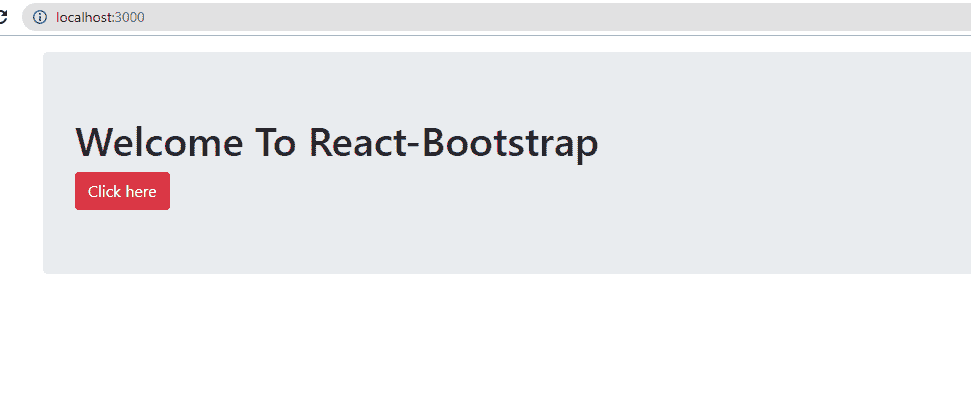
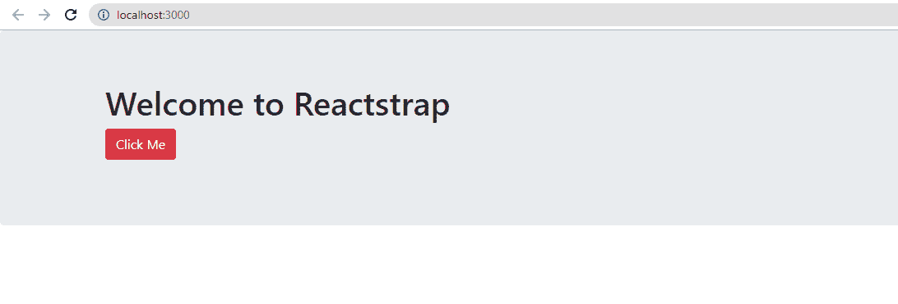

# 反应阱和反应自举的区别

> 原文:[https://www . geeksforgeeks . org/react trap-and-react-bootstrap 之间的差异/](https://www.geeksforgeeks.org/difference-between-reactstrap-and-react-bootstrap/)

Bootstrap 是一个流行的前端 CSS 框架，被 web 开发人员用来设计他们的 web 应用程序。引导组件包括 HTML、CSS 和 JavaScript，它们具有额外的依赖性，比如 jQuery，这使得它很难在 React 应用程序中使用。有两个可用的库可以帮助我们克服这个问题，它们是 reactstrap 和 react-bootstrap。两个库对引导组件都有类似的方法。然而，这两个库之间存在微小的差异，这使得根据需求，一个库优于另一个库。

让我们看看两者之间的比较:

| 参数 | REACT-BOOTSTRAP | REACTSTRAP |
| --- | --- | --- |
| 创造 | 2013 年 12 月 28 日 | 2016 年 2 月 19 日 |
| 描述 | 反应-自举是用反应构建的自举 4 组件 | Reactstrap 是无状态的 React Bootstrap 4 组件 |
| 上次更新时间 | 2020 年 10 月 19 日 | 2020 年 10 月 17 日 |
| 执照 | 用它 | 用它 |
| 版本 | One hundred and fifty-five | Two hundred |
| 属国 | 为动画和定位提供自己的实现。 | 取决于反应-过渡组和反应-弹出窗口的动画和定位。 |
| 排除 | 不再依赖于 Javascript 和 jquery | 它不包括引导 CSS，也不依赖于 Javascript 或 jquery |
| 明星 | 18, 456 | Nine thousand five hundred and ninety-four |
| 开放的问题 | One hundred and seventeen | Two hundred and twenty-four |
| 下载 | 更多下载次数 | 下载次数减少 |
| 装置 | npm 安装反应-引导 | npm 安装 reactstrap |
| 从计算机上卸载 | npm 卸载 react-引导 | npm 卸载 reactstrap |

**反应-引导:**

以下是创建简单的 react-bootstrap 应用程序的步骤

```
npm install -g create-react-app
```

```
create-react-app my_app
```

```
cd my_app/
```

```
npm start
```

在“http://localhost:3000/”打开应用程序

**添加引导:**

```
npm install react-bootstrap bootstrap
```

在“myapp”目录中，有一个“src”文件夹，其中包含我们感兴趣的“index.js”和“App.js”文件。在每个文件中写下如下代码，在 **http://localhost:3000/** 查看 app

**App.js 文件:**“app . js”文件有以下代码。

## java 描述语言

```
// Importing individual react components
import React from 'react';

import Jumbotron from 'react-bootstrap/Jumbotron';
import Container from 'react-bootstrap/Container';
import Button from 'react-bootstrap/Button';

// App function is created which contains the html
// code that is displayed in the webpage
const App = () => (
  <Container className="p-3">
    <Jumbotron>
      <h1 className="header">Welcome To React-Bootstrap</h1>
      <Button variant="danger">Click here</Button>
    </Jumbotron>
  </Container>
);

export default App;
```

**index . js:**“index . js”文件有以下代码。

## java 描述语言

```
import React from 'react';
import ReactDOM from 'react-dom';
import './index.css';
import App from './App';
import * as serviceWorker from './serviceWorker';

// Importing the Bootstrap CSS
import 'bootstrap/dist/css/bootstrap.min.css';

ReactDOM.render(
  <React.StrictMode>
    <App />
  </React.StrictMode>,
  document.getElementById('root')
);

// For faster loading and working of app,
// you can change unregister() to register()
// below. Note this comes with some pitfalls.
// Learn more about service workers: 
// https://bit.ly/CRA-PWA
serviceWorker.unregister();
```

**输出:**



**反应堆陷阱:**

以下是创建简单 reactstrap 应用程序的步骤

```
npm install -g create-react-app
```

```
create-react-app myapp
```

```
cd myapp/
```

```
npm start
```

打开“http://localhost:3000/”查看您的应用。

**添加引导:**

```
npm i bootstrap
```

```
npm i reactstrap react react-dom
```

在“myapp”目录中，有一个“src”文件夹，其中包含我们感兴趣的“index.js”和“App.js”文件。在每个文件中写下如下代码，在 **http://localhost:3000/** 查看 app

**app . js:**“app . js”文件有以下代码。

## java 描述语言

```
// Importing individual react components to 
// reduce the code size
import React, { Component } from 'react';
import { Button } from 'reactstrap';
import { Jumbotron } from 'reactstrap';
import { Row } from 'reactstrap';
import { Col } from 'reactstrap';
import { Container } from 'reactstrap';

// This is what is displayed on the webpage
// we create a jumbotron having a message
// and a button
class App extends Component {
    render() {
        return (
            <div>
                <Jumbotron>
                    <Container>
                        <Row>
                            <Col>
                                <h1>Welcome to Reactstrap</h1>
                                <p>
                                    <Button color="danger">
                                        Click Me
                                    </Button>
                                </p>
                            </Col>
                        </Row>
                    </Container>
                </Jumbotron>
            </div>
        );
    }
}

export default App;
```

**index . js:**“index . js”文件有以下代码。

## java 描述语言

```
import React from 'react';
import ReactDOM from 'react-dom';
import './index.css';
import App from './App';
import * as serviceWorker from './serviceWorker';

import 'bootstrap/dist/css/bootstrap.css';

ReactDOM.render(
  <React.StrictMode>
    <App />
  </React.StrictMode>,
  document.getElementById('root')
);

// If you want your app to work offline
// and load faster, you can change
// unregister() to register() below. 
// Note this comes with some pitfalls.
// Learn more about service workers: 
// https://bit.ly/CRA-PWA
serviceWorker.unregister();
```

**输出:**



**结论:**

**React trap**使用类组件，而 **React-bootstrap** 使用函数和钩子。这两个代码产生相似的输出，唯一的区别是组件的使用。用户可以根据自己的喜好进行选择。