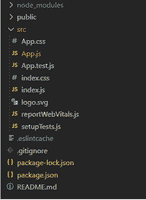

# ReactJS 中 useRef 和 createRef 的区别

> 原文:[https://www . geesforgeks . org/difference-user ef-and-create ref-in-reactjs/](https://www.geeksforgeeks.org/difference-between-useref-and-createref-in-reactjs/)

**什么是裁判？**
参考被定义为在组件被更改时不会触发组件重新渲染的任何值。这种行为违背了状态和道具的功能。一个引用可以通过两种方式来创建——通过 useRef 钩子或者通过 createRef 函数。

**[useRef:](https://www.geeksforgeeks.org/react-js-useref-hook/)**useRef 是一个钩子，始终使用相同的 Ref。它在功能组件中的重新渲染之间保存其值，并且不会为每次重新渲染创建 ref 的新实例。它在重新呈现之间保持现有的引用。

**[createRef:](https://www.geeksforgeeks.org/how-to-create-refs-in-reactjs/)**createRef 是一个每次都会创建一个新 Ref 的函数。与 useRef 不同，它不会在两次重新渲染之间保存其值，而是为每次重新渲染创建一个 Ref 的新实例。因此，这意味着它不会在重新呈现之间保留现有的引用。

让我们看一个例子来更清楚地理解差异。

**创建反应应用程序:**

*   **步骤 1:** 使用以下命令创建一个反应应用程序:

    ```
    npx create-react-app react-ref
    ```

*   **步骤 2:** 创建项目文件夹(即 react-ref)后，使用以下命令移动到该文件夹:

    ```
    cd react-ref
    ```

**项目结构:**



**示例 1:** 在本例中，我们将使用**用户界面**创建一个引用。在这种情况下，我们会注意到，每次重新渲染，我们的引用都会持续，因此我们会看到我们在 useEffect 中设置的消息被重复。现在在 App.js 文件中写下以下代码。在这里，App 是我们编写代码的默认组件。

## App.js

```
import React, { useEffect, useRef, useState } from "react";
import "./App.css";

export default function App() {
  const [counter, setCounter] = useState(0);
  const ref = useRef();

  useEffect(() => {
    ref.current = "GeeksforGeeeks";
  }, []);

  useEffect(
    () => {
      console.log(counter, ref.current);
    },
    [counter]
  );

  return (
    <div className="App">
      <header className="App-header">
        <h3>Example on useRef</h3>
        <button onClick={() => setCounter((c) => c + 1)}>
          Increment
        </button>
        <h5>Counter Value: {counter}</h5>{" "}
      </header>
    </div>
  );
}
```

**运行应用程序的步骤:**从项目的根目录使用以下命令运行应用程序:

```
npm start
```

**输出:**现在打开浏览器，转到***http://localhost:3000/***，会看到如下输出:


**解释:**由于 createRef 在重新渲染时保持 Ref 值，所以我们可以在每次重新渲染时看到 ref.current 值。

**示例 2:** 在本例中，我们将使用**创建参考**来创建参考。在这种情况下，我们会注意到每次重新渲染后都会创建一个新的 ref 实例，因此在初始显示后，我们会丢失我们的消息(GeeksforGeeks)。现在在 App.js 文件中写下以下代码。在这里，App 是我们编写代码的默认组件。

## App.js

```
import React, { useEffect, useRef, useState } from "react";
import "./App.css";

export default function App() {
  const [counter, setCounter] = useState(0);
  const ref = useRef();

  useEffect(() => {
    ref.current = "GeeksforGeeeks";
  }, []);

  useEffect(
    () => {
      console.log(counter, ref.current);
    },
    [counter]
  );

  return (
    <div className="App">
      <header className="App-header">
        <h3>Example on useRef</h3>
        <button onClick={() => setCounter((c) => c + 1)}>
          Increment
        </button>
        <h5>Counter Value: {counter}</h5>{" "}
      </header>
    </div>
  );
}
```

**运行应用程序的步骤:**从项目的根目录使用以下命令运行应用程序:

```
npm start
```

**输出:**现在打开浏览器，转到***http://localhost:3000/***，会看到如下输出:


**解释:**由于 createRef 在重新渲染时不会保持 Ref 值，所以我们只能看到 ref.current 值一次。

**useRef 与 CreateRef 的区别:**

<figure class="table">

| 

useRef

 | 

CreateRef

 |
| --- | --- |
| It's a hook. | It is a function. |
| It uses the same ref throughout. | A new ref will be created every time. |
| It saves its value between re-renderings of functional components. | It creates a new reference for each re-rendering. |
| It maintains existing references between renderings. | It does not retain existing references between renderings. |
| It returns a mutable ref object. | It also returns a mutable ref object. |
| References created with useRef can remain unchanged throughout the life cycle of the component. | References created with createRef can be referenced throughout the assembly. |
| It is used for functional components. | Used for class components. It can also be used for functional components, but the display may be inconsistent. |

</figure>