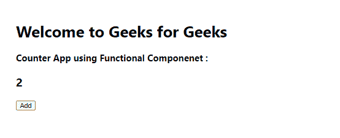

# 反应中功能成分和类别成分的区别

> 原文:[https://www . geeksforgeeks . org/功能组件和类别组件之间的差异-in-react/](https://www.geeksforgeeks.org/differences-between-functional-components-and-class-components-in-react/)

制作一个计数器应用程序，当用户使用函数和类组件点击“添加”按钮时，它会增加计数。

[**功能组件:**](https://www.geeksforgeeks.org/reactjs-functional-components/) 功能组件是在 React 中工作时会遇到的一些比较常见的组件。这些只是简单的 JavaScript 函数。我们可以通过编写一个 JavaScript 函数来创建一个功能组件来进行反应。

**语法:**

```
const Car=()=> {
  return <h2>Hi, I am also a Car!</h2>;
}
```

**示例:**

## java 描述语言

```
import React ,{useState} from "react";

const FunctionalComponent=()=>{
    const[count , setCount]=useState(0);

    const increase=()=>{
        setCount(count+1);
    }

    return
        <div style={{margin:'50px'}}>
            <h1>Welcome to Geeks for Geeks </h1>
            <h3>Counter App using Functional Component : </h3>
          <h2>{count}</h2>
            <button onClick={increase}>Add</button>
        </div>
    )
} 

export default FunctionalComponent;
```

**输出:**



[**Class Component:**](https://www.geeksforgeeks.org/reactjs-class-based-components/) 这是 ReactJS 内置的大多数现代网络应用的面包和黄油。这些组件是简单的类(由向应用程序添加功能的多个函数组成)。

**语法:**

```
class Car extends React.Component {
  render() {
    return <h2>Hi, I am a Car!</h2>;
  }
}
```

**示例:**

## java 描述语言

```
import React from "react";

class ClassComponent extends React.Component{
    constructor(){
        super();
        this.state={
            count :0
        };
        this.increase=this.increase.bind(this);
    }

   increase(){
       this.setState({count : this.state.count +1});
   }

    render(){
        return (
            <div style={{margin:'50px'}}>
               <h1>Welcome to Geeks for Geeks </h1>
               <h3>Counter App using Class Component : </h3>
               <h2> {this.state.count}</h2> 
               <button onClick={this.increase}> Add</button>

            </div>
        )
    }
}

export default ClassComponent;
```

**输出:**


钩子是 React 16.8 的新增功能。它们允许您在不编写类的情况下使用状态和其他 React 特性。

在上面的例子中，对于功能组件，我们使用钩子(useState)来管理状态。如果你写了一个函数组件，并且意识到你需要给它添加一些状态，以前你必须把它转换成一个类组件。现在，您可以在现有的函数组件中使用钩子来管理状态，而不需要将其转换为类组件。代替类，可以在功能组件中使用钩子，因为这是一种更简单的管理状态的方式。钩子只能用于功能组件，不能用于类内组件。

**功能组件 vs 类组件:**

<figure class="table">

| **Functional component** | **Class component** |
| The function is just an ordinary JavaScript function that takes props as parameters and returns React elements. | A class component needs you to extend from React. Component and create a rendering function that returns a React element. |
| The rendering method is not used in the component. | It must have a render () method that returns HTML |
| Also known as stateless components, because they just accept data and display them in some form, they are mainly responsible for rendering the UI. | Also called stateful components, because they implement logic and state. |
| The React lifecycle method (such as componentDidMount) cannot be used in functional components. | The React lifecycle method can be used inside class components (for example, componentDidMount). |
| 挂钩可轻松用于功能部件。示例:const [name，SetName]= react . usestate(') | 它需要类组件内部不同的语法来实现钩子。例:建造师(道具){超(道具)；this . state = { name:}} |
| Do not use constructors. | Constructors are used to store state. |

</figure>