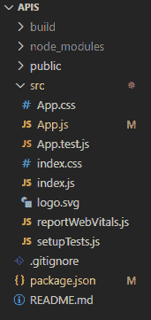
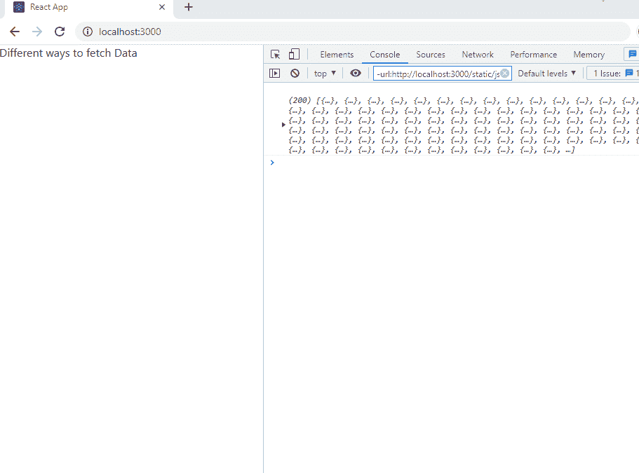

# 在 React

中使用 API 获取数据的不同方式

> 原文:[https://www . geeksforgeeks . org/不同方式获取数据-使用 api-in-react/](https://www.geeksforgeeks.org/different-ways-to-fetch-data-using-api-in-react/)

**ReactJS:** ReactJS 是一个声明式、高效且灵活的 JavaScript 库，用于构建用户界面。是 MVC 中的‘V’。ReactJS 是一个开源的、基于组件的前端库，只负责应用程序的视图层。它由脸书维护。

**API:** API 是应用编程接口(Application Programming Interface)的缩写，它是各种程序用来在它们之间进行通信的通信协议和子程序的集合。程序员可以利用各种应用编程接口工具使其程序变得更加容易和简单。此外，应用编程接口为程序员开发软件程序提供了一种有效的方法。在本文中，我们将了解如何从 API(应用程序编程接口)获取数据。对于数据，我们使用了

```jsx
http://jsonplaceholder.typicode.com/users
```

**方法:**在本文中，我们将了解如何从 API(应用程序编程接口)获取数据。对于数据，我们使用了来自[https://jsonplaceholder.typicode.com/todos](https://jsonplaceholder.typicode.com/todos)的 API 端点，我们在 App.js 中创建了组件，从 API 中我们有目标“userId”、“Id”、“title”、“completed”，并从 API 端点获取数据。

下面是我们如何使用 3 种不同的方式从应用编程接口获取数据的分步实现。

**步骤 1:** 创建反应项目

```jsx
npx create-react-app apis
```

**步骤 2:** 更改您的目录并输入您的主文件夹图表如下

```jsx
cd apis
```

**第三步:**在 App.js 中写代码，从 API 中取数据。

**项目结构:**如下图。



项目结构

现在我们有 3 种方法可以从应用编程接口获取数据

**1。fetch 方法:**JavaScript 中的 fetch()方法用于向服务器请求并加载网页中的信息。该请求可以是任何以 JSON 或 XML 格式返回数据的应用编程接口。这个方法返回一个承诺。

## App.js

```jsx
import {useEffect} from "react";

function App() {

  useEffect(() => {
    fetch('https://jsonplaceholder.typicode.com/todos')
    .then(response => response.json())
    .then(json => console.log(json))
    }, []);

  return (
    <div>
        Different ways to fetch Data
    </div>
  );
}

export default App;
```

**运行应用程序的步骤:**打开终端，键入以下命令。

```jsx
npm start
```

**输出:**现在打开 localhost:300，在控制台中，获取数据。



**2。Axios 包:** Axios 是一款基于承诺的 HTTP 客户端，专为 Node.js 和浏览器设计。借助 Axios，我们可以轻松地向 REST APIs 发送异步 HTTP 请求，并执行创建、读取、更新和删除操作。这是一个托管在 Github 上的开源协作项目。它可以用普通的 Javascript 或任何相应的库导入。

要安装 Axios，请编写以下命令

```jsx
npm i axios
```

## App.js

```jsx
import {useEffect} from "react";
import axios from "axios"

function App() {

  useEffect(() => {
    axios.get("https://jsonplaceholder.typicode.com/todos")
      .then((response) => console.log(response.data));
    }, []);

  return (
    <div>
        Different ways to fetch Data
    </div>
  );
}

export default App;
```

**运行应用程序的步骤:**打开终端，键入以下命令。

```jsx
npm start 
```

**输出:**现在打开 localhost:300，在控制台中，获取数据。


**3。异步等待:**这是从应用编程接口获取数据的首选方式。

**Async:** 它只是允许我们编写基于承诺的代码，就好像它是同步的一样，并且它检查我们没有破坏执行线程。它通过事件循环异步运行。异步函数将总是返回值。

**等待:**等待功能用于等待承诺。它只能在异步块中使用。它使代码等待，直到承诺返回结果。它用于防止回调地狱，我们可以在 Axios 中使用它，而不是 fetch 方法，因为 Axios 使我们的代码看起来更干净，也使它更短(因为我们不需要转换为 JSON 格式)。

## App.js

```jsx
import {useEffect} from "react";
import axios from "axios"

function App() {

  useEffect(() => {
    (async () => {
      try {
        const result = await axios.get(
"https://jsonplaceholder.typicode.com/todos")
        console.log(result.data);
      } catch (error) {
        console.error(error);
      }
    })()
  })

  return (
    <div >
        Different ways to fetch Data
    </div>
  );
}

export default App;
```

**运行应用程序的步骤:**打开终端，键入以下命令。

```jsx
npm start
```

**输出:**现在打开 localhost:300，在控制台中，获取数据。


**4。使用自定义钩子:**为您的自定义钩子创建一个文件(useFetch.js)，该文件返回数据、加载和错误等重要参数的状态。App.js 文件将导入这个钩子

现在编写以下代码:

## useFetch.js

```jsx
import { useEffect, useState } from "react";
import axios from "axios";

function useFetch(url) {
  const [data, setData] = useState("");
  const [loading, setLoading] = useState(false);
  const [error, setError] = useState("");

  useEffect(() => {
    setLoading(true);
    axios
      .get(url)
      .then((response) => {
        setData(response.data);
      })
      .catch((err) => {
        setError(err);
      })
      .finally(() => {
        setLoading(false);
      });
  }, [url]);

  const refetch = () => {
    setLoading(true);
    axios
      .get(url)
      .then((response) => {
        setData(response.data);
      })
      .catch((err) => {
        setError(err);
      })
      .finally(() => {
        setLoading(false);
      });
  };

  return { data, loading, error, refetch };
}

export default useFetch;
```

导入 useFetch 钩子，并传递要从中获取数据的应用编程接口端点的网址。

## App.js

```jsx
import {useEffect} from "react";
import axios from "axios"

function App() {
  const { data: dataInfo, loading, error, refetch } = useFetch(
    https://jsonplaceholder.typicode.com/todos
  );

  return (
    <div >
        Different ways to fetch data
        {console.log(data)}
    </div>
  );
}

export default App;
```

**运行应用程序的步骤:**打开终端，键入以下命令。

```jsx
npm start
```

**输出:**现在打开 localhost:300，在控制台中，获取数据。

