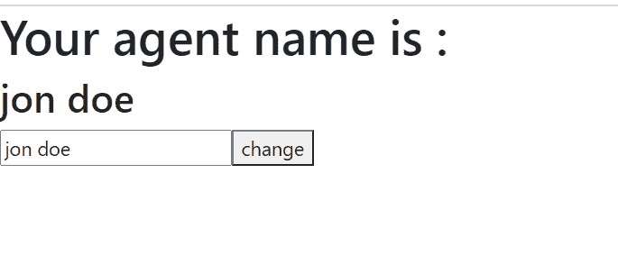

# 【React useState Hook 是否立即更新？

> 原文:[https://www . geesforgeks . org/do-react-usestate-hook-update-immediate/](https://www.geeksforgeeks.org/does-react-usestate-hook-update-immediately/)

**如何在 React 中使用 useState 钩子？**

*useState* 是 React 最近版本中引入的一个 API/Hook。因为它是一个钩子，所以我们可以钩入 react 特性，准确地说是 React 提供的状态特性。

在 React 的早期版本中，如果我们想给任何组件一个状态，那么我们需要将该组件转换为基于类的组件，但是与 *useState* 挂钩，我们可以给我们的功能组件一个状态。但是， *useState* 钩子不能在类中使用，也不应该在正常的 JavaScript 函数中使用，以获得完全证明。我们使用 *useState* 钩子如下，提取更新状态的状态和函数。 *useState* 唯一需要的就是初始状态。

**如何勾更新** **的工作？**

React 通过按调用顺序对状态进行排队来跟踪状态。反应队列所有要做的更改，并在组件重新呈现时更新，这不是立即的。这就是 React 如何知道哪个值对应哪个状态。每次组件试图重新渲染时，它都会按照队列进行。

**创建反应应用程序:**

*   **步骤 1:** 使用以下命令创建一个反应应用程序:

    ```
    npx create-react-app foldername
    ```

*   **步骤 2:** 创建项目文件夹(即文件夹名**)后，使用以下命令移动到该文件夹中:**

    ```
    cd foldername
    ```

**项目结构:**如下图。


项目结构

**文件名:App.js**

## App.js

```
import React, { useState } from "react"

export default function App() {

  // State for username
  const [name, setName] = useState("jon doe");

  // Function to change name
  function changeName(e) {
    setName(e.target.value);
  }

  return (
    <div>
      <h1>Your agent name is :</h1>
      <h2>{name}</h2>
      <input value={name} onChange={changeName} ></input>
      <button>change</button>
    </div>
  )
}
```

**运行应用程序的步骤:**从项目的根目录使用以下命令运行应用程序:

```
npm start
```

**输出:**现在打开浏览器，转到***http://localhost:3000/***，会看到如下输出:



**说明:**如你所见更新状态我们使用了*设置状态*的方法，从*使用状态*的钩子中提取。所以为了更新，我们没有使用 *this.name* 或者任何类似 *this.setname* 的东西。

你可能想知道是否没有基于类的组件或者*这个*是如何参与的，react 如何知道我们指的是哪个状态，因为代码中会有很多状态，如下所示:

```
const [name, setName] = useState("jon");
const [sername, setSername] = useState("doe");
const [age,setAge] = useState(23);
```

反应不要立即更新，虽然乍一看似乎是立即的。React 通过按调用顺序对状态进行排队来跟踪状态。反应队列所有要做的更改，并在组件重新呈现时更新，这不是立即的。这就是 React 如何知道哪个值对应哪个状态。每次组件试图重新渲染时，它都会按照队列进行。

**示例:**如果我们的组件以某种顺序更新状态，如*名称*、 *sername* 和 *age，*则它将这些更改放在队列中，并且不会在遇到这些更改时立即更新这些状态。一旦功能组件结束，它将重新呈现该组件，并按照将它们放入队列的顺序更新状态。这种方式 React 保持了状态的完整性，并允许我们使用 *useState* 钩子在功能组件中使用状态。

```
setName("James");    // First state on queue
setSername("Bond");     // Second state on queue
setAge(23);             // Third state on queue

// End of the component function

// After that re-render happens and state actually updates
```

**参考文献:**T2】https://reactjs.org/docs/hooks-rules.html