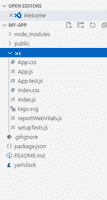
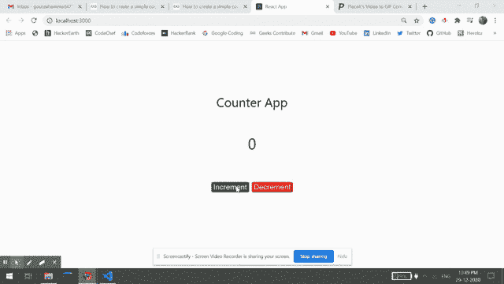

# 作为反应开发者需要知道的基本事情

> 原文:[https://www . geeksforgeeks . org/必不可少的事情-反应时知道-开发者/](https://www.geeksforgeeks.org/essential-things-to-know-as-react-developer/)

ReactJS 是一个开源的 JavaScript 库，用于为网站前端构建令人敬畏的用户界面。React JS 还以声明式、基于组件和一次学习、代码随处编写而闻名。在这篇文章中，我们知道作为一个新开发人员的基本情况如下:

**1。** [**NPM:**](https://www.geeksforgeeks.org/node-js-npm-node-package-manager/) Npm 是默认的包管理器通过 javaScript NPM 可以通过 package.json 文件安装一个项目的所有依赖项。它还可以更新和卸载软件包。它有一个命令行客户端。在文件中，每个依赖项都可以使用语义版本方案指定一个有效版本范围，允许开发人员自动更新他们的包

**2。**[**Redux**](https://www.geeksforgeeks.org/introduction-to-redux-action-reducers-and-store/)**:**Redux 是一个开源的 JavaScript 库。Redux 的主要特点是，它在 Angular js 和 React js 这两个框架中都用于构建令人敬畏的用户界面 Redux 只是管理应用程序的状态，或者换句话说，它用于管理应用程序的数据。Redux 也称为状态容器。

**3。** [**JSX:**](https://www.geeksforgeeks.org/reactjs-introduction-jsx/) JSX 代表 JavaScript XML，JSX 是在 React 中编写 HTML 代码的简单扩展，所以 JSX 被称为模板语言 React Dom 是渲染元素。JSX 是用柯利大括号{ }写 HTML 元素的。JSX 遵循的规则与 XML 规则相同。JSX 允许我们在不使用 appendChild()或 createElement()方法的情况下将 HTML 元素放入 DOM。

**4。**[**Context API:**](https://www.geeksforgeeks.org/context-in-react/)React Js 中的 Context API 用于通过将道具存储在商店中(类似于 Redux)并由子组件使用商店中的这些道具来传递来自子组件的道具，而无需在组件树的每个级别手动传递它们。简单来说，我们可以说上下文 API 是 React STructure 类型，用于交换所有唯一的细节。

**5。** [**虚拟 Dom:**](https://www.geeksforgeeks.org/reactjs-reactdom/) 虚拟 DOM 是实际 DOM 的轻量级副本。虚拟 dom 用于声明性 web 框架，如 React js、Vue Js 等，使用虚拟 dom 的主要优点是与实际 Dom 相比速度相当快。如果每个对象都在原始 Dom 中，那么在反应虚拟 DOM 中就有一个对象。有点类似。

**6** [。](https://www.geeksforgeeks.org/reactjs-methods-as-props/) [**道具:**](https://www.geeksforgeeks.org/reactjs-props-set-1/) 道具代表属性。道具是一种特殊类型的键盘，它用于将数据从一个组件传递到另一个组件，道具是不可改变的，它们不能改变组件的寿命。基本上，prop 是一个全局变量或一种用于传递组件信息的对象。在 React 中，有时我们需要改变组件内部的内容，在这种情况下，我们特别使用道具。

**7。** [**状态:**](https://www.geeksforgeeks.org/reactjs-state-react/) 状态多变。你可以根据需要更新状态，这意味着状态可以在未来更新，而道具不能。我们可以在构造函数中初始化状态，然后在我们想要更改状态时调用 setState。状态是出现在组件内部的变量，不能在组件外部访问或修改。

**8。** [**组件**](https://www.geeksforgeeks.org/reactjs-components/) **在 React JS:**

1.  **功能组件:**功能组件是在 React 中工作时会遇到的一些更常见的组件。这些只是简单的 JavaScript 函数。我们可以通过编写一个 JavaScript 函数来创建一个功能组件来进行反应。
2.  **类组件:**类组件比功能组件复杂一点。功能组件不知道程序中的其他组件，而类组件可以相互协作。我们可以将数据从一个类组件传递到其他类组件。我们可以在 React 中使用 JavaScript ES6 类来创建基于类的组件。

**9。调试器工具:**调试器工具用于移除 React js 代码中的 bug。调试中使用的主要顶级工具有:

1.  Chrome 开发工具。
2.  反应开发者工具
3.  查尔斯网络代理
4.  断点
5.  核素

**下面是一步一步的过程，我们知道如何使用 React js 创建一个基本的应用程序:**

**步骤 1:** 创建反应项目

```jsx
npx create-react-app MY-APP
```

**步骤 2:** 更改您的目录并输入您的主文件夹图表如下

```jsx
cd MY-APP
```

**步骤 3:** 通过以下命令运行项目:

```jsx
npm start
```

**项目结构:**项目结构如下:



现在让我们用这个例子来看看 react 应用程序的工作原理。

**示例:**在本例中，我们将看到如何在 react 中创建一个简单的计数器应用程序，其中我们可以使用状态和事件处理来设置计数器的值。

## App.js

```jsx
import React, { useState } from "react";

// Importing app.css is css file to add styling
import "./App.css";

const App = () => {
  // Counter is a state initialized to 0
  const [counter, setCounter] = useState(0);

  // Function is called everytime increment button is clicked
  const handleClick1 = () => {
    // Counter state is incremented
    setCounter(counter + 1);
  };

  // Function is called everytime decrement button is clicked
  const handleClick2 = () => {
    // Counter state is decremented
    setCounter(counter - 1);
  };

  return (
    <div
      style={{
        display: "flex",
        flexDirection: "column",
        alignItems: "center",
        justifyContent: "center",
        fontSize: "300%",
        position: "absolute",
        width: "100%",
        height: "100%",
        top: "-15%",
      }}
    >
      Counter App
      <div
        style={{
          fontSize: "120%",
          position: "relative",
          top: "10vh",
        }}
      >
        {counter}
      </div>
      <div className="buttons">
        <button
          style={{
            fontSize: "60%",
            position: "relative",
            top: "20vh",
            marginRight: "5px",
            backgroundColor: "green",
            borderRadius: "8%",
            color: "white",
          }}
          onClick={handleClick1}
        >
          Increment
        </button>
        <button
          style={{
            fontSize: "60%",
            position: "relative",
            top: "20vh",
            marginLeft: "5px",
            backgroundColor: "red",
            borderRadius: "8%",
            color: "white",
          }}
          onClick={handleClick2}
        >
          Decrement
        </button>
      </div>
    </div>
  );
};

export default App;
```

**运行应用程序的步骤:**从项目的根目录使用以下命令运行应用程序:

```jsx
npm start
```

**输出:**

