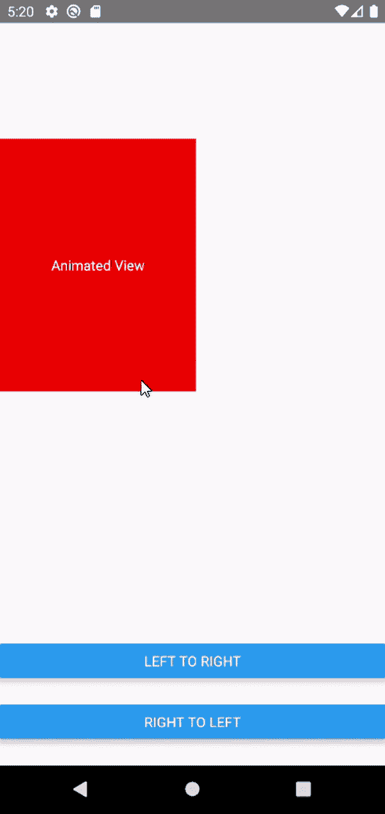

# 解释反应原生

中的动画

> 原文:[https://www . geesforgeks . org/explain-动画-in-react-native/](https://www.geeksforgeeks.org/explain-animations-in-react-native/)

**React Native 中的动画:** React Native 有一个动画 API，可以处理应用中的动画。它有各种功能来创建大多数类型的动画(例如，褪色，颜色变化，宽度和高度变化，位置变化)。我们将主要使用动画。平行，动画。时间，动画。价值，和动画。查看此示例。

**实现:**现在让我们从实现开始:

*   **步骤 1:** 打开终端，通过以下命令安装 expo-cli。

    ```jsx
    npm install -g expo-cli
    ```

*   **步骤 2:** 现在通过以下命令创建一个项目。

    ```jsx
    expo init animationDemo
    ```

*   **第三步:**现在进入你的项目文件夹，即动画演示

    ```jsx
    cd animationDemo
    ```

**项目结构:**如下图。


目录结构

**创建动画的步骤:**

1.  **定义状态:**我们将从**【反应-原生】**导入**动画**。然后我们将声明我们的状态，稍后将由动画功能更改。在这里，我们使用“右”来移动 **<动画。从左向右查看>** ，反之亦然。和“半径”状态，这将在动画期间改变视图的**边框**。
2.  **定义动画功能:**我们将定义两个功能**左对齐**和**右对齐**，它们将在调用时激活视图。在这里，我们使用**动画并行()**功能，该功能用于同时运行多个动画。以及以状态、动画持续时间、最终值为参数的**动画定时()**功能。开始动画的**开始()**。
3.  **创建视图:**现在我们将使用 **<动画创建视图。查看>** 并在样式中传递动画状态。

**注意:**使用<动画。视图>用于创建基于动画状态的动画视图。正常<查看>会抛出堆栈限制超出错误。

## App.js

```jsx
import React, { Component } from 'react';
import { Text, View, Animated, Dimensions, Button } from 'react-native';

class App extends Component {
  constructor(props) {
    super(props);
    this.state = {
      right: new Animated.Value(
        Dimensions.get('window').width - 200),
      radius: new Animated.Value(0),
    };
  }

  leftToRight = () => {
    Animated.parallel([
      Animated.timing(this.state.radius, {
        toValue: 200,
        duration: 1000,
        useNativeDriver: false,
      }),
      Animated.timing(this.state.right, {
        toValue: 0,
        duration: 1000,
        useNativeDriver: false,
      }),
    ]).start();
  };

  rightToLeft = () => {
    Animated.parallel([
      Animated.timing(this.state.radius, {
        toValue: 0,
        duration: 1000,
        useNativeDriver: false,
      }),
      Animated.timing(this.state.right, {
        toValue: Dimensions.get('window').width - 200,
        duration: 1000,
        useNativeDriver: false,
      }),
    ]).start();
  };

  render() {
    return (
      <View style={{ flex: 1 }}>
        <Animated.View
          style={{
            marginTop: '30%',
            backgroundColor: 'red',
            height: 200,
            width: 200,
            right: this.state.right,
            position: 'absolute',
            justifyContent: 'center',
            borderRadius: this.state.radius,
          }}>
          <Text
            style={{
              textAlign: 'center',
              color: 'white',
            }}>
            Animated View
          </Text>
        </Animated.View>
        <View
          style={{
            position: 'absolute',
            bottom: 0,
            width: '100%',
            height: '20%',
            justifyContent: 'space-evenly',
          }}>
          <Button title="Left to right" 
            onPress={() => this.leftToRight()} />
          <Button title="right to left" 
            onPress={() => this.rightToLeft()} />
        </View>
      </View>
    );
  }
}

export default App;
```

使用以下命令启动服务器。

```jsx
npm run android
```

**输出:**



输出

**插值:**假设我们想用“%”代替一个数字来定义我们正确的样式属性。如果我们通过“%”如<动画。查看>并尝试在我们的*动画定时()*功能中更改它，我们会得到一个错误。这就是插值有帮助的地方。它将输入范围映射到输出范围(例如，0-100 到 0%-100%)。我们只需要在<动画中应用插值。查看>正确的风格道具和剩下的代码会一样。

## App.js

```jsx
<Animated.View
  style={{
    marginTop: '30%',
    backgroundColor: 'red',
    height: 200,
    width: 200,
    right: this.state.right.interpolate({
      inputRange: [0, 100],
      outputRange: ['0%', '100%'],
    }),
    position: 'absolute',
    justifyContent: 'center',
    borderRadius: this.state.radius,
  }}>
  <Text
    style={{
      textAlign: 'center',
      color: 'white',
    }}>
    Animated View
  </Text>
</Animated.View>
```

**参考:**T2】https://reactnative.dev/docs/animations