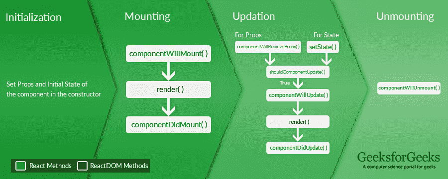
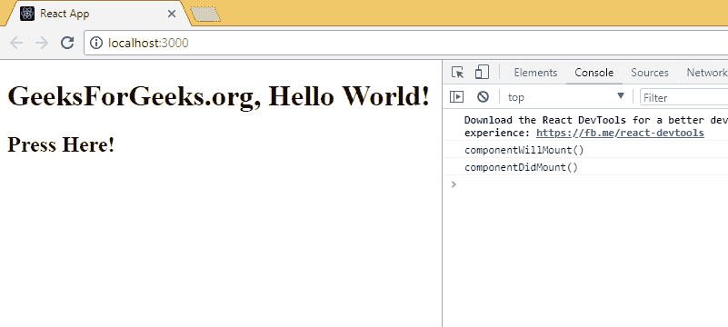

# 解释反应组件的生命周期方法

> 原文:[https://www . geesforgeks . org/explain-life cycle-methods-react-components/](https://www.geeksforgeeks.org/explain-lifecycle-methods-of-react-components/)

到目前为止，我们已经看到 React 网络应用程序实际上是一个独立组件的集合，这些组件根据与它们的交互来运行。每个反应组件都有自己的生命周期，组件的生命周期可以定义为在组件存在的不同阶段调用的一系列方法。定义很简单，但是我们所说的不同阶段是什么意思呢？反应组件可以经历如下四个生命阶段。

*   **初始化:**这是用给定的道具和默认状态构造组件的阶段。这是在组件类的构造函数中完成的。
*   **挂载:**挂载是渲染方法本身返回的 JSX 的阶段。
*   **更新:**更新是组件状态更新，应用重绘的阶段。
*   **卸载:**顾名思义，卸载是组件生命周期的最后一步，即从页面中移除组件。

React 为开发人员提供了一组预定义的函数，如果有的话，这些函数会在组件的生命周期中围绕特定的事件进行调用。开发人员应该用期望的逻辑覆盖函数，以便相应地执行。我们已经在下图中说明了要点。



现在让我们描述每个阶段及其相应的功能。
**生命周期各阶段的功能**

*   **初始化**:在这个阶段开发人员必须定义组件的道具和初始状态，这通常在组件的构造器中完成。下面的代码片段描述了初始化过程。

## java 描述语言

```jsx
class Clock extends React.Component {
  constructor(props) {

    // Calling the constructor of 
    // Parent Class React.Component
    super(props);

    // Setting the initial state
    this.state = { date: new Date() };
  }
}
```

*   **挂载**:挂载是组件初始化完成，组件在 DOM 上挂载并在网页中第一次渲染时，组件生命周期的阶段。现在反应遵循这个预定义函数的命名约定中的默认过程，其中包含“将”的函数表示在某个特定阶段之前，“做”表示在该阶段完成之后。安装阶段包括如下所述的两个预定义功能。
    *   **componentWillMount()函数**:顾名思义，这个函数就在组件挂载到 DOM 之前被调用，也就是说这个函数在第一次执行 render()函数之前被调用一次。
    *   **组件挂载()函数**:与上一个类似，这个函数是在组件挂载到 DOM 之后调用的，也就是说，这个函数在第一次执行 render()函数之后被调用一次。
*   **更新** : React 是一个 JS 库，帮助轻松创建 Active 网页。现在，活动网页是根据用户行为的特定页面。例如，让我们以 GeeksforGeeks {IDE}网页为例，该网页对每个用户的行为都不同。用户甲可能会在光明主题中用 C 写一些代码，而另一个用户可能会在黑暗主题中同时写一个 Python 代码。这种部分依赖于用户本身的动态行为使网页成为活动网页。这和上升有什么关系？更新是组件的状态和道具被更新的阶段，随后是一些用户事件，如点击、按键盘上的键等。以下是在更新阶段不同点调用的函数的描述。
    *   **component willereceprops()函数**:这是一个道具专属函数，与状态无关。在已安装的组件重新分配其道具之前调用该函数。该功能被传递给新的道具集，该道具集可能与原始道具相同，也可能不同。因此，检查是这方面的一个强制性步骤。下面的代码片段显示了一个示例用例。

## java 描述语言

```jsx
componentWillRecieveProps(newProps)
{
    if(this.props !== newProps)
    {
        console.log(" New Props have been assigned ");
        // Use this.setState() to rerender the page.
    } 
}
```

*   **setState()函数**:这不是一个特别生命周期的函数，可以在任何时刻显式调用。该函数用于更新组件的状态。详细信息可以参考[这篇文章](https://www.geeksforgeeks.org/reactjs-state-react/)。
*   **shouldComponentUpdate()函数**:默认情况下，每个状态或道具更新都会重新渲染页面，但这可能并不总是期望的结果，有时希望在更新页面时不会被重新绘制。函数的作用是让 React 知道组件的输出是否会受到更新的影响。当接收到新的道具或状态时，在呈现已经挂载的组件之前调用 shouldComponentUpdate()。如果返回 false，则不会执行后续的渲染步骤。在 forceUpdate()的情况下不能使用该函数。该函数以新道具和新状态为参数，返回是否重新渲染。
*   **componentWillUpdate()函数**:顾名思义，这个函数是在组件重新渲染之前调用的，也就是说，在状态或道具更新之后执行 render()函数之前，这个函数会被调用一次。
*   **componentdupdate()函数**:类似的，该函数在组件重新渲染后调用，即在状态或道具更新后执行 render()函数后，该函数被调用一次。
*   **卸载**:这是组件生命周期的最后阶段，也就是从 DOM 中卸载组件的阶段。以下功能是此阶段的唯一成员。
    *   **组件将卸载()函数**:在组件最终从 DOM 中卸载之前调用该函数，即在组件从页面中移除之前调用该函数一次，这表示生命周期结束。

到目前为止，我们已经讨论了组件生命周期中的每个预定义函数，并且我们还指定了函数的执行顺序。现在让我们看最后一个例子来完成这篇文章，同时修改上面讨论的内容。

## java 描述语言

```jsx
import React from 'react';
import ReactDOM from 'react-dom';

class Test extends React.Component {
    constructor(props)
    {
        super(props);
        this.state = { hello : "World!" };
    }

    componentWillMount()
    {
        console.log("componentWillMount()");
    }

    componentDidMount()
    {
        console.log("componentDidMount()");
    }

    changeState()
    {
        this.setState({ hello : "Geek!" });
    }

    render()
    {
        return (
            <div>
            <h1>GeeksForGeeks.org, Hello{ this.state.hello }</h1>
            <h2>
            <a onClick={this.changeState.bind(this)}>Press Here!</a>
            </h2>
            </div>);
    }

    shouldComponentUpdate(nextProps, nextState)
    {
        console.log("shouldComponentUpdate()");
        return true;
    }

    componentWillUpdate()
    {
        console.log("componentWillUpdate()");
    }

    componentDidUpdate()
    {
        console.log("componentDidUpdate()");
    }
}

ReactDOM.render(
    <Test />,
    document.getElementById('root'));
```

**输出:**

[](https://cdncontribute.geeksforgeeks.org/wp-content/uploads/state_lifecycle_reactjs.gif)

在下一篇文章中，我们将使用状态和生命周期函数来重新创建我们在使用多个 render()调用之前创建的时钟。