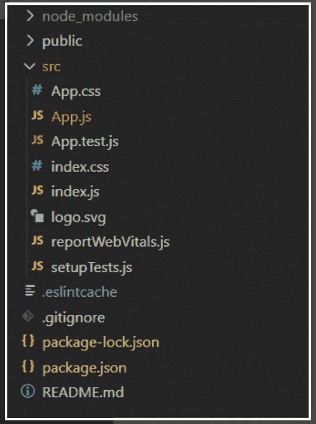

# 解释 ReactJS

中渲染()的目的

> 原文:[https://www . geeksforgeeks . org/explain-the-of-to-render-in-reactjs/](https://www.geeksforgeeks.org/explain-the-purpose-of-render-in-reactjs/)

React.js 库有两个组件:

*   类组件
*   功能组件

类组件使用呈现函数。函数的作用是:接受两个参数，一个是 HTML 代码，一个是 HTML 元素。

**渲染目的():**

*   React 通过使用一个名为 render()的函数向网页呈现 HTML。
*   该函数的目的是在指定的 HTML 元素中显示指定的 HTML 代码。
*   在 render()方法中，我们可以读取道具和状态，并将 JSX 代码返回到应用程序的根组件。
*   在 render()方法中，我们不能更改状态，也不能导致副作用(例如向 web 服务器发出 HTTP 请求)。

让我们用一个例子来理解渲染函数。

**创建反应应用程序并安装模块:**

**步骤 1:** 使用以下命令创建一个 React 应用程序。

```
npx create-react-app foldername
```

**步骤 2:** 创建项目文件夹(即文件夹名)后，使用以下命令移动到该文件夹。

```
cd foldername
```

**项目结构:**如下图。



现在在 App.js 文件中写下以下代码。

## App.js

```
import React, { Component } from 'react';
export default class App extends Component {
state = {
    PawriDays: [
        { id: '123s', Day: 'Monday' },
        { id: '234r', Day: 'Saturday' },
        { id: '12d5', Day: 'Sunday' }
    ]
}

render() {
    const PartyDays = this.state.PawriDays.length
    const style = {
    'textAlign': 'center',
    'color': 'green'
    }

    // Return JSX code
    return (
    <div style={style}>
        <h1>I am User</h1>
        <p> We party: {PartyDays} days a week </p>
    </div>
    );
}
}
```

**运行应用程序的步骤:**从项目的根目录使用以下命令运行应用程序:

```
npm start
```

**输出:**现在打开浏览器，转到 http://localhost:3000/，会看到如下输出:

