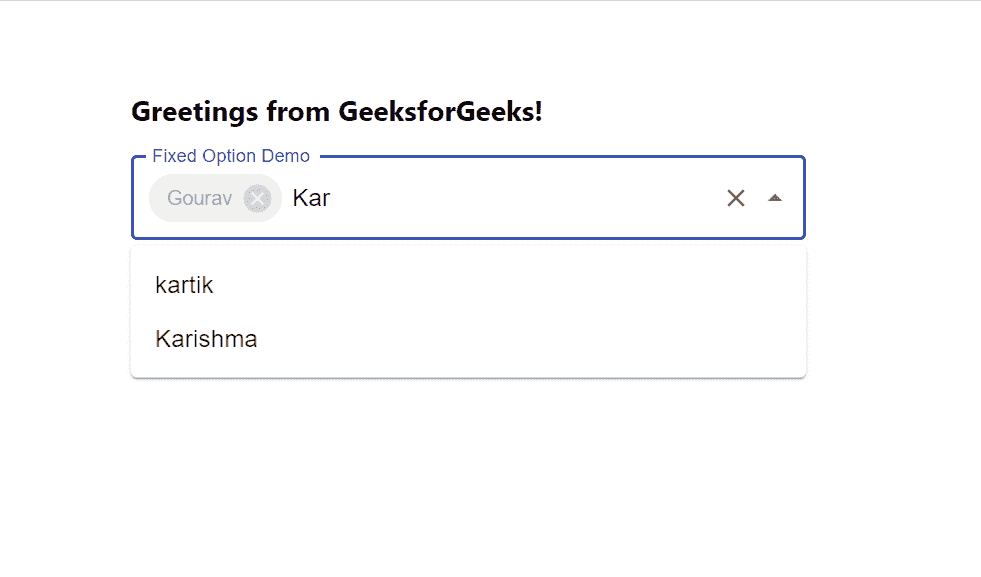

# 反应堆中搜索框的固定选项

> 原文:[https://www . geesforgeks . org/fixed-options-in-searchbox-in-reactjs/](https://www.geeksforgeeks.org/fixed-options-in-searchbox-in-reactjs/)

固定选项是指将我们定义的选项放在的搜索框中。固定选项不能在搜索栏中更改。React 的 Material UI 有这个组件可供我们使用，非常容易集成。我们可以使用以下方法将固定选项放入 ReactJS 中的搜索框中。

**创建反应应用程序并安装模块:**

**步骤 1:** 使用以下命令创建一个反应应用程序:

```jsx
npx create-react-app foldername
```

**步骤 2:** 创建项目文件夹(即文件夹名**)后，使用以下命令移动到该文件夹中:**

```jsx
cd foldername
```

**步骤 3:** 创建 ReactJS 应用程序后，使用以下命令安装 **material-ui** 模块:

```jsx
npm install @material-ui/core
npm install @material-ui/lab
```

**项目结构:**如下图。


项目结构

**App.js:** 现在在 **App.js** 文件中写下以下代码。在这里，App 是我们编写代码的默认组件。

## java 描述语言

```jsx
import React from 'react'
import TextField from '@material-ui/core/TextField';
import Chip from '@material-ui/core/Chip';
import Autocomplete from '@material-ui/lab/Autocomplete';

const App = () => {

  // Fixed Options to show
  const fixedOption = ['Gourav']

  // Sample options for search box
  const myOptions = [
    'Gourav', 'Niharika', 'kartik',
    'Madhuri', 'Karishma', 'Dinesh'
  ];

  const [value, setValue] = React.useState(fixedOption);

  return (
    <div style={{ marginLeft: '40%', marginTop: '60px' }}>
      <h3>Greetings from GeeksforGeeks!</h3>
      <Autocomplete
        multiple
        id="fixed-tags-demo"
        value={value}
        onChange={(event, newValue) => {
          setValue([
            ...fixedOption,
            ...newValue.filter((option) => fixedOption.indexOf(option) === -1),
          ]);
        }}
        options={myOptions}
        getOptionLabel={(option) => option}
        renderTags={(tagValue, getTagProps) =>
          tagValue.map((option, index) => (
            <Chip
              label={option}
              {...getTagProps({ index })}
              disabled={fixedOption.indexOf(option) !== -1}
            />
          ))
        }
        style={{ width: 450 }}
        renderInput={(params) => (
          <TextField {...params}
            label="Fixed Option Demo"
            variant="outlined"
            placeholder="Enter Option" />
        )}
      />
    </div>
  );
}

export default App
```

**运行应用程序的步骤:**从项目的根目录使用以下命令运行应用程序:

```jsx
npm start
```

**输出:**现在打开浏览器，转到***http://localhost:3000/***，会看到如下输出:



正如你现在在上面的搜索框中看到的，我们的固定选项数组已经在搜索栏中固定了，所以这就是我们如何在 ReactJS 中放置已经固定的标签。