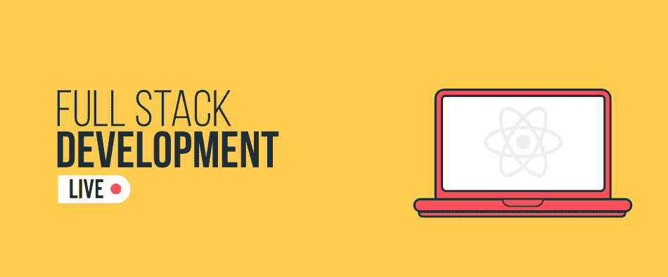

# 带 React 的全栈开发&节点. js–Live

> 原文:[https://www . geesforgeks . org/full-stack-development-with-react-node-js-live/](https://www.geeksforgeeks.org/full-stack-development-with-react-node-js-live/)

最有可能的是，众所周知——网络开发主要分为两类:前端开发和后端开发。虽然这两个领域需要不同的技术和工具，但每个领域都有特定的职业概况。然而，你需要知道的是，在最近的时间里，对那些能够处理两个领域，前端和后端开发的专业人员的需求已经显著增加。

没错，这些人被称为**全栈开发者！！**

据报道，在过去的 3-4 年里，全栈开发人员的需求有相当大的增长，增幅在 **20-22%** 左右。此外，与前端开发人员或后端开发人员相比，这些全栈开发人员的工资通常更高。这一切都导致了这样一个推论，即在未来的时间里，你可以考虑在全栈开发中追求成功的职业生涯。与此同时，如果你已经下定决心成为一名全栈开发人员，并且正在寻找高质量的学习资源，无论是视频教程、笔记、基于项目的学习，还是任何其他——T2 极客博客可以在这方面帮助你！

对于所有有抱负的全栈开发人员，我们为您提供丰富的实时课程 [**全栈开发与反应&节点 JS-MERN 栈**](https://practice.geeksforgeeks.org/courses/full-stack-node) 。本课程将使您精通全栈开发，以至于在本课程结束时，您将能够使用 React & Node JS 和其他概念(如 AWS、CI/CD 等)开发行业就绪的单页 Web 应用程序和 API。

### 课程详情

在本课程中，您将开始学习 Git 基础知识、前端网络开发基础知识、JavaScript 等。然后继续学习行业排名前两位的库和框架——React JS 和 Node JS。您将从头开始学习基础知识，同时创建一个行业就绪的单页 web 应用程序。完成本课程后，您将完成一个名为 Leadstagram 的产品，它是一个类似于 Instagram 的销售线索管理器。此外，您将学习如何使用完整的 DevOps 工作流部署和维护应用程序。

再者，多种部署方式如 AWS、Netlify、GitHub Pages 等。，各种 CI / CD 管道(如 Travis-CI & GitHub)也将在本课程中介绍，让您为行业做好准备。本课程的一些额外突出特点如下:

*   *课程结业证书*
*   *由行业专家指导的课程*
*   *基于项目的学习，将为你的简历添加星星*
*   *1 个基于现实应用的重大项目*
*   *极客集团的实习机会*
*   *6 个月可观看本课程录制的现场讲座*

### 课程格式

这将是一个**在线直播课程**，因此你可以在方便的时候从任何地方参加课程。此外，由于这将是一个互动的现场会议，您可以像在离线课堂环境中一样向讲师提出您的疑问。谈论课程的先决条件，你应该知道 HTML、CSS 和 JavaScript 的基础知识。尽管该课程对所有想要进入全栈开发世界的人开放，但强烈建议寻求成为 React(前端网络)开发人员或创建并启动自己的 React 应用程序的大学生和职场人士。

带 React & Node JS 的全栈开发–直播课程以**10999 INR/-**的折扣价提供给您，您可以直接 [**从这里**](https://practice.geeksforgeeks.org/courses/full-stack-node) 注册课程。

### 课程内容

反应与节点 JS-Live 课程的完整堆栈开发将提供以下内容:

*   *第一场:介绍&社区纽带*
*   *会议 2:版本控制系统介绍*
*   *会议 3:前端&响应网页设计*
*   *第 4 节:JavaScript 基础知识*
*   *第五场:介绍我们的项目*
*   *第六节:反应 JS 介绍*
*   *会话 7:使用数据*
*   *会话 8:条件渲染*
*   *第 9 节:节点 JS 基础知识*
*   *第 10 节:REST APIs 介绍*
*   *第 11 节:数据库介绍*
*   *会话 12:会话处理介绍*
*   *第 13 节:设置我们自己的 REST API*
*   *会话 14:将我们的 REST API 连接到前端*
*   *第 15 节:造型和组件化*
*   *第 16 节:部署和托管应用程序*

### 常见问题解答

**Q1:我们将如何开展这些项目？**

**Ans:** 你将在课程导师的帮助下开始项目。每个学生都将受到班级导师的指导。

**Q2:课程结束后我会获得什么认证吗？**

**Ans:** 是的，这是一个 GeeksforGeeks 认证的项目，包括项目和学习。所有学生都将获得相应等级的培训证书。

**Q3:如何注册课程？**

**Ans:** 您只需点击注册按钮，输入所需的详细信息，如姓名、联系电话等。然后，支付成功注册所需的费用。

**Q4:课程的时长是多少？**

**Ans** :虽然课程将在 8 周内完成，但您将有 6 个月的时间观看本课程的现场录制讲座。

**Q5。这门课有什么特定的先决条件吗？**

**Ans:** 不，没有任何硬性的合格标准，但是，你应该知道 HTML、CSS 和 JavaScript 的基础知识。