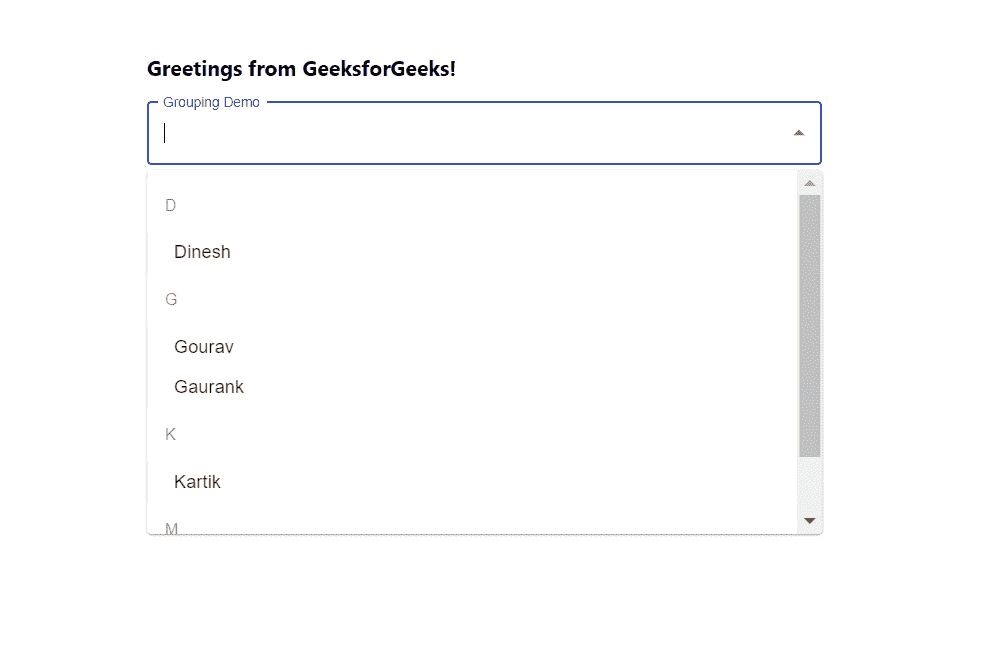

# 使用 ReactJS 对下拉选项进行分组

> 原文:[https://www . geesforgeks . org/group-drop down-options-using-reactjs/](https://www.geeksforgeeks.org/grouping-dropdown-options-using-reactjs/)

**将**选项分组意味着根据条件将选项分组，以获得更好的用户体验。例如，在我们的手机上，所有联系人都按其第一个字母分组，这样用户就更容易搜索联系人。【React 的 Material UI 有这个组件可以给我们用，非常容易集成。

**创建反应应用程序并安装模块:**

**步骤 1:** 使用以下命令创建一个反应应用程序:

```
npx create-react-app foldername
```

**步骤 2:** 在创建项目文件夹(即文件夹名**)后，使用以下命令将**移动到该文件夹:

```
cd foldername
```

**步骤 3:** 创建 ReactJS 应用程序后，使用以下命令安装 **material-ui** 模块:

```
npm install @material-ui/core
npm install @material-ui/lab
```

**项目结构:**如下图。


项目结构

**App.js:** 现在在 **App.js** 文件中写下以下代码。在这里，App 是我们编写代码的默认组件。

## java 描述语言

```
import React from 'react'
import TextField from '@material-ui/core/TextField';
import Autocomplete from '@material-ui/lab/Autocomplete';

const App = () => {

  const myOptions = [
    { title: 'Gourav', age: 20 },
    { title: 'Dinesh', age: 25 },
    { title: 'Madhuri', age: 18 },
    { title: 'Kartik', age: 21 },
    { title: 'Gaurank', age: 5 },
  ];

  // Our sample dropdown options
  const options = myOptions.map((option) => {
    const initialLetter = option.title[0].toUpperCase();
    return {
      initialLetter: /[0-9]/.test(initialLetter) ? 
      '0-9' : initialLetter,
      ...option,
    };
  });

  return (
    <div style={{ marginLeft: '40%', marginTop: '60px' }}>
      <h3>Greetings from GeeksforGeeks!</h3>
      <Autocomplete
        style={{ width: 600 }}
        options={options.sort((a, b) =>
          -b.initialLetter.localeCompare(a.initialLetter))}
        groupBy={(option) => option.initialLetter}
        getOptionLabel={(option) => option.title}
        renderInput={(params) => <TextField {...params}
          label="Grouping Demo"
          variant="outlined" />}
      />
    </div>
  );
}

export default App
```

**运行应用程序的步骤:**从项目的根目录使用以下命令运行应用程序:

```
npm start
```

**输出:**现在打开浏览器，转到***http://localhost:3000/***，会看到如下输出:

