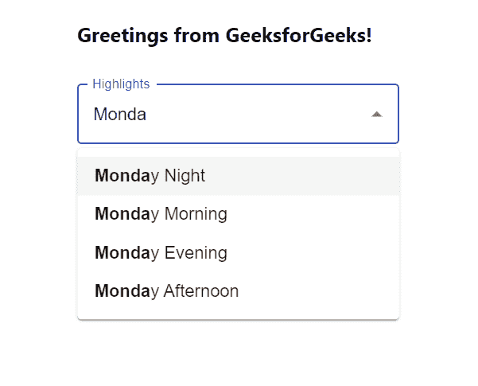

# 突出显示反应中的下拉选项

> 原文:[https://www . geesforgeks . org/highlighting-drop down-options-in-reactjs/](https://www.geeksforgeeks.org/highlighting-dropdown-options-in-reactjs/)

**高亮**选项让用户体验更好。每当选项显示在下拉列表中，并且用户开始键入时，为了用户方便，选项应该突出显示，这可以使用 M 材料用户界面来实现。

**创建反应应用程序并安装模块:**

**步骤 1:** 使用以下命令创建一个反应应用程序:

```
npx create-react-app foldername
```

**步骤 2:** 在创建项目文件夹(即文件夹名**)后，使用以下命令将**移动到该文件夹:

```
cd foldername
```

**步骤 3:** 创建 ReactJS 应用程序后，使用以下命令安装 **material-ui** 模块:

```
npm install @material-ui/core
npm install @material-ui/lab
npm install autosuggest-highlight
```

**项目结构:**如下图。


项目结构

**App.js:** 现在在 **App.js** 文件中写下以下代码。在这里，App 是我们编写代码的默认组件。

## java 描述语言

```
import React from 'react'
import TextField from '@material-ui/core/TextField';
import Autocomplete from '@material-ui/lab/Autocomplete';
import parse from 'autosuggest-highlight/parse';
import match from 'autosuggest-highlight/match';

const App = () => {

  // Our sample dropdown options
  const options = ['Monday Night', 'Monday Morning', 
  'Monday Evening', 'Monday Afternoon']

  return (
    <div style={{ marginLeft: '40%', marginTop: '60px' }}>
      <h3>Greetings from GeeksforGeeks!</h3>
      <Autocomplete
        id="highlights-demo"
        style={{ width: 300 }}
        options={options}
        renderOption={(option, { inputValue }) => {
          const matches = match(option, inputValue);
          const parts = parse(option, matches);
          return (
            <div>
              {parts.map((part, index) => (
                <span key={index} style={{ fontWeight: part.highlight ? 700 : 400 }}>
                  {part.text}
                </span>
              ))}
            </div>
          );
        }}
        renderInput={(params) => (
          <TextField {...params} label="Highlights"
            variant="outlined"
            margin="normal" />
        )}
      />
    </div>
  );
}

export default App
```

**运行应用程序的步骤:**从项目的根目录使用以下命令运行应用程序:

```
npm start
```

**输出:**现在打开浏览器，转到***http://localhost:3000/***，会看到如下输出:

