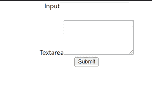
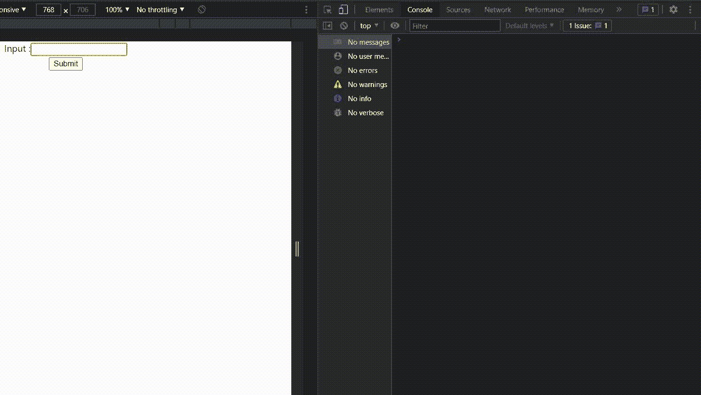
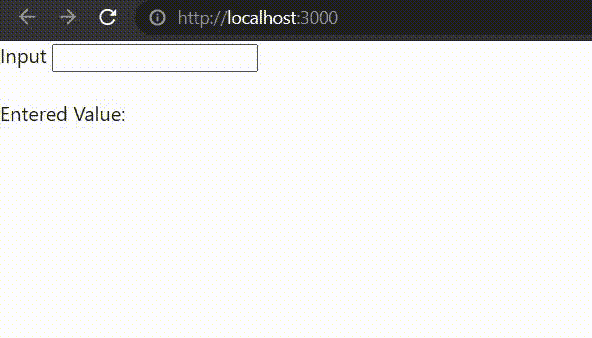

# ReactJS 中的表单是如何创建的？

> 原文:[https://www . geeksforgeeks . org/forms-how-in-created-reactjs/](https://www.geeksforgeeks.org/how-are-forms-created-in-reactjs/)

表单是使用交互式控件在 web 服务器上存储用户信息的文档。表单包含不同类型的信息，如用户名、密码、联系号码、电子邮件 id 等。表单是网站非常重要的组成部分。因为它能够直接从用户那里收集数据，这使得网站更具互动性。如果我们保持简单，只做一个静态的表单，那么在 React 中创建一个表单几乎类似于 HTML。但是在处理数据和检索表单提交时会有很多不同。

**受控组件:**在像输入标签这样的简单 HTML 元素中，只要用户键入，输入字段的值就会改变。但是，在 react 中，无论用户键入什么值，我们都将其保存在状态中，并将相同的值作为其值传递给输入标签，因此在这里，它的值不受 DOM 的更改，而是由 React 状态控制。

#### 创建 react 应用程序:

**步骤 1:** 使用以下命令创建一个反应应用程序:

```jsx
npx create-react-app name_of_the_app
```

**步骤 2:** 创建 react 应用程序后，使用以下命令根据您的应用程序名称移动到目录:

```jsx
cd name_of_the_app
```

**项目结构:**如下图。


#### 现在让我们用不同的例子来理解。

**示例 1:** 在本例中，我们将在 App.js 文件的 App 组件内部创建一个简单的表单组件。这只是一个静态表单，它不包含任何类型的动态事件处理和处理，所以这个表单是一个基本表单，不满足我们的要求。

**App.js**

## java 描述语言

```jsx
import React from 'react';
import './App.css';

function App() {

  return (
    <div className='App'>
      <div>
        <label>Input</label>
        <input type='text'/>
      </div>
      <div>
        <label>Textarea</label>
        <textarea rows='5'></textarea>
      </div>
      <div>
        <button>Submit</button>
      </div>
    </div>
  );
}

export default App;
```

#### 输出:



**示例 2:** 在本例中，我们将把输入框内的值打印到控制台日志中。为此，我们必须采取以下措施:

*   创建一个名为“检测更改”的新函数。该函数将打印目标 JSX 元素的值。
*   在“onChange”事件中调用此函数。
*   这将在输入框改变时打印其值。

**App.js**

## java 描述语言

```jsx
import React from 'react';
import './App.css';

function App() {

  function detectChange(e){
    console.log(e.target.value)
  }

  return (
    <div className='App'>
      <div>
        <label>Input :</label>
        <input type='text' onChange={detectChange}/>
      </div>
      <div>
        <button>Submit</button>
      </div>
    </div>
  );
}

export default App;
```

#### 输出:



**示例 3:** 在本例中，我们将使用 react state 将输入框内的值呈现给同一组件内的另一个 DOM 元素。在 App.js 的 App 组件中

*   使用空字符串的值创建输入值状态。
*   将输入框的值属性设置为等于输入值状态..
*   每当输入框内发生更改时，使用 setState()方法更新 inputValue 状态。
*   将“输入值:”后的文本设置为等于输入值状态。

**App.js**

## java 描述语言

```jsx
import React from 'react';
class App extends React.Component {

    state = { inputValue: '' };
    render() {
        return (
        <div>
            <form>
                <label> Input </label>
                <input type="text"
                    value={this.state.inputValue}
                    onChange={(e) => this.setState(
                    { inputValue: e.target.value })}/>
            </form>
            <div>
                Entered Value: {this.state.inputValue}
            </div>
         </div>
        );
    }
}

export default App;
```

#### 输出:

