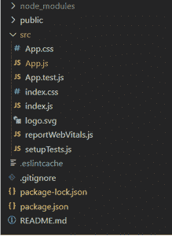

# 【React Native 与 ReactJS 有何不同？

> 原文:[https://www . geesforgeks . org/how-react-native-is-异于-reactjs/](https://www.geeksforgeeks.org/how-react-native-is-different-from-reactjs/)

[**ReactJS:**](https://www.geeksforgeeks.org/react-js-introduction-working/) 它是一个同时支持前端和服务器端的 JavaScript 库。这是一个普遍使用的库，它专注于为移动和基于网络的应用程序开发用户界面。它是由脸书开发的，基于 JavaScript 语言，因此也被同义地称为 ReactJS。

**创建反应应用程序的步骤:**

*   **步骤 1:** 使用以下命令创建一个反应应用程序:

    ```jsx
    npx create-react-app react-demo
    ```

*   **步骤 2:** 创建项目文件夹(即 react-demo)后，使用以下命令移动到该文件夹:

    ```jsx
    cd react-demo
    ```

**项目结构:**如下图。



## App.js

```jsx
import React from "react";
import logo from "./logo.svg";
import "./App.css";

function App() {
  return (
    <div className="App">
      <header className="App-header">
        
        <p>ReactJS Demo Application</p>

      </header>
    </div>
  );
}

export default App;
```

**运行应用程序的步骤:**从项目的根目录使用以下命令运行应用程序:

```jsx
npm start
```

**输出:**现在打开浏览器，转到 http://localhost:3000/，会看到如下输出


**[React Native:](https://www.geeksforgeeks.org/introduction-react-native/)**React Native 是一个使用 ReactJS 框架的跨平台移动框架。顾名思义，它主要用于开发“原生”移动应用程序(如 Windows、iOS 以及 Android)。同样由脸书开发，React Native 提供的主要优势是，它允许开发人员在各种不同的平台上创建移动应用程序，而不会影响最终用户的体验。

**创建 React 原生应用程序的步骤:**

*   **步骤 1:** 打开终端，通过以下命令安装 expo-cli。

    ```jsx
    npm install -g expo-cli
    ```

*   **步骤 2:** 现在通过以下命令创建一个项目。

    ```jsx
    expo init react-native-demo
    ```

*   **步骤 3:** 现在进入你的项目文件夹，即反应-原生-演示

    ```jsx
    cd react-native-demo
    ```

**项目结构:**如下图。


## App.js

```jsx
import React from "react";
import { StyleSheet, Text, View } from "react-native";

export default function App() {
  return (
    <View style={styles.container}>
      <Text style={styles.header}>React Native Demo Application</Text>
    </View>
  );
}

const styles = StyleSheet.create({
  container: {
    flex: 1,
    backgroundColor: "#fff",
    alignItems: "center",
    justifyContent: "center",
  },
  header: {
    color: "#006600",
    fontSize: 22,
    fontWeight: "700",
  },
});
```

**运行应用程序的步骤:**使用以下命令启动服务器。

```jsx
expo start
```

**输出:**


**React 与 React Native 的区别:**

<figure class="table">

| category | 反应 js | 原生反应 |
| --- | --- | --- |
| definition | A JavaScript library, widely used for developing user interface. | Cross-platform mobile framework for developing native mobile applications. |
| platform | Because it is mainly used for web browsers, it can be easily implemented on all platforms. | Because it is used for native applications, it needs enough efforts of developers to customize and execute on all platforms. |
| User Interface(UI) | ReactJS presents HTML tags in its user interface. The React component can include simple HTML tags. | React Native presents JSX in its user interface. React Native supports the specific JSX tags used. |
| pattern | ReactJS uses cascading style sheets (CSS). | React Native uses stylesheet objects (javascript objects). |
| play up | ReactJS uses VirtualDOM, a tool that allows easy interaction with DOM elements. | React Native widely uses native APIs. |
| navigate | ReactJS uses the React router, allowing users to visit different web pages. | React Native uses its built-in Navigator library to allow users to access different screens. |
| External library support | ReactJS supports third-party packages, but lacks native library support. | React Native lacks the support of native libraries and third-party packages. |
| animation | Because ReactJS focuses on UI, it needs animation, which can be easily added with CSS. | In order to add animation to React Native, it uses an animation application programming interface. |
| safe | It has high security. | The security is relatively low. |
| use | Dynamic user interface widely used for developing web applications. | Used to develop real native mobile applications. |
| application program | Facebook, Netflix, Medium, Udemi | Evil bites people, Tesla |

</figure>