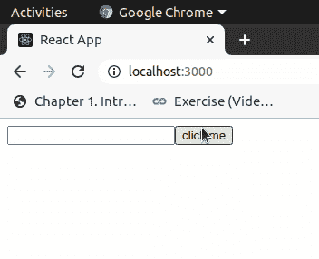

# 如何在 React 中访问一个 DOM 元素？

> 原文:[https://www . geeksforgeeks . org/如何访问-a-dom-element-in-react/](https://www.geeksforgeeks.org/how-to-access-a-dom-element-in-react/)

在 React 中，我们可以使用 Refs 访问 DOM 元素。引用提供了一种访问在呈现方法中创建的 DOM 节点或反应元素的方法。

**创建参考:使用 React.createRef()创建参考，并通过 Ref 属性附加到 React 元素。**

```jsx
class App extends React.Component {
constructor(props) {
  super(props);
  //creating ref
  this.myRef= React.createRef();
}
render() {
//assigning ref
  return (
  <div >
  <input ref= {this.myRef } />
  </div>
  )
}
}
```

**访问引用:**当我们在渲染中将引用分配给一个元素时，我们可以使用引用的当前属性来访问该元素。

```jsx
const element = this.myRef.current;
```

**创建反应应用程序:**

**步骤 1:** 使用以下命令创建一个反应应用程序:

```jsx
npx create-react-app foldername
```

**步骤 2:** 创建项目文件夹(即文件夹名)后，使用以下命令移动到该文件夹:

```jsx
cd foldername
```

**项目结构:**如下图。


**文件名- App.js:** 打开位于 src 文件夹中的 **App.js** 文件，将其编辑为:

## java 描述语言

```jsx
import React from 'react'

class App extends React.Component {

    constructor(props) {
        super(props);

        this.myRef = React.createRef();
      }

    handleClick = () => {

        this.myRef.current.value = "you clicked on button";
    }

    render() {
      return (
        <div>
        <input ref = {this.myRef}/>
          <button 
            onClick = {this.handleClick}
          > click me </button>
        </div>
      );
    }
  }

  export default App;
```

**输出:**
