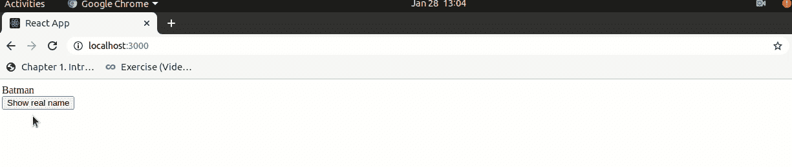

# 如何在 React 中访问孩子的状态？

> 原文:[https://www . geesforgeks . org/如何访问-childs-state-in-react/](https://www.geeksforgeeks.org/how-to-access-childs-state-in-react/)

在 React 中，我们可以使用 Refs 访问孩子的状态。我们将为父组件中的子组件指定一个参照。然后使用 Refs 我们可以访问孩子的状态。

**创建参照**参照是使用 React.createRef()创建的，并通过 Ref 属性附着到 React 元素。

```jsx
class App extends React.Component {
constructor(props) {
 super(props);
 //creating ref
 this.childRef= React.createRef();
}
render() {
 return (
 //assigning the ref to child component
 <Child ref= {this.myRef } />
 )
}
}
```

**访问引用**当我们在渲染中将引用分配给元素或子组件时，我们可以使用引用的当前属性来访问该元素。

```jsx
const element = this.myRef.current;
```

同样，我们可以从父组件使用 element.state.state_name 访问状态。

创建一个 react 应用程序，并将 **App.js** 文件编辑为:

**文件路径- src/App.js**

## java 描述语言

```jsx
import React from "react";
import Child from './Child'

class App extends React.Component {
  constructor(props) {
    super(props);
    this.ChildElement = React.createRef();
  }
  handleClick = () => {
    const childelement = this.ChildElement.current;
      alert("current state of child is :  "+ childelement.state.name);
    childelement.changeName("Aakash");

  };
  render() {
    return (
      <div >
        <Child ref={this.ChildElement} />
        <button onClick={this.handleClick}>Show real name</button>
      </div>
    );
  }
}
export default App
```

在 src 文件夹中创建新的 **Child.js** 组件，并按如下方式进行编辑:

**文件路径- src/Child.js:**

## java 描述语言

```jsx
import React from 'react'
class Child extends React.Component {
  state = {
    name: "Batman"
  };
  changeName = (newname ) => {
    this.setState({
      name:newname
    });
  };
  render() {
    return <div>{this.state.name}</div>;
  }
}
export default Child
```

**输出:** 