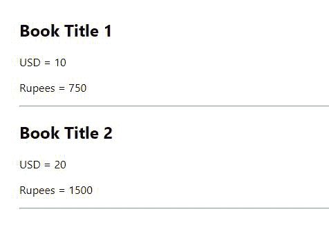

# 如何在 ReactJS 中访问另一个函数中的映射对象？

> 原文:[https://www . geeksforgeeks . org/如何访问另一个函数中的映射对象-in-reactjs/](https://www.geeksforgeeks.org/how-to-access-mapped-objects-in-another-function-in-reactjs/)

下面是访问 array.map()对象到 React 中另一个函数的简单方法

我们可以直接调用 array.map()中的函数，并在该函数中传递对象以返回所需的值。

**设置环境和执行:**

**步骤 1:** 创建反应应用程序命令

```jsx
npx create-react-app foldername
```

**步骤 2:** 创建项目文件夹，即文件夹名称后，使用以下命令移动到该文件夹:

```jsx
cd foldername
```

**项目结构:**如下图。


**文件名:App.js**

## java 描述语言

```jsx
import React, { Component } from "react";

class App extends Component {
  constructor(props) {
    super(props);
    this.state = {
      books: [
        { title: "Book Title 1", USD: 10 },
        { title: "Book Title 2", USD: 20 },
      ],
    };
  }

  // We want to pass books object in this function
  // and return Rupees value
  usdToRupees = (book) => {
    return book.USD * 75;
  };

  render() {
    return (
      <div>
        {this.state.books &&
          this.state.books.map((book) => {
            return (
              <div>
                <h2>{book.title}</h2>

<p>USD = {book.USD}</p>

                {/* We are passing book object to the function */}

<p>Rupees = {this.usdToRupees(book)}</p>

                <hr></hr>
              </div>
            );
          })}
      </div>
    );
  }
}

export default App;
```

**运行应用程序的步骤:**从项目的根目录使用以下命令运行应用程序:

```jsx
npm start
```

**输出:**现在打开浏览器，转到***http://localhost:3000/***，会看到如下输出:

