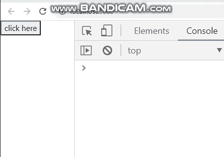

# 如何访问 ReactJS 中的嵌套对象？

> 原文:[https://www . geeksforgeeks . org/如何访问嵌套对象 in-reactjs/](https://www.geeksforgeeks.org/how-to-access-nested-object-in-reactjs/)

ReactJS 中对象的结构可以多次嵌套，并且会很快变得复杂。如果我们想访问嵌套对象的所有值，那么我们必须使用递归来访问该对象的每一层。

**嵌套对象示例:**

```jsx
 var person = {
      "name":"Kapil",
      "age":27,
      "vehicles": {
         "car":"city 100",
         "bike":"ktm-duke",
         "plane":"lufthansa"
      }
     }
```

根据对象的嵌套，它会变得更加复杂。这就是为什么我们必须使用递归来获取所有的值并访问整个嵌套对象。

**创建反应应用程序:**

*   **步骤 1:** 使用以下命令创建一个反应应用程序:

    ```jsx
    npx create-react-app foldername
    ```

*   **步骤 2:** 创建项目文件夹(即文件夹名)后，使用以下命令移动到该文件夹:

    ```jsx
    cd foldername
    ```

**项目结构:**如下图。


**示例:**现在在 **App.js** 文件中写下以下代码。在这里，App 是我们编写代码的默认组件。

## App.js

```jsx
import React from 'react';

class App extends React.Component {

  constructor(props) {
    super(props);
    this.state = {
      person: {
        name: {
          first: "Kapil",
          last: "Chhipa"
        },
        age: 23,
        key1: {
          key2: {
            key3: {
              val: "Welcome to GeeksforGeeks"
            }
          }
        }
      }
    };
  }

  helper = (obj) => {
    const values = Object.values(obj)

    values.forEach(val =>
      val && typeof val === "object" ? 
      this.helper(val) : this.addtoConsole(val))
  }

  addtoConsole = (val) => {
    console.log(val)
  }

  render() {
    return (
      <div>
        <button onClick={() => {
          this.helper(this.state.person)
        }}>click here</button>
      </div>
    );
  }
}

export default App;
```

**运行应用程序的步骤:**从项目的根目录使用以下命令运行应用程序:

```jsx
npm start
```

**输出:**现在打开浏览器，转到***http://localhost:3000/***，会看到如下输出:

