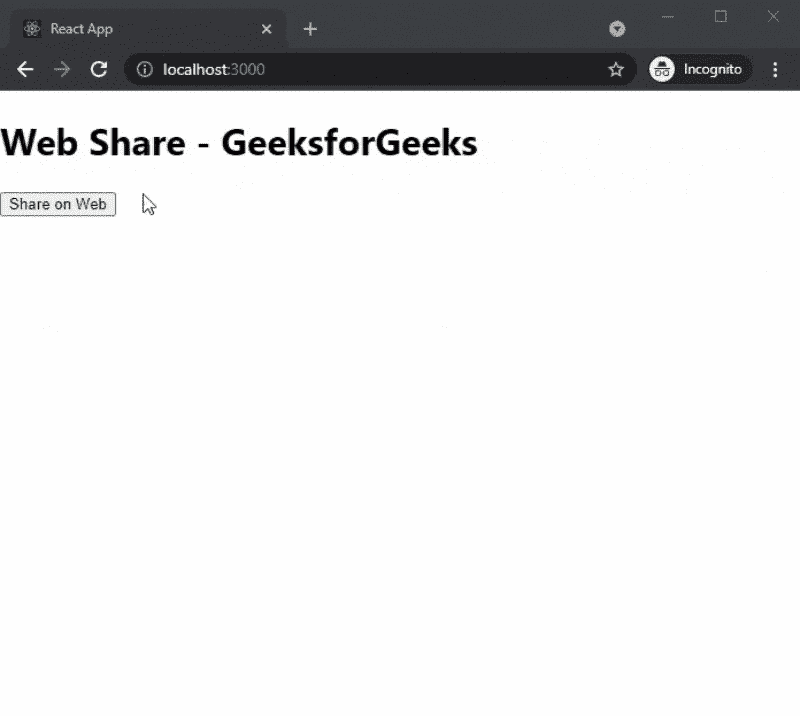

# 如何在 ReactJS 中使用 react-web-share 激活 web 共享？

> 原文:[https://www . geeksforgeeks . org/如何激活-web 共享-使用-反应-web 共享-in-reactjs/](https://www.geeksforgeeks.org/how-to-activate-web-share-using-react-web-share-in-reactjs/)

在本文中，我们将学习如何使用 react-web-share 包在 ReactJs 中添加 Web Share 按钮。使用社交分享按钮，用户可以在不同的社交媒体网站上分享他们的内容。

React 是一个免费的开源前端 JavaScript 库，用于构建用户界面或 UI 组件。它由脸书和一个由个人开发者和公司组成的社区维护。

**方法:**要添加我们的社交分享按钮，我们将使用 react-web-share 包。react-web-share 包包含帮助我们添加社交分享按钮的 UI 组件。首先，我们将安装 react-web-share 包，然后我们将使用 react-web-share 包在主页上添加不同的社交共享按钮。

**创建 reatjs 应用程序:**您可以使用以下命令创建一个新的 reatjs 项目:

```
npx create-react-app gfg  
```

**安装所需的包:**现在我们将使用以下命令安装 react-web-share 包:

```
npm i react-web-share
```

**项目结构:**会是这样的。


**添加网页分享按钮:**安装 react-web-share 包后，我们可以在 app 的任何页面轻松添加不同的社交分享按钮。对于这个例子，我们将在主页上添加社交分享按钮。

在 **App.js** 文件中添加以下内容:

## App.js

```
import React from "react";
import { RWebShare } from "react-web-share";

export default function WebShareGfg(){
  return (
    <div>
      <h1>Web Share - GeeksforGeeks</h1>
      <RWebShare
        data={{
          text: "Web Share - GfG",
          url: "http://localhost:3000",
          title: "GfG",
        }}
        onClick={() => console.log("shared successfully!")}
      >
        <button>Share on Web</button>
      </RWebShare>
    </div>
  );
};
```

**说明:**在上面的例子中，我们首先从 react-web-share 包中导入 RWebShare 函数。之后，我们将创建一个新的网络共享功能，该功能将返回我们的社交共享按钮。您也可以在数据的 URL 参数中传递您想要发送的 URL。

**运行应用的步骤:-** 在终端运行下面的命令运行应用。

```
npm start
```

### 输出:

