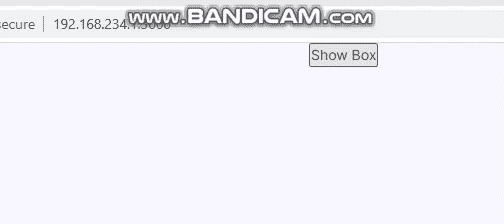

# 如何在 ReactJS 中每当组件更新时都添加一个 CSS 类？

> 原文:[https://www . geesforgeks . org/how-add-a-CSS-class-每当组件在 reactjs 中更新时/](https://www.geeksforgeeks.org/how-to-add-a-css-class-whenever-the-component-is-updated-in-reactjs/)

如果我们想在组件更新或组件的状态/道具改变时更新/添加 CSS 类，那么我们必须根据状态/道具值有条件地应用 CSS。

下面是一个有条件地添加 CSS 类的简单示例。

```jsx
 <div className={`box ${flag === false ? "" : "hidden"}`}>
```

当标志的值为真时，将应用隐藏的类，否则将只应用 box CSS 类。

**创建反应应用程序:**

*   **步骤 1:** 使用以下命令创建一个反应应用程序:

    ```jsx
    npx create-react-app foldername
    ```

*   **步骤 2:** 创建项目文件夹(即文件夹名)后，使用以下命令移动到该文件夹:

    ```jsx
    cd foldername
    ```

**项目结构:**如下图。


**示例:**现在在 **App.js** 文件中写下以下代码。在这里，App 是我们编写代码的默认组件。

## App.js

```jsx
import React, { Component } from 'react';
import styles from './index.css';

class App extends Component {
    state = {
        flag: true
    };

    handleUpdate = () => {
        this.setState(prevstate => ({ flag: !prevstate.flag }));
    };

    render() {
        const flag = this.state.flag;
        return (
            <div>
                <button onClick={this.handleUpdate}>Show Box</button>
                <div className={`box ${flag === false ? "" : "hidden"}`}>
                    <p>click on button to hide and show the box</p>
                </div>
            </div>
        );
    }
}

export default App;
```

## index.css

```jsx
.box{
  width: 100px;
  height: 200;
  padding: 20px;
  border: 1px solid black;
}
.hidden {
  display: none;
}
```

**运行应用程序的步骤:**从项目的根目录使用以下命令运行应用程序:

```jsx
npm start
```

**输出:**现在打开浏览器，转到***http://localhost:3000/***，会看到如下输出:



从上面的输出中我们可以看到，当隐藏的 CSS 类根据状态的更新值被添加到 HTML 元素中时，该框将会消失。