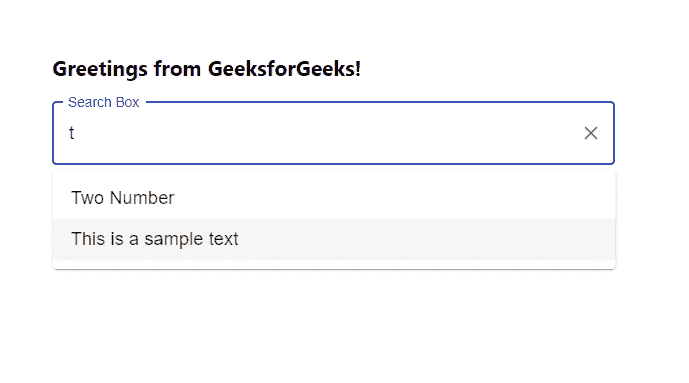
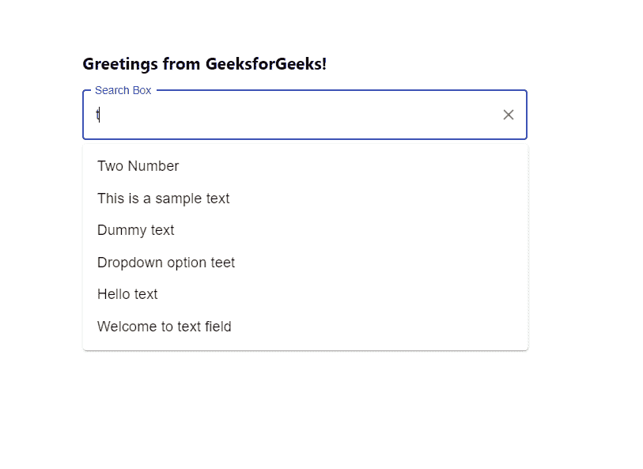

# 如何在 ReactJS 的搜索框中添加自定义过滤器？

> 原文:[https://www . geesforgeks . org/how-add-custom-filter-in-search-box-in-reactjs/](https://www.geeksforgeeks.org/how-to-add-custom-filter-in-search-box-in-reactjs/)

自定义过滤器意味着添加我们自己的业务登录来过滤搜索框或任何下拉菜单中显示的选项。React 的 Material UI 有这个组件可供我们使用，非常容易集成。我们可以使用以下方法为 ReactJS 中的选项创建自己的自定义过滤器。

**创建反应应用程序并安装模块:**

**步骤 1:** 使用以下命令创建一个反应应用程序:

```
npx create-react-app foldername
```

**步骤 2:** 在创建项目文件夹(即文件夹名**)后，使用以下命令将**移动到该文件夹:

```
cd foldername
```

**步骤 3:** 创建 ReactJS 应用程序后，使用以下命令安装 **material-ui** 模块:

```
npm install @material-ui/core
npm install @material-ui/lab
```

**项目结构:**如下图。


项目结构

**App.js:** 现在在 **App.js** 文件中写下以下代码。在这里，App 是我们编写代码的默认组件。

## java 描述语言

```
import React from 'react'
import TextField from '@material-ui/core/TextField';
import Autocomplete, { createFilterOptions } from '@material-ui/lab/Autocomplete';

const App = () => {

  const filterOptions = createFilterOptions({
    matchFrom: 'start',
    stringify: option => option,
  });

  // Sample options for search box
  const myOptions = ['One Number', 'Two Number', 'Five Number',
    'This is a sample text', 'Dummy text', 'Dropdown option teet',
    'Hello text', 'Welcome to text field'];

  return (
    <div style={{ marginLeft: '40%', marginTop: '60px' }}>
      <h3>Greetings from GeeksforGeeks!</h3>
      <Autocomplete
        style={{ width: 500 }}
        freeSolo
        filterOptions={filterOptions}
        options={myOptions}
        renderInput={(params) => (
          <TextField {...params}
            variant="outlined"
            label="Search Box"
          />
        )}
      />
    </div>
  );
}

export default App
```

**运行应用程序的步骤:**从项目的根目录使用以下命令运行应用程序:

```
npm start
```

**输出:**现在打开浏览器，转到***http://localhost:3000/***，会看到如下输出:



如果不添加我们的自定义过滤函数，输出结果如下:

