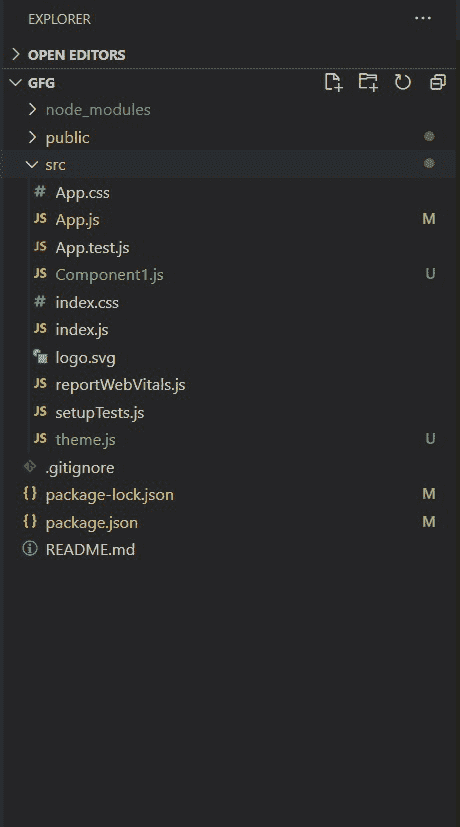
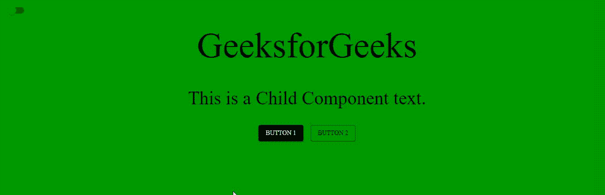

# 如何给你的 React App 添加双主题？

> 原文:[https://www . geesforgeks . org/how-add-dual-theme-to-your-react-app/](https://www.geeksforgeeks.org/how-to-add-dual-theme-to-your-react-app/)

双主题现在在网站上很常见，最常见的是亮暗版本，越来越多的应用和网站都包含了这个功能。对于 React 应用程序，Material UI 框架使用多个主题提供了非常有用的功能，并且在它们之间切换非常容易。

我们将创建一个简单的反应应用程序，并使用开关组件在黑暗和光明主题之间切换。

**创建反应应用程序并安装模块:**

*   **步骤 1:** 使用以下命令创建一个反应应用程序:

    ```
    npx create-react-app gfg
    ```

*   **第 2 步:**创建项目文件夹后，即 gfg **，**使用以下命令移动到该文件夹:

    ```
    cd gfg
    ```

*   **步骤 3:** 创建 ReactJS 应用程序后，使用以下命令安装 **material-ui** 模块:

    ```
    npm install @material-ui/core
    ```

*   **步骤 4:** 在 **src** 文件夹中创建以下两个新文件:

    *   **theme.js:** 在这个文件中，我们将定义我们的主题对象。
    *   **Component1.js:** 这是我们的示例子组件。

**项目结构:**如下图。



**useTheme 钩子:**

我们可以从主题文件中导入多个主题，然后使用 switch 组件及其处理函数在父组件中切换主题。但是出现了一个问题，它的子组件和进一步嵌套的组件呢？

在单一主题架构中，应用程序的所有组件都可以直接从 theme.js 文件导入主题对象并使用它。既然有双重主题，他们怎么知道主题的变化呢？我们是否必须传递一个适当的信息，分别通知每个组件“*嘿，活动主题已经改变了*”，这将是一个相当麻烦和低效的方法。

幸运的是，Material-UI 提供了一个钩子*使用主题*，通过它我们可以访问反应组件中的父主题变量。所以我们不需要单独导入主题，只需要使用父组件正在使用的任何主题对象。因此，现在即使我们改变主题，它也会在整个组件树中改变。

***语法:***

```
import { useTheme } from '@material-ui/core/styles';

function Component1() {
  const theme = useTheme();
}
```

**创建黑暗主题对象:**

尽管材质用户界面带有内置的亮暗模式，但我们将分别定义暗主题对象，因为随着时间的推移，我们可以自由地在两个主题中独特地更改每个属性，或者您甚至可以想要灰色主题而不是暗主题。

```
const darkTheme = responsiveFontSizes(createMuiTheme({
  spacing: 4,
}));
```

我们将保持黑色主题的字体和版式与原始主题相同。我们将背景更改为黑色，调色板主要/次要颜色更改为白色，如下所示。

## 主题. js

```
import { createMuiTheme, responsiveFontSizes } from '@material-ui/core/styles';

const lightTheme = responsiveFontSizes(createMuiTheme({
  spacing: 4,
  typography: {
    fontFamily: [
      'Roboto',
      'Raleway',
      'Open Sans',
    ].join(','),
    h1: {
      fontSize: '5rem',
      fontFamily: 'Raleway',
    },
    h3: {
      fontSize: '2.5rem',
      fontFamily: 'Open Sans',
    },
  },
  palette: {
    background: {
      default: '#009900'//green
    },
    primary: {
      main: '#009900',//green
    },
    secondary:{
      main: '#000000',//black
      icons: '#009900', //white
    },
    text: {
      primary: '#000000',//black
      secondary: '#FFFFFF',//white
    },
  },
}));

const darkTheme = responsiveFontSizes(createMuiTheme({
  spacing: 4,
  typography: {
    fontFamily: [
      'Roboto',
      'Raleway',
      'Open Sans',
    ].join(','),
    h1: {
      fontSize: '5rem',
      fontFamily: 'Raleway',
    },
    h3: {
      fontSize: '2.5rem',
      fontFamily: 'Open Sans',
    },
  },
  palette: {
    background: {
      default: '#000000'//black
    },
    primary: {
      main: '#FFFFFF',//white
    },
    secondary:{
      main: '#FFFFFF', //white
      icons: '#FFFFFF', //white
    },
    text: {
      primary: '#FFFFFF',//white
      secondary: '#FFFFFF',//white
    },
  },
}));

export default lightTheme ;
export {darkTheme} ;
```

## Component1.js

```
import React, { Component } from 'react';
import { makeStyles } from '@material-ui/core/styles';
import { useTheme } from '@material-ui/core/styles';
import Typography from '@material-ui/core/Typography';

const useStyles = makeStyles((theme) => ({
    root: {
        flexGrow: 1,
    },
}));

export default function Component1() {
    const theme = useTheme();
    const classes = useStyles(theme);
    return (
        <div className={classes.root}>
            <Typography variant="h3" 
                        align="center" 
                        color="textPrimary" 
            paragraph>
            This is a Child Component text.
          </Typography>
        </div>
    );
}
```

## App.js

```
import React, { Component } from 'react';
import './App.css';
import CssBaseline from '@material-ui/core/CssBaseline';
import { ThemeProvider } from '@material-ui/styles';
import { createMuiTheme } from '@material-ui/core/styles';
import Container from '@material-ui/core/Container';
import Typography from '@material-ui/core/Typography';
import Button from '@material-ui/core/Button';
import { AppBar, Toolbar } from '@material-ui/core';
import Switch from '@material-ui/core/Switch';
import lightTheme, { darkTheme } from './theme';
import Grid from '@material-ui/core/Grid';
import Component1 from './Component1';

function App() {
  // The 'checked' state is for the status of Switch component
  const [checked, setChecked] = React.useState(false);
  // The 'newtheme' state tells if the new theme (i.e, dark theme) 
  // is to be applied or not.
  const [newtheme, setTheme] = React.useState(false);
  function changeTheme() {
    setTheme(!newtheme);
    setChecked(!checked);
  }
  // Conditional - if newtheme is set to true
  // then set appliedTheme to dark
  const appliedTheme = 
     createMuiTheme(newtheme ? darkTheme : lightTheme);
  return (
    <React.Fragment>
      <ThemeProvider theme={appliedTheme}>
        <CssBaseline />
        <AppBar position="static" color="transparent" elevation={0}>
          <Toolbar>
            {/* Switch position whenever 
                changed triggers the changeTheme() */}
            <Switch checked={checked} onChange={() => { changeTheme() }} 
            style={{ color: appliedTheme.palette.secondary.icons }} />
          </Toolbar>
        </AppBar>
        <Container maxWidth="sm">
          <Typography component="h1" variant="h1" align="center" 
          color="textPrimary" gutterBottom>
            Geeks for Geeks
          </Typography>
          <br />
          <Component1></Component1>
          <br />
          <Grid container direction="row" 
                justify="center" spacing={4}>
            <Grid item>
              <Button variant="contained" color="secondary">
                Button 1
              </Button>
            </Grid>
            <Grid item>
              <Button variant="outlined" color="secondary">
                Button 2
              </Button>
            </Grid>
          </Grid>
          <br />
        </Container>
      </ThemeProvider>
    </React.Fragment>
  );
}

export default App;
```

**运行应用程序的步骤:**从项目的根目录使用以下命令运行应用程序:

```
npm start
```

**输出:**现在打开浏览器，转到***http://localhost:3000/***，会看到如下输出:

