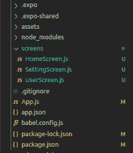
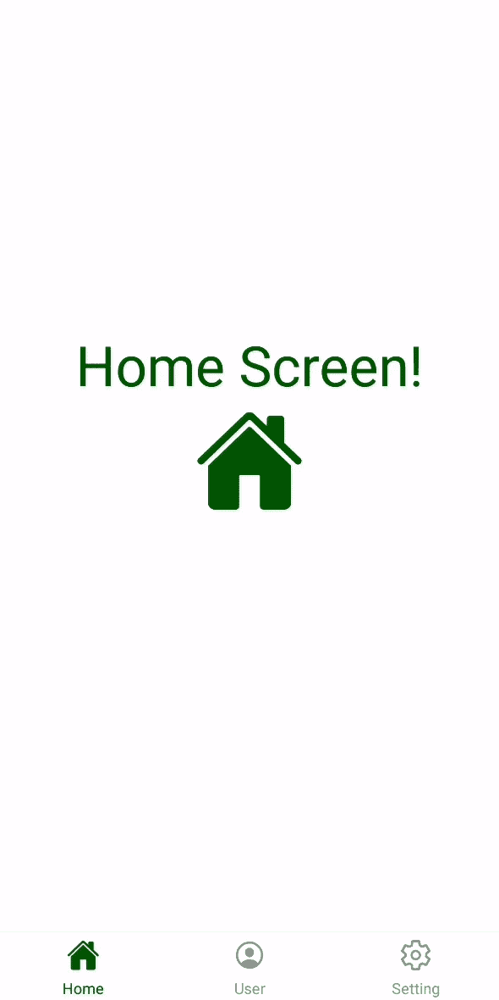

# 如何在 React Native 中的标签导航底部添加图标？

> 原文:[https://www . geesforgeks . org/如何在标签底部添加图标-导航-反应-原生/](https://www.geeksforgeeks.org/how-to-add-icons-at-the-bottom-of-tab-navigation-in-react-native/)

在“反应原生”中的选项卡导航底部添加图标是一项相当简单的任务。在本文中，我们将实现一个基本的应用程序来学习在选项卡导航中使用图标。为此，我们首先需要设置应用程序并安装一些软件包。

**实现:**现在让我们从实现开始:

*   **步骤 1:** 打开终端，通过以下命令安装 expo-cli。

    ```jsx
    npm install -g expo-cli
    ```

*   **步骤 2:** 现在通过以下命令创建一个项目。

    ```jsx
    expo init tab-navigation-icons
    ```

*   **第三步:**现在进入你的项目文件夹，即标签-导航-图标

    ```jsx
    cd tab-navigation-icons
    ```

**步骤 4:** 使用以下命令安装所需的软件包:

```jsx
npm install --save react-navigation react-native-gesture-handler 
npm install --save react-native-vector-icons  
```

**项目结构:**如下图。



**示例:**现在，让我们设置选项卡导航器并添加图标，以及一些基本的 CSS 样式，以使图标看起来像样。在我们的演示应用程序中将有 3 个屏幕，即主屏幕、用户屏幕和设置屏幕。因此，我们将有 3 个标签在这 3 个屏幕之间导航，我们的主屏幕是默认屏幕。

## App.js

```jsx
import React from "react";
import { Ionicons } from "@expo/vector-icons";
import { createAppContainer } from "react-navigation";
import { createBottomTabNavigator } from "react-navigation-tabs";

import HomeScreen from "./screens/HomeScreen";
import UserScreen from "./screens/UserScreen";
import SettingScreen from "./screens/SettingScreen";

const TabNavigator = createBottomTabNavigator({
  Home: {
    screen: HomeScreen,
    navigationOptions: {
      tabBarLabel: "Home",
      tabBarOptions: {
        activeTintColor: "#006600",
      },
      tabBarIcon: (tabInfo) => {
        return (
          <Ionicons
            name="md-home"
            size={24}
            color={tabInfo.focused ? "#006600" : "#8e8e93"}
          />
        );
      },
    },
  },
  User: {
    screen: UserScreen,
    navigationOptions: {
      tabBarLabel: "User",
      tabBarOptions: {
        activeTintColor: "#006600",
      },
      tabBarIcon: (tabInfo) => {
        return (
          <Ionicons
            name="md-person-circle-outline"
            size={24}
            color={tabInfo.focused ? "#006600" : "#8e8e93"}
          />
        );
      },
    },
  },
  Setting: {
    screen: SettingScreen,
    navigationOptions: {
      tabBarLabel: "Setting",
      tabBarOptions: {
        activeTintColor: "#006600",
      },
      tabBarIcon: (tabInfo) => {
        return (
          <Ionicons
            name="md-settings-outline"
            size={24}
            color={tabInfo.focused ? "#006600" : "#8e8e93"}
          />
        );
      },
    },
  },
});

const Navigator = createAppContainer(TabNavigator);

export default function App() {
  return (
    <Navigator>
      <HomeScreen />
    </Navigator>
  );
}
```

上面的代码包含标签导航器的逻辑，标签导航器的底部有图标。现在，我们需要我们需要导航到的屏幕。

## HomeScreen.js

```jsx
import React from "react";
import { Text, View } from "react-native";
import { Ionicons } from "@expo/vector-icons";

const Home = () => {
  return (
    <View style={{ flex: 1, alignItems: "center", justifyContent: "center" }}>
      <Text style={{ color: "#006600", fontSize: 40 }}>Home Screen!</Text>
      <Ionicons name="md-home" size={80} color="#006600" />
    </View>
  );
};

export default Home;
```

## 用户屏幕

```jsx
import React from "react";
import { Text, View } from "react-native";
import { Ionicons } from "@expo/vector-icons";

const User = () => {
  return (
    <View style={{ flex: 1, alignItems: "center", justifyContent: "center" }}>
      <Text style={{ color: "#006600", fontSize: 40 }}>User Screen!</Text>
      <Ionicons name="md-person-circle-outline" size={80} color="#006600" />
    </View>
  );
};

export default User;
```

## 设置屏幕.js

```jsx
import React from "react";
import { Text, View } from "react-native";
import { Ionicons } from "@expo/vector-icons";

const Settings = () => {
  return (
    <View style={{ flex: 1, alignItems: "center", justifyContent: "center" }}>
      <Text style={{ color: "#006600", fontSize: 40 }}>Settings Screen!</Text>
      <Ionicons name="md-settings-outline" size={80} color="#006600" />
    </View>
  );
};

export default Settings;
```

使用以下命令启动服务器。

```jsx
npm run android
```

**输出:**如果你的模拟器没有自动打开，那么你需要手动打开。首先，去你的安卓工作室运行模拟器。现在再次启动服务器。



**参考:**T2】https://reactnavigation.org/docs/tab-based-navigation/