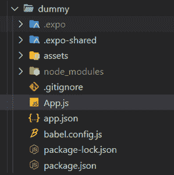
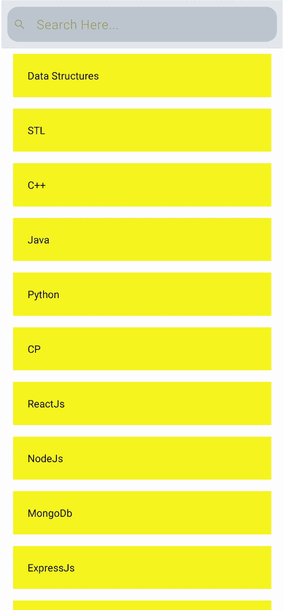

# 如何在 React Native 中添加搜索栏？

> 原文:[https://www . geesforgeks . org/how-add-searchbar-in-react-native/](https://www.geeksforgeeks.org/how-to-add-searchbar-in-react-native/)

在本文中，我们将在 React-Native 中添加搜索功能。这可以看作是 [React native flatlist 组件/](https://www.geeksforgeeks.org/react-native-flatlist-component/) 的延续。在前面提到的文章中，我们使用平面列表组件创建了一个平面列表，让我们使用搜索栏组件来搜索它。要将搜索栏添加到平面列表中，基本语法如下:

**基本语法:**

```jsx
<SearchBar
    placeholder="Type Here..."
    onChangeText={this.updateSearch}
    value={search}
/>
```

**方法:**上面的语法在应用程序中添加了一个标准的特定于平台的搜索栏，它通常是一个带有输入空间的矩形框。滚动到实现部分时，您会注意到我们添加了一个适当的占位符，它指定了搜索栏打开时显示的默认值。此外，我们希望搜索栏是带有圆形边缘的灯光主题，因此有以下道具。现在，当我们想要搜索一个值时，我们想要显示在搜索栏中输入的那个值，为此，我们从**搜索**类中添加一个对象搜索值，默认情况下它是空的，但是当我们键入它时，它被修改并存储我们当前的文本输入。由于搜索值是自定义的，我们关闭自动校正选项，并在搜索字段中输入文本后立即调用搜索功能。

**搜索栏中的道具:**

*   **cancelButtonProps:** 指定传递给 cancel Button 的各种道具，这些可以自定义其颜色、按钮样式、文字颜色等。
*   **取消按钮标题:**用于自定义右侧取消按钮的标题。
*   **cancel con:**这个道具允许覆盖图标道具或者使用自定义组件，这也是安卓平台特有的。
*   **clearIcon:** 这个道具允许覆盖 Icon 道具或者使用自定义组件。空值或假值可用于隐藏图标。
*   **容器样式:**搜索栏的容器可以使用这个道具进行风格化。
*   **inputContainerStyle:** 这个道具用来为输入文本的容器设置样式。
*   **输入样式:**这个道具用来风格化输入文本。
*   **left concontainers style:**为左侧的图标容器设置样式。
*   **灯光主题:**这个道具将主题改为灯光主题。
*   **加载属性:**该属性被传递给活动指示器。
*   **onCancel:** 这个道具让回调在按下取消按钮(iOS)或后退图标(安卓)时触发。
*   **onChangeText:** 这个道具调用了当文本改变时应该触发的方法。
*   **onClear:** 指定清除输入时触发的方法。
*   **占位符:**此道具用于设置占位符文本。
*   **placeholderTextColor:** 这个道具设置占位符文本的颜色。
*   **平台:**这个道具指定了搜索栏的观感。可供选择的值有“默认”、“ios”、“android”。
*   **right concontainerstyle:**我们可以使用这个道具来设置右侧图标容器的样式。
*   **圆角:**这个道具是用来把 TextInput 的样式改成圆角的。
*   **搜索图标:**该道具允许覆盖图标道具或使用自定义组件。使用 null 或 false 隐藏图标。
*   **显示取消:**此道具如果设置为真，即使在模糊事件后，取消按钮也将保持可见。
*   **显示加载:**这个道具显示加载活动指示器效果。
*   **下划线颜色图标:**该属性指定透明下划线颜色，而不是默认颜色。

**实施:**

*   **第一步:**打开终端，安装 expo-cli，如果还没有安装的话。

    ```jsx
    npm install --global expo-cli
    ```

*   **步骤 2:** 安装后，让我们初始化一个项目，如果还没有完成的话。

    ```jsx
    expo init dummy
    ```

*   **步骤 3:** 现在导航到您的项目。

    ```jsx
    cd dummy
    ```

**文件夹结构:**如果按照上面的步骤，你的文件夹结构应该是这样的。



**示例:**现在让我们看看如何使用上述方法添加搜索栏的实现。

## App.js

```jsx
import React, { Component } from "react";
import { StyleSheet, Text, View, FlatList } from "react-native";
import { ListItem, SearchBar } from "react-native-elements";
import filter from "lodash.filter";

const DATA = [
  {
    id: "1",
    title: "Data Structures",
  },
  {
    id: "2",
    title: "STL",
  },
  {
    id: "3",
    title: "C++",
  },
  {
    id: "4",
    title: "Java",
  },
  {
    id: "5",
    title: "Python",
  },
  {
    id: "6",
    title: "CP",
  },
  {
    id: "7",
    title: "ReactJs",
  },
  {
    id: "8",
    title: "NodeJs",
  },
  {
    id: "9",
    title: "MongoDb",
  },
  {
    id: "10",
    title: "ExpressJs",
  },
  {
    id: "11",
    title: "PHP",
  },
  {
    id: "12",
    title: "MySql",
  },
];

const Item = ({ title }) => {
  return (
    <View style={styles.item}>
      <Text>{title}</Text>
    </View>
  );
};

const renderItem = ({ item }) => <Item title={item.title} />;
class Search extends Component {
  constructor(props) {
    super(props);
    this.state = {
      loading: false,
      data: DATA,
      error: null,
      searchValue: "",
    };
    this.arrayholder = DATA;
  }

  searchFunction = (text) => {
    const updatedData = this.arrayholder.filter((item) => {
      const item_data = `${item.title.toUpperCase()})`;
      const text_data = text.toUpperCase();
      return item_data.indexOf(text_data) > -1;
    });
    this.setState({ data: updatedData, searchValue: text });
  };

  render() {
    return (
      <View style={styles.container}>
        <SearchBar
          placeholder="Search Here..."
          lightTheme
          round
          value={this.state.searchValue}
          onChangeText={(text) => this.searchFunction(text)}
          autoCorrect={false}
        />
        <FlatList
          data={this.state.data}
          renderItem={renderItem}
          keyExtractor={(item) => item.id}
        />
      </View>
    );
  }
}

export default Search;

const styles = StyleSheet.create({
  container: {
    marginTop: 30,
    padding: 2,
  },
  item: {
    backgroundColor: "#f5f520",
    padding: 20,
    marginVertical: 8,
    marginHorizontal: 16,
  },
});
```

**运行应用程序:**现在，通过运行以下命令启动服务器

```jsx
npm run web
```

您可以从 Expo Go 应用程序扫描您生成的二维码并获得此输出。

**输出:**



**参考:**T2】https://reactnativeelements.com/docs/searchbar/