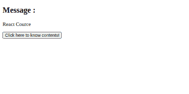

# 如何在 React 中添加不带构造函数类的 Statefull 组件？

> 原文:[https://www . geeksforgeeks . org/如何添加不带构造函数的 state full-component-in-react/](https://www.geeksforgeeks.org/how-to-add-statefull-component-without-constructor-class-in-react/)

通常，我们在构造函数类中设置组件的初始状态，并使用 setState 方法更改状态。在基本反应中，我们编写了看起来像 HTML 的代码，叫做 JSX。JSX 不是一个有效的 JavaScript 代码，但为了让开发人员的生活更轻松 **BABEL** 承担了将 JSX 转换为有效 JavaScript 代码的所有责任，并允许开发人员用看起来像 HTML 的语法编写代码。同样，没有构造函数类也不能初始化状态，当我们再次在构造函数类外初始化状态时，Bable 阅读了语法，明白有必要在类内创建构造函数，并在场景后面做所有需要的艰苦工作。这被称为类属性建议。

**语法:**使用语法在构造函数类外部初始化状态。

```jsx
state = {stateName1:stateValue1, 
         stateName2:stateName2, 
         ....... 
         stateNamek:stateValuek}
```

**例 1:** 这个例子说明了如何在没有构造函数的情况下，用类属性建议来初始化状态

**index.js:**

## java 描述语言

```jsx
import React from 'react'
import ReactDOM from 'react-dom'
import App from './App'

ReactDOM.render(<App />, document.querySelector('#root'))
```

**文件名–app . js**

## java 描述语言

```jsx
import React, { Component } from 'react'

class App extends Component {

  // The class property proposal
  // The state initialization without
  // constructor class
  state = {msg : 'Hi, There!'}

  handleClick(){
    // Changing state
    this.setState({msg : 'Welcome to the React world!'})
  }

  render(){
    return (
      <div>
        <h2>Message :</h2>

<p>{this.state.msg}</p>

        {/* Set click handler */}
        <button onClick={() => this.handleClick()}>
          Click here!
        </button>
      </div>
    )
  }
}

export default App
```

**输出:**


**例 2:** 这个例子说明了如何在没有构造函数的情况下，用类属性建议来初始化状态

**index.js:**

## java 描述语言

```jsx
import React from 'react'
import ReactDOM from 'react-dom'
import App from './App'

ReactDOM.render(<App />, document.querySelector('#root'))
```

**App.js:**

## java 描述语言

```jsx
import React, { Component } from 'react'

class App extends Component {
  static defaultProps = {
    courceContent : [
      'JSX', 'React Props', 'React State',
      'React Lifecycle Methods', 'React Event Handlers',
      'React Router', 'React Hooks', 'Readux',
      'React Context'
    ]
  }

  // The class property proposal
  // The state initialization without
  // constructor class
  state = {msg : 'React Cource', content:''}

  renderContent(){
    return (
      <ul>
        {this.props.courceContent.map(content => (
          <li>{content}</li>
        ))}
      </ul>
    )
  }

  handleClick(){
    //changing state
    this.setState({
      msg : 'Cource Content',
      content : this.renderContent()
    })
  }

  render(){
    return (
      <div>
        <h2>Message :</h2>

<p>{this.state.msg}</p>

<p>{this.state.content}</p>

        {/* set click handler */}
        <button onClick={() => this.handleClick()}>
          Click here to know contents!
        </button>
      </div>
    )
  }
}

export default App
```

**输出:**

