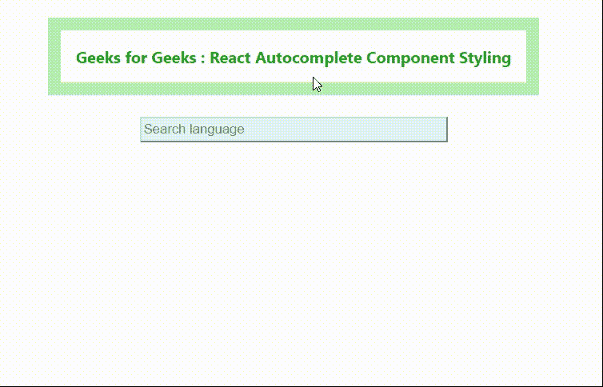

# 如何在 ReactJS 中为自动完成添加样式？

> 原文:[https://www . geesforgeks . org/how-to-add-style-autocomplete-in-reactjs/](https://www.geeksforgeeks.org/how-to-add-styles-to-autocomplete-in-reactjs/)

自动完成组件用于自动完成带有选项值的文本值。它基本上允许用户从建议列表中键入和选择项目。它通过在用户键入时给出建议来改善用户体验。

在本文中，您将研究如何在 ReactJS 中设置自动完成组件的样式。

**创建反应应用程序并安装模块:**

*   **步骤 1:** 使用以下命令创建一个反应应用程序:

    ```
    npx create-react-app foldername
    ```

*   **步骤 2:** 创建项目文件夹(即文件夹名)后，使用以下命令移动到该文件夹:

    ```
    cd foldername
    ```

*   **步骤 3:** 创建 ReactJS 应用程序后，使用以下命令安装所需的模块:

    ```
    npm install --save react-autocomplete
    ```

**项目结构:**如下图。


项目结构

**示例:**现在在 App.js 文件中写下以下代码。在这里，App 是我们编写代码的默认组件。以下代码添加了带有样式的自动完成组件。

## App.js

```
import React, { useState } from 'react'
import Autocomplete from 'react-autocomplete'

function App() {

    // Defining a state named value, which
    // we can update by calling setValue 
    // Value will store the typed value or
    // selected suggestion by the user
    const [value, setValue] = useState('');

    return (
        <div style={{
            display: 'flex', flexDirection: 'column',
            alignItems: 'center'
        }}>
            <div>
                {/* Inline css*/}
                <h4 style={{
                    padding: '15px', 
                    border: '13px solid #b4f0b4',
                    color: 'rgb(11, 167, 11)'
                }}>
                    Geeks for Geeks : React 
                    Autocomplete Component Styling
                </h4>
            </div>
            <div>
                <Autocomplete

                    // Items is the list of suggestions 
                    // displayed while the user type
                    items={[
                        { label: 'C++' },
                        { label: 'C' },
                        { label: 'Python' },
                        { label: 'JavaScript' },
                        { label: 'Julia' },
                        { label: 'Java' },
                        { label: 'Objective C' },
                        { label: 'C#' },
                        { label: 'Dart' },
                        { label: 'Perl' }
                    ]}

                    // To handle the case that when
                    // the user type, suggested 
                    // values should be independent
                    // of upper or lower case 
                    shouldItemRender={(item, value
                        ) => item.label.toLowerCase()
                        .indexOf(value.toLowerCase()) > -1}
                    getItemValue={item => item.label}
                    renderItem={(item, isHighlighted) =>
                        // Styling to highlight selected item
                        <div style={{
                            background: isHighlighted ?
                                '#bcf5bc' : 'white'
                        }}
                            key={item.id}>
                            {item.label}
                        </div>
                    }
                    value={value}

                    // The onChange event watches for
                    // changes in an input field
                    onChange={e => setValue(e.target.value)}

                    // To set the state variable to value
                    // selected from dropdown
                    onSelect={(val) => setValue(val)}

                    // Added style in Autocomplete component
                    inputProps={{
                        style: {
                            width: '300px', height: '20px',
                            background: '#e4f3f7', 
                            border: '2px outset lightgray'
                        },
                        placeholder: 'Search language'
                    }}
                />
            </div>
        </div>
    );
}

export default App;
```

**说明:**

*   在自动完成元素上，类名并不像您预期的那样应用于文本输入。您不能在自动完成组件上使用类名，您必须使用 inputProps 属性。
*   inputProps 通常用于(但不限于)占位符、事件处理程序(onFocus、onBlur 等)。)，autoFocus 等。
*   您可以在上面的代码中自定义输入点中的样式。
*   在 renderItem 道具中，您可以添加样式作为一组样式，这些样式可以应用于改善下拉菜单中项目的外观。

**运行应用程序的步骤:**从项目的根目录使用以下命令运行应用程序:

```
npm start
```

**输出:**现在打开浏览器，转到***http://localhost:3000/***，会看到如下输出:



选择语言时自动完成

**参考:**T2】https://www.npmjs.com/package/react-autocomplete