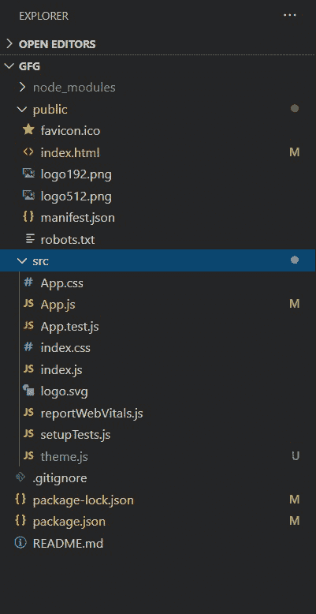
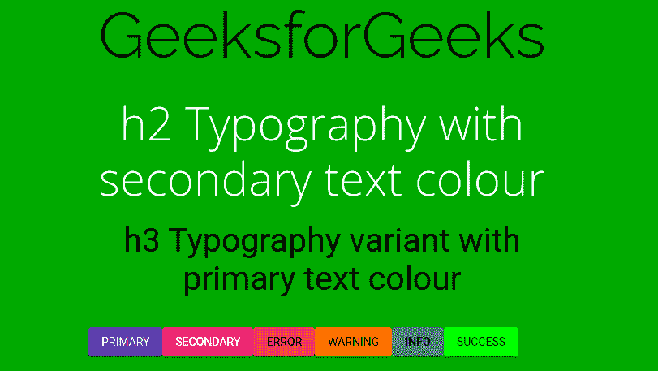

# 如何给你的 React App 添加主题？

> 原文:[https://www . geesforgeks . org/how-to-add-theme-to-react-app/](https://www.geeksforgeeks.org/how-to-add-theme-to-your-react-app/)

主题在 web 应用程序中非常重要，因为它们在整个应用程序中提供了一致的基调。它用于控制和设置颜色、背景、字体属性、阴影级别、不透明度等的值。

**创建反应应用程序并安装模块:**

*   **步骤 1:** 使用以下命令创建一个 React 应用程序。

    ```jsx
    npx create-react-app gfg
    ```

*   **步骤 2:** 创建项目文件夹(即文件夹名)后，使用以下命令移动到该文件夹。

    ```jsx
    cd gfg
    ```

*   **步骤 3:** 创建 ReactJS 应用程序后，使用以下命令安装 **material-ui** 模块。

    ```jsx
    npm install @material-ui/core
    ```

*   **第四步:**前往 public/index.html，将字体添加到你的<头像>:

    ```jsx
    <link rel="stylesheet" href=
    "https://fonts.googleapis.com/css2family=Open+Sans:wght@300
    &family=Raleway:wght@300&family=Roboto
    &display=swap">
    ```

现在，在 src 文件夹中创建一个新的文件 theme.js，我们将在其中定义主题对象。

**项目目录:**会是这样的:



**材质用户界面中的主题化:**材质用户界面提供了一个主题提供者组件，用户可以使用它将主题注入到应用程序中。

主题的工作方式是，我们首先使用 createMuiTheme()定义一个主题对象，然后将这个对象传递给<themeprovider>组件，包装整个需要主题化的模板。</themeprovider>

Acc。to docs–“<themeprovider>依靠 React 的上下文特性将主题向下传递给组件”，这意味着它将主题注入到模板中的所有组件。因为默认情况下，每个组件都将样式属性设置为主要(例如，默认情况下，appbar 颜色设置为“主要”，这意味着它的背景颜色将是任何主要颜色。主题对象的主要价值是)。所以现在每个组件的默认样式都是通过主题设置的。</themeprovider>

如果需要，可以通过显式地为每个组件设置值，或者通过在组件的所需部分周围放置另一个嵌套的<themeprovider theme="{theme2}">包装来覆盖和更改组件的颜色或样式。</themeprovider>

**定义主题对象:**responvefontsize()函数使我们能够拥有视口响应文本大小。

## 主题. js

```jsx
import { createMuiTheme, responsiveFontSizes } 

from '@materialui/core/styles';

const theme = responsiveFontSizes(createMuiTheme({

}));
```

现在，我们将继续更改一些预定义的主题配置变量。

*   **间距:**它有助于在我们的 UI 元素之间创建一致的间距。

    ```jsx
    spacing: 4,
    ```

*   **版式:**版式是我们定义不同字体变体的地方，然后通过“版式”组件在组件模板中使用。

    ```jsx
    typography: {
        fontFamily: [
          'Roboto',
          'Raleway',
          'Open Sans',
        ].join(','),
        h1: {
          fontSize: '5rem',
          fontFamily: 'Raleway',
        },
        h2: {
          fontSize: '3.5rem',
          fontFamily: 'Open Sans',
          fontStyle: 'bold',
        },
        h3: {
          fontSize: '2.5rem',
          fontFamily: 'Roboto',
        },
      },
    ```

*   **调色板:**调色板是我们定义要在 React 应用程序中使用的颜色的地方。该主题公开了以下预定义的调色板颜色–主要颜色、次要颜色、错误颜色、警告颜色、信息颜色、成功颜色和字体颜色文本。

    ```jsx
    palette: {
        background: {
          default: '#009900',
        },
        primary: {
          main: '#2B37D4',
        },
        secondary: {
          main: '#E769A6',
        },
        error: {
          main: '#D72A2A',
        },
        warning: {
          main: '#FC7B09',
        },
        info: {
          main: '#6B7D6A',
        },
        success: {
          main: '#09FE00',
        },
        text: {
          primary: '#000000',
          secondary: '#FFFFFF',
        },
      },
    ```

**示例:**

## 主题. js

```jsx
import { createMuiTheme, responsiveFontSizes } 
from '@material-ui/core/styles';

const theme = responsiveFontSizes(createMuiTheme({
  spacing: 4,
  typography: {
    fontFamily: [
      'Roboto',
      'Raleway',
      'Open Sans',
    ].join(','),
    h1: {
      fontSize: '5rem',
      fontFamily: 'Raleway',
    },
    h2: {
      fontSize: '3.5rem',
      fontFamily: 'Open Sans',
      fontStyle: 'bold',
    },
    h3: {
      fontSize: '2.5rem',
      fontFamily: 'Roboto',
    },
  },
  palette: {
    background: {
      default: '#009900'//green
    },
    primary: {
      main: '#2B37D4',//indigo
    },
    secondary: {
      main: '#E769A6',//pink
    },
    error: {
      main: '#D72A2A',//red
    },
    warning: {
      main: '#FC7B09',//orange
    },
    info: {
      main: '#6B7D6A',//gray
    },
    success: {
      main: '#09FE00',//green
    },
    text: {
      primary: '#000000',//black
      secondary: '#FFFFFF',//white
    },
  },
}));

export default theme;
```

## App.js

```jsx
import React, { Component } from 'react';
import './App.css';
import CssBaseline from '@material-ui/core/CssBaseline';
import { ThemeProvider } from '@material-ui/styles';
import theme from './theme';
import Container from '@material-ui/core/Container';
import Typography from '@material-ui/core/Typography';
import Button from '@material-ui/core/Button';

function App() {
  return (
    <React.Fragment>
      <ThemeProvider theme={theme}>

        <CssBaseline />
        <Container maxWidth="sm">
          <Typography component="h1" variant="h1" align="center" 
           color="textPrimary" gutterBottom>
            Geeks for Geeks
          </Typography>
          <Typography variant="h2" align="center" 
           color="textSecondary">
            h2 Typography with secondary text colour
          </Typography>
          <br />
          <Typography variant="h3" align="center" 
           color="textPrimary" paragraph>
            h3 Typography variant with primary text colour
          </Typography>
          <br />
          <Button variant="contained" 
                  color="primary" > Primary 
          </Button>
          <Button variant="contained" 
                  color="secondary"> Secondary
          </Button>
          {/* Since, color prop only takes primary and 
          secondary as values,we define other colors 
          in component's style */}
          <Button variant="contained"
          style={{background:theme.palette.error.main}}>
          Error </Button>
          <Button variant="contained" 
          style={{background:theme.palette.warning.main}}>
          Warning </Button>
          <Button variant="contained" 
          style={{background:theme.palette.info.main}}>
          Info </Button>
          <Button variant="contained" 
          style={{background:theme.palette.success.main}}>
          Success </Button>

          <br /><br />
        </Container>

      </ThemeProvider>
    </React.Fragment>

  );
}

export default App;
```

**输出:**


**参考:**

*   [https://material-ui.com/customization/typography/](https://material-ui.com/customization/typography/)
*   [https://material-ui.com/customization/palette/](https://material-ui.com/customization/palette/)