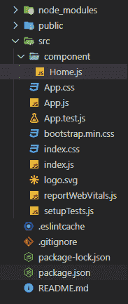
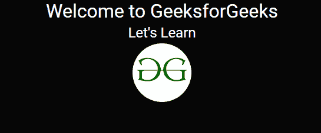

# 如何在 ReactJS 项目中使用 Bootswatch 为网页添加主题？

> 原文:[https://www . geeksforgeeks . org/如何使用-bootsswatch-in-reactjs-project 向您的网页添加主题/](https://www.geeksforgeeks.org/how-to-add-theme-to-your-webpage-using-bootswatch-in-reactjs-project/)

我们可以使用**bootswatch 为 ReactJS 项目添加即时主题。**

**bootsswatch:**It**是一个开源项目，它为 bootstrap 提供了许多 web 开发人员可以使用的免费主题。它帮助开发人员获得合适的用户界面，而无需花费时间和精力来设计不同的元素。**

****先决条件:****

1.  **[反应堆的介绍和工作](https://www.geeksforgeeks.org/react-js-introduction-working/)**
2.  **[重新设置开发环境](https://www.geeksforgeeks.org/reactjs-setting-development-environment/)**

**按照给定的链接开始。向下滚动一点，主题就会出现。一些最常用的主题是宇宙，黑暗。**

****链接:****

> **https://bootswatch.com/**

****项目结构:****

****

****在 ReactJS 项目中安装 bootsatch:****

1.  **点击**预览**按钮，以更广阔的视角查看不同的组件，如表单、下拉列表和其他组件，看看如果我们使用这个特定的主题，这些组件将如何显示。**
2.  **选择主题后，点击**下载**按钮，下载 **bootstrap.min.css** 文件。**
3.  **在你的 react.js 文件夹中打开**终端**，写**命令，**这将在你的应用程序中安装 react-bootstrap。

    ```jsx
    npm install react-bootstrap bootstrap
    ```** 
4.  **举个例子，我们选择半机械人或者 https://bootswatch.com/cyborg/作为主题。现在在 **src** 文件夹中添加下载的 **bootstrap.min.css** 文件**。****
5.  ****在**index . js .**
    **Filename-index . js:**中导入 **bootstrap.min.css** 文件，这里我们只导入 **bootstrap.min.css.** 现在主题适用于整个应用程序。

    ## java 描述语言

    ```jsx
    import React from 'react';
    import ReactDOM from 'react-dom';
    import './index.css';
    import App from './App';
    import reportWebVitals from './reportWebVitals';

    // Import downloaded theme
    import './bootstrap.min.css';

    ReactDOM.render(
      <React.StrictMode>
        <App />
      </React.StrictMode>,
      document.getElementById('root')
    );
    reportWebVitals();
    ```**** 
6.  ****在 **src** 文件夹中创建另一个文件夹**组件**，并在其中创建一个文件并将其命名为 **Home.js** 它将是我们的功能组件**。******
7.  ****Create a functional component in the file, like below. Now add any bootstrap component in your react.js application and it will be styled according to the theme.

    **文件名- Home.js:**

    ## java 描述语言

    ```jsx
    import React from 'react';
    import {Image , Row} from 'react-bootstrap';

    const Home = () => {

        return (
            <div>
                <h1>Welcome to GeeksforGeeks</h1> 
                <h2>Let's Learn</h2>

                {/* aligning the image at the center */}
                <Row className="justify-content-md-center">
                   <Image src=
    "https://www.geeksforgeeks.org/wp-content/uploads/gfg_200X200-1.png" 
                          roundedCircle fluid />
                </Row>
            </div>
        )
    }

    export default Home
    ```**** 
8.  ****Now we just need to import the Home.js component in our App.js root component.

    **Filename- App.js:** 去掉这个文件中不必要的东西，添加下面的代码。

    ## java 描述语言

    ```jsx
    import './App.css';
    // Importing Home component
    import Home from './component/Home';

    function App() {
      return (
        <div className="App">
          <Home />
        </div>
      );
    }

    export default App;
    ```**** 

******启动服务器:**运行以下命令启动服务器。****

```jsx
**npm start**
```

******输出:**应用的主题是 Cyborg(黑暗主题)，这里是输出。****

********