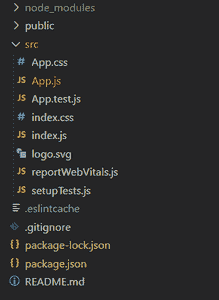

# 如何在 React Bootstrap 中将图像和文本垂直对齐在同一行？

> 原文:[https://www . geesforgeks . org/如何在同一行垂直对齐图像和文本-反应-引导/](https://www.geeksforgeeks.org/how-to-align-an-image-and-text-vertically-on-the-same-line-in-react-bootstrap/)

ReactJS 有一个非常漂亮的方法，可以在 React Bootstrap 中将图像和文本垂直对齐在同一行。ReactJS 是由脸书开发的前端库，用于构建前端的各种组件。Bootstrap 是 Twitter 开发的一个 CSS 框架，用于构建 CSS 丰富的前端网站。

**包含引导程序:**引导程序可以嵌入到 React 应用程序中，方法是在我们的 HTML 页面的<标题>部分包含以下链接:

```
<link rel="stylesheet" 
      href=
"https://maxcdn.bootstrapcdn.com/bootstrap/3.3.7/css/bootstrap.min.css" 
      integrity=
"sha384-BVYiiSIFeK1dGmJRAkycuHAHRg32OmUcww7on3RYdg4Va+PmSTsz/K68vbdEjh4u" 
      crossorigin="anonymous" />

```

上面的代码将把 CSS 引导框架嵌入到我们的网页中。

**创建反应应用程序:**

**步骤 1:** 使用以下命令创建一个反应应用程序:

```
npx create-react-app foldername
```

**步骤 2:** 创建项目文件夹(即文件夹名)后，使用以下命令移动到该文件夹:

```
cd foldername
```

**项目结构:**如下图。



项目结构

我们可以通过在图像和文本标签之间放置一个分隔线标签来垂直对齐图像和文本。React HTML 标签是自关闭标签，所以确保当你打开一个标签时， 你也关闭了标签。

**文件名:App.js**

## java 描述语言

```
import React from "react";
import Container from "react-bootstrap/Container";
import Card from "react-bootstrap/Card";
import "./App.css";

const App = () => {
  const subtitle = "Hi There";
  const infoIcon = "https://www.pixelstalk.net/wp-content/uploads/" + 
  "images1/Free-Download-Sunrise-Desktop-Images-Wallpapers.jpg"

  return (
    <Container className="p-3">
      <Card>
        <div>
          
          <br />
          <i className="text-muted p-0" style={{ backgroundColor: "red" }}>
            {subtitle}
          </i>
        </div>
      </Card>
    </Container>
  );
};

export default App;
```

**运行应用程序的步骤:**从项目的根目录使用以下命令运行应用程序:

```
npm start
```

**输出:**


输出