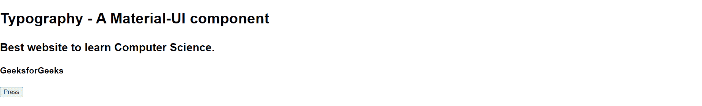
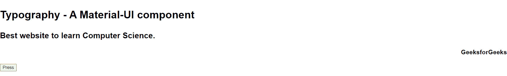
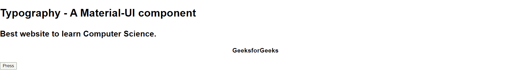
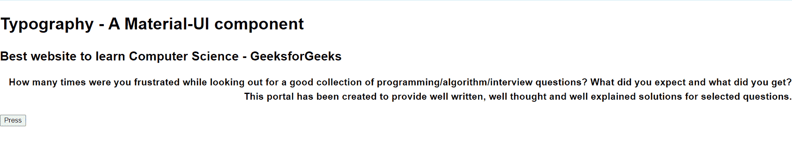
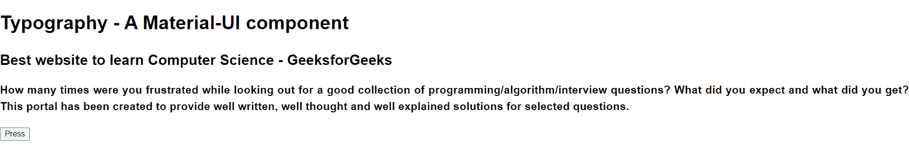

# 如何在 React Material UI 中对齐文本？

> 原文:[https://www . geeksforgeeks . org/how-align-text-in-react-material-ui/](https://www.geeksforgeeks.org/how-to-align-text-in-react-material-ui/)

[素材 UI](https://www.geeksforgeeks.org/material-ui-introduction-and-installation-for-react/) 的排版组件用于尽可能清晰高效地呈现您的文本和内容。

**进口:**

```jsx
import Typography from '@material-ui/core/Typography';
// OR
import { Typography } from '@material-ui/core';
```

**语法:**设置对齐属性。

```jsx
<object align="value"> Text </object>
```

**属性值:**

*   **左侧:**它沿着页面或包含元素的左侧对齐文本。这是默认值。
*   **右侧:**它沿着页面或包含元素的右侧对齐文本。
*   **中心:**文本围绕中点对齐。
*   **对齐:**为了确保每一行的两个边缘都与两个边距对齐，单词之间会添加空格。段落的最后一行靠左对齐。

**返回值:**根据设定值返回对齐的文本。

**示例 1:** 本示例描述了左对齐值。

*   **App.js:**

    ## java 描述语言

    ```jsx
    // This code will be written in App.js file of your React Project

    import Typography from "@material-ui/core/Typography";
    import { useState } from "react";

    function App() {
      const [alignment, setAlignment] = useState("");

      return (
        <div className="App">
          <Typography>
            <h1>Typography - A Material-UI component</h1>
            <h2>Best website to learn Computer Science.</h2>
            <h3 id="h3" align={alignment}>
              GeeksforGeeks
            </h3>
          </Typography>
          <button onClick={() => setAlignment("left")}>Press</button>
        </div>
      );
    }

    export default App;
    ```

*   **运行应用程序的步骤:**从项目的根目录使用以下命令运行应用程序:

    ```jsx
    npm start
    ```

    **输出:**

    *   点击按钮前:
        

    *   点击按钮后:
        

**示例 2:** 本示例描述了右对齐值。

*   **App.js:**

    ## java 描述语言

    ```jsx
    // This code will be written in App.js file of your React Project

    import Typography from "@material-ui/core/Typography";
    import { useState } from "react";

    function App() {
      const [alignment, setAlignment] = useState("");

      return (
        <div className="App">
          <Typography>
            <h1>Typography - A Material-UI component</h1>
            <h2>Best website to learn Computer Science.</h2>
            <h3 id="h3" align={alignment}>
              GeeksforGeeks
            </h3>
          </Typography>
          <button onClick={() => setAlignment("right")}>Press</button>
        </div>
      );
    }

    export default App;
    ```

*   **运行应用程序的步骤:**从项目的根目录使用以下命令运行应用程序:

    ```jsx
    npm start
    ```

    **输出:**

    *   点击按钮前:
        

    *   点击按钮后:
        

**示例 3:** 本示例描述了中心对齐值。

*   **App.js**

    ## java 描述语言

    ```jsx
    // This code will be written in App.js file of your React Project

    import Typography from "@material-ui/core/Typography";
    import { useState } from "react";

    function App() {
      const [alignment, setAlignment] = useState("");

      return (
        <div className="App">
          <Typography>
            <h1>Typography - A Material-UI component</h1>
            <h2>Best website to learn Computer Science.</h2>
            <h3 id="h3" align={alignment}>
              GeeksforGeeks
            </h3>
          </Typography>
          <button onClick={() => setAlignment("center")}>Press</button>
        </div>
      );
    }

    export default App;
    ```

*   **运行应用程序的步骤:**从项目的根目录使用以下命令运行应用程序:

    ```jsx
    npm start
    ```

    **输出:**

    *   点击按钮前:
        

    *   点击按钮后:
        

**示例 4:** 本示例描述了对齐值。

*   **App.js:**

    ## java 描述语言

    ```jsx
    // This code will be written in App.js file of your React Project

    import Typography from "@material-ui/core/Typography";
    import { useState } from "react";

    function App() {
      const [alignment, setAlignment] = useState("right");

      return (
        <div className="App">
          <Typography>
            <h1>Typography - A Material-UI component</h1>
            <h2>Best website to learn Computer Science - GeeksforGeeks </h2>
            <h3 id="h3" align={alignment}>
              How many times were you frustrated while looking out for a good
              collection of programming/algorithm/interview questions? What did you
              expect and what did you get? This portal has been created to provide
              well written, well thought and well explained solutions for selected
              questions.
            </h3>
          </Typography>
          <button onClick={() => setAlignment("justify")}>Press</button>
        </div>
      );
    }

    export default App;
    ```

*   **运行应用程序的步骤:**从项目的根目录使用以下命令运行应用程序:

    ```jsx
    npm start
    ```

    **输出:**

    *   点击按钮前:
        

    *   点击按钮后:
        